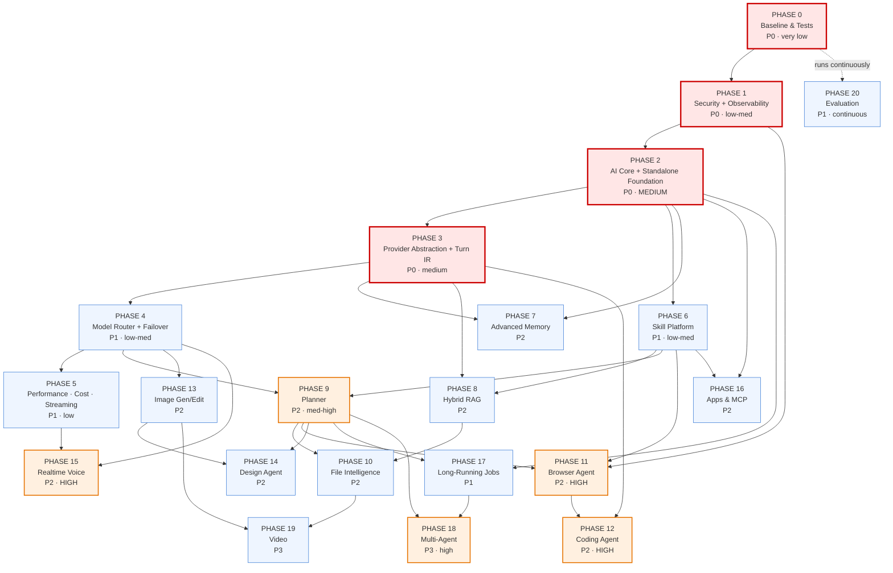

# KOLEEX AI — Evolution Plan

**Version:** 1.0 · **Date:** 2026-08-30 · **Status:** DRAFT — awaiting owner approval before Phase 0 execution
**Baseline commit:** `7c99778` (origin/main) · **Companion:** [`KOLEEX_AI_ARCHITECTURE_AUDIT.md`](../../KOLEEX_AI_ARCHITECTURE_AUDIT.md)
**Supersedes as the active roadmap:** [`implementation-phases.md`](./implementation-phases.md) (Phase 0 shipped; Phases 1–6 folded into this plan)

---

## Product definition (permanent)

> **KOLEEX AI is a general-purpose agentic artificial intelligence platform** that can operate as an integrated intelligence layer within Koleex Hub **or** as an independent multi-platform AI application. Its shared AI core provides conversational intelligence, reasoning, multimodal understanding, tools, memory, research, coding, voice, image and design capabilities, while optional secure connectors allow authorized users to access systems such as Koleex Hub and other external services.

Two deployment modes, one core:

| | Mode A — Integrated | Mode B — Standalone |
|---|---|---|
| Surface | Inside Koleex Hub | Web · iOS · iPadOS · Android · APK · macOS · Windows |
| Identity | Same KOLEEX account | Same KOLEEX account |
| General capabilities | ✅ all | ✅ all |
| Hub data | ✅ via connector, permission-gated | ✅ via connector, permission-gated, **only if entitled** |
| Backend | **The same AI Core** | **The same AI Core** |

The correct relationship is **two independent products with deep first-party integration** — never "Hub contains a chatbot", and never "AI disconnected from Hub".

---

## How to read this document

Sections A–D are **findings**, verified against the code at `7c99778`. Sections E onward are **plan**. Every score is justified; none is inflated. Where evidence is insufficient the document says **cannot confirm** rather than guessing.

---

# A. Current state (verified 2026-08-30)

## A.1 What exists

~16 000 lines of AI code. The dominant files are `src/lib/server/ai-agent/orchestrator.ts` (3 211 L) and `src/components/ai/KoleexAiApp.tsx` (3 958 L).

| Layer | Reality |
|---|---|
| **Entry points** | `POST /api/ai/agent` (primary, SSE, tool loop) · `POST /api/ai/chat` (secondary, lane router) · `/api/ai/attachments` · `/api/ai/knowledge/*` · `/api/ai/conversations|projects|translate|product-copy|feedback` · `/api/translator` · `/api/qa/ai/*` |
| **Auth** | HttpOnly HMAC cookie (`koleex_session`), 30-day, `src/lib/server/session.ts`. Codec v2 exists (`session-codec.ts`) with `iat`/tenant fields — **dual-read only, not minted** |
| **Gate** | `requireInternalUser()` — 403 unless `user_type === "internal"` on every AI route |
| **Orchestration** | `orchestrate()` — up to 4 iterations, ≤6 tool runs, forced `tool_choice` for trade-terms and `askUser`, per-turn tool cache |
| **Routing** | ~10 deterministic regex/heuristic detectors, duplicated across `agent/route.ts`, `chat/route.ts`, `orchestrator.ts` |
| **Tools** | 45, static registry, all schemas sent every call, `dispatchTool` enforces module + minRole then audits |
| **Permissions** | `buildUserContext` reads `koleex_permissions` + `account_permission_overrides`; `SENSITIVE_FIELDS` + `filterFields`; `hasProductDataAccess` / `hasProductCostAccess` |
| **Verification** | 5-stage seal chain at one funnel: tool-markup scrub → quotation hard mode → exec v1/v2/v3 → pricing gate |
| **Provider** | DeepSeek only. `orchestrator.ts:39-42` hard-codes URL + model; three raw `fetch` calls. `providersForLane()` returns `["deepseek"]` for every lane |
| **Knowledge** | Refinery (page-aware chunking) → `ai_knowledge_units` draft → super-admin approval → **ILIKE keyword retrieval** |
| **Memory** | 60-msg/48 KB window · ≤25 user facts in `accounts.preferences.ai_memory` · reply-language lock |
| **Vision** | Real — `describeImage()` → DeepSeek vision; scanned PDFs rasterised ≤3 pages |
| **Voice** | Browser-only Web Speech API. Server TTS (ElevenLabs) exists but is wired to the **QA module only** |
| **Desktop** | Electron **shell** that loads the production Hub URL. No own API client |

## A.2 Request path today

```
KoleexAiApp → POST /api/ai/agent (SSE)
  requireAuth (cookie) → requireInternalUser → conversation ownership
  canned FAST_REPLIES → return
  parallel: history(60) │ buildUserContext │ user-turn insert
  ~10 detectors decide the lane  ← DECISION HAPPENS HERE, ABOVE THE ORCHESTRATOR
    ├─ fast lane (no tools) → deepseekChatStream → sealPricingSafety
    └─ orchestrate() → loop → dispatchTool → sealFinalReply
  post-process → persist → SSE end
```

---

# B. Architecture delta vs the audit

**Method:** `git diff --stat origin/main -- src/ supabase/ package.json` → **empty**. `git rev-list --count 7c99778..origin/main` → **0**. The audited tree and the current tree are byte-identical. Four P0 claims were then re-verified directly against source rather than trusted.

| Audit claim | Re-verified? | Evidence |
|---|---|---|
| `pendingAction` produced by 15 tools, **read by none** | ✅ still true | Only `types.ts:165` (the type) and an unrelated inventory i18n key match |
| `dispatchTool` / `preToolGuard` never inspect `confirm` | ✅ still true | `grep -c confirm tool-registry.ts` → **0** |
| `search_web` forwards `args.query` verbatim | ✅ still true | `web-search.ts:74-75` — trim, then straight to `searchWeb(query)` |
| Full reply logged every turn | ✅ still true | **7** `[ai.agent.final.before]` sites in `orchestrator.ts` |

| Status | Finding |
|---|---|
| **Still accurate** | The entire audit. No code has changed since it was written. |
| **Already changed** | Nothing. |
| **Already fixed** | Nothing from the audit's issue list. |
| **Still missing** | All 10 critical issues; all 30 gap-analysis rows. |

## B.1 New findings — discovered for *this* plan, outside the audit's scope

The audit assessed the AI as a Hub feature. The new requirements (general-purpose, standalone, multi-platform, China-first) surface five issues it never examined:

| # | New finding | Evidence | Impact |
|---|---|---|---|
| **N1** | **Auth cannot serve native mobile.** Sessions are HttpOnly cookies read via `next/headers` `cookies()`. No bearer token, no refresh token, no device registry, no per-device revocation. `SESSION_SECRET` rotation invalidates **every** session at once. | `src/lib/server/session.ts`, `resolveServerAuth()` | **Blocks Mode B.** iOS/Android native clients need bearer + refresh + revocation. |
| **N2** | **No API versioning.** `src/app/api/` has no `v1` namespace; response shapes are coupled to current React components (e.g. the SSE `end` frame ships a raw Supabase row). | `ls src/app/api` → 0 version dirs | Shipped mobile apps pin to whatever shape exists; any change breaks them. |
| **N3** | **`requireInternalUser` blocks the general-purpose product by design.** Every AI route 403s unless `user_type === "internal"`. Correct for today's threat model; **structurally incompatible** with "a normal KOLEEX AI user who has no Hub access". | `src/lib/server/ai/require-internal.ts`, applied on 8 routes | Mode B cannot exist until capability entitlements replace this single boolean. |
| **N4** | **DeepSeek publishes no embeddings endpoint** (needs re-verification against their current API before Phase 8). The RAG phase therefore has **no China-native embedding provider identified yet** — unlike chat, where DeepSeek is China-native and ideal. | `ai-provider.ts` has no `embed()`; no embedding call anywhere | **Phase 8 has an unresolved China dependency.** Candidates to evaluate: Alibaba DashScope/Qwen, BAAI BGE self-hosted, Jina. |
| **N5** | **Desktop is a shell, not a client.** `desktop/package.json`: *"native desktop shell around the live cloud app"*. It loads the Hub URL; it has no API layer of its own. | `desktop/electron/main.ts` | A standalone desktop KOLEEX AI needs either a standalone web URL to wrap, or a real client. The shell is reusable — cheap win. |

## B.2 Prior work this plan inherits (important — do not redo)

The China readiness work is **already done to Level 2** and is a major asset:

- `docs/performance/MAINLAND_CHINA_READINESS_AUDIT.md` — **Decision: Level 2, usable with remediation.** `hub.koleexgroup.com` passed 199/201 mainland probes, avg **0.47 s**, no VPN.
- Login/session/all `/api/*` **PASS by architecture** — single origin, no Supabase Auth in the browser.
- **Koleex AI itself already passes**: DeepSeek is a China-native provider and the call is server-side egress from `hnd1`.
- Remaining degradation is the **browser→Supabase** path (realtime WSS + storage assets, ~19% node failure), with fallback polling shipped for realtime and a first-party proxy (R3) designed but unapproved.
- pdf.js self-hosted, Google favicons removed (R1/R2 done).
- **FCM push is blocked in China; APNs works.** Android push in CN needs a CN vendor.

**This changes the DeepSeek conclusion.** The audit scored coupling 7/10 as a weakness. That remains true *structurally*, but strategically DeepSeek is the **correct China-first primary**. The goal is not to replace it — it is to stop being unable to add others beside it.

---

# C. Target state

```
                              KOLEEX AI
                                  │
                         ┌────────┴────────┐
                    AI GATEWAY  (/api/v1/ai/*)
                    auth · rate limit · quota · trace
                                  │
                          POLICY ENGINE
                 capability entitlements ∩ Hub permissions
                                  │
                     INTENT / COMPLEXITY ANALYSIS
                                  │
                         CONTEXT MANAGER
                        (token-budgeted assembly)
                                  │
                 ┌────────────────┼────────────────┐
             FAST PATH       SMART PATH        AGENT PATH
                                                    │
                                                 PLANNER
                                                    │
                      ┌─────────────┬───────────────┼──────────────┐
                   MEMORY       KNOWLEDGE      MODEL ROUTER    SKILL ROUTER
                 multi-layer    hybrid RAG    provider registry  (relevant
                                                    │            tools only)
                    ┌───────────────────────────────┼──────────────┐
                  FAST  REASON  CODE  VISION  VOICE  IMAGE  EMBED
                    └───────────── Turn IR ─────────┘
                                                    │
                                            AGENT EXECUTOR
                                                    │
        ┌────────┬────────┬────────┬────────┬────────┬────────┬─────────┐
       WEB     FILES    CODE   BROWSER   IMAGE   DESIGN    MCP   CONNECTORS
                                                                      │
                                                          KOLEEX HUB CONNECTOR
                                                                      │
                                          PERMISSION → CONFIRMATION → EXECUTION
                                                                      │
                                                          VERIFICATION ENGINE
                                                                      │
                                                       ARTIFACTS → CLIENTS
```

**One core, many clients:**

```
                  KOLEEX AI CORE  (server)
                          │
      ┌───────────┬───────┴────┬────────────┬──────────────┐
  Koleex Hub   Web app      iOS/iPadOS   Android/APK   macOS/Windows
```

Clients are presentation and interaction only. Orchestration, permissions, memory, knowledge, model routing and verification never leave the server.

---

# D. Gap analysis

Score = current → target (0–10). "Blocked by" names the phase that must land first.

| Subsystem | Now | Target | What is missing | Risk if unaddressed | Blocked by |
|---|---:|---:|---|---|---|
| AI architecture | 6.0 | 9 | One canonical pipeline; routing lives above the orchestrator in 3 files | Every new capability multiplies the duplication | — |
| Provider independence | 4.5 | 9 | `chatWithTools()` interface + Turn IR; one registry replacing three | Single vendor = single point of failure | P2 |
| Agent system | 6.5 | 8.5 | Planner, decomposition, replanning, reflection budgets | Cannot do multi-step research/coding tasks | P2 |
| Tool architecture | 7.5 | 9 | Runtime schema validation, per-tool timeout, permission-scoped exposure, capability domains | 45 schemas per call wastes latency + invites bad calls | — |
| Permissions | 8.0 | 9.5 | Capability entitlements separate from Hub permissions; knowledge-nudge gate | Mode B impossible; knowledge leaks past its module gate | P1 |
| Security | 6.0 | 9 | Server-enforced confirmation, egress scanning, injection isolation, log redaction | Agent with more autonomy on prompt-only guards | — |
| Tenant isolation | 6.5 | 8.5 | Tenant-scoped query helper; AI-path isolation tests | One missing `.eq()` = cross-tenant leak, undetected | — |
| RAG | 3.0 | 8 | FTS + trigram, then pgvector hybrid + rerank; cross-lingual | Knowledge base is bypassed in practice | P5 |
| Knowledge base | 6.5 | 8.5 | Retrieval quality; expiry/versioning surfaced | Good governance, poor recall | P8 |
| Memory | 4.0 | 8 | Summarisation, entity, episodic, task memory; relevance-scored injection | Long conversations lose their middle | P2 |
| Model routing | 1.5 | 9 | Model classes, health, cost/region-aware selection | Everything pays reasoning-model latency | P3 |
| Verification | 8.5 | 9.5 | Write-payload, date, citation, code-execution verification | Writes and dates unverified | — |
| Voice | 2.0 | 8 | Server STT/TTS, realtime duplex, barge-in | Fails on Firefox/Android; two voices in one product | P3 |
| Vision | 6.0 | 8.5 | Multi-image, provider abstraction, re-look at source image | Pinned to one `-exp` model | P3 |
| Coding | 0 | 8 | Sandbox, repo intelligence, test runner, diff | Cannot serve a core general-purpose use case | P3,P6 |
| Browser | 0 | 7.5 | Sandboxed browser agent + confirmations | — | P3,P6 |
| Image gen/edit | 0 | 8 | Provider abstraction + China-accessible provider | — | P3 |
| Design agent | 0 | 7.5 | Structured design IR, layout, typography, QA | — | P13 |
| Observability | 3.0 | 8.5 | Trace ids, structured logs, metrics, dashboards | Cannot find the bottleneck; cannot prove regressions | — |
| Cost governance | 1.0 | 8.5 | `ai_usage`, price table, budgets | Spend is unattributable and uncapped | P3 |
| Reliability | 5.0 | 8.5 | Timeouts, circuit breaker, failover, health | Vendor outage = product outage | P3 |
| Performance | 4.5 | 8.5 | Real streaming, tool filtering, retrieval cache, measured budgets | "Fast" is unproven and partly fake | — |
| **China availability** | **7.0** | **9** | Voice/image/embedding providers unverified; storage R3; CN push | New capabilities could break the no-VPN guarantee | P3 |
| **Standalone platform** | **1.0** | **9** | Versioned API, bearer auth, entitlements, Hub connector, cross-device jobs | Mode B cannot ship | P2 |
| Maintainability | 5.0 | 8 | Split the two monoliths, dedupe routing | Change cost rises with every phase | P2 |

---

# E. Priorities

- **P0 — ship first.** Exploitable today, or blocks everything: security holes, the core refactor, provider abstraction.
- **P1 — high.** Reliability, cost, standalone foundation, tool hardening.
- **P2 — important.** Memory, RAG, planner, file intelligence, the major new capabilities.
- **P3 — future.** Multi-agent, video, computer use.

---

# F. Phased roadmap

## F.0 Sequencing changes vs the requested order — and why

The requested order is sound. Four deviations, each for a stated engineering reason:

| # | Change | Reason |
|---|---|---|
| 1 | **Standalone Platform Foundation merged into Phase 2** (not a late phase) | Extracting the AI Core out of `agent/route.ts` **is** what makes it callable from a versioned API. These are the same edit to the same files. Sequencing them apart means touching `orchestrator.ts`, `agent/route.ts` and `chat/route.ts` twice, and building 15 phases of capability on a cookie-only, Hub-coupled surface that then has to be re-cut. |
| 2 | **Observability moved earlier (into Phase 1)** | §39 of the audit and the user's own rule say *measure first, don't optimise by guessing*. Trace ids and token capture are prerequisites for judging every later phase — and for proving Phase 5's latency targets were met rather than asserted. |
| 3 | **Tool hardening (P6) split**: runtime validation + tool filtering pulled into Phase 2 | Permission-scoped tool exposure is a **latency and security** change, not a nicety: it removes ~3 KB from every prompt and stops showing a Sales user 45 tool schemas. It belongs with the core refactor that already touches the schema builder. |
| 4 | **RAG Phase 1 (FTS) before Phase 8 (pgvector)** | FTS + `pg_trgm` needs no new provider and no schema gate beyond an index; pgvector needs an embedding provider that is **not yet identified for China** (finding N4). Ship the recall win that has no unresolved dependency first. |

## F.1 Phase table (near-term phases in full detail)

---

### PHASE 0 — Baseline & Tests · P0 · Risk: **very low**

**Objective.** Establish a measured, test-covered baseline so every later phase can be proven not to regress.
**Why it matters.** The audit found ~20 documented production incidents encoded as detectors and guards. A refactor without a regression net will silently undo them.

| | |
|---|---|
| **Existing code affected** | None modified. Read-only + new test files. |
| **New files** | `scripts/validate-ai-baseline.mts` (incident-replay suite); `scripts/validate-ai-tenant-isolation.mts`; `docs/koleex-ai/BASELINE_METRICS.md` |
| **DB changes** | None |
| **APIs** | None |
| **Security impact** | Adds the first automated cross-tenant test for the AI path (audit Issue 10). |
| **Performance impact** | None at runtime. Captures the p50/p95 baseline. |
| **China impact** | None |
| **Tests** | ~20 incident cases from orchestrator comments (fast-lane swallow, mid-flow "yes", trade-terms forcing, choice-card prose refusal, tool-markup leak, pricing guard, quotation hard mode, Franco→Arabic, language lock); tenant-isolation probes per tool |
| **Rollback** | Delete the scripts. Zero production surface. |
| **Dependencies** | None |
| **Acceptance** | Suite green on `7c99778`; every incident case demonstrably fails when its guard is stubbed out; baseline latency table committed |
| **User-visible** | None (foundation) |

---

### PHASE 1 — Security Hardening & Observability · P0 · Risk: **low–medium**

**Objective.** Convert the four prompt-only rules into server enforcement, stop logging business data, and add the tracing needed to measure everything that follows.
**Why it matters.** Audit Issues 1–5 are exploitable today by any internal account or by injected document text, and the plan is about to give the agent *more* autonomy. Autonomy on prompt-only guards is the single worst combination in this document.

| | |
|---|---|
| **Existing code affected** | `ai-agent/tool-registry.ts` (confirmation gate) · `tools/{todos,projects,calendar,planning}.ts` (unchanged logic, now behind the ledger) · `tools/web-search.ts` (egress scan) · `orchestrator.ts` (log redaction, `attachedDocCtx` narrowed to the current turn) · `agent/route.ts` + `chat/route.ts` (rate limit, trace id, knowledge-nudge gate) · `ai-agent/audit.ts` (id allowlist) |
| **New files** | `lib/server/ai/security/pending-actions.ts` · `lib/server/ai/security/egress-scanner.ts` · `lib/server/ai/security/untrusted.ts` (fencing) · `lib/server/ai/observability/trace.ts` · `lib/server/ai/rate-limit.ts` |
| **DB changes** | **`ai_pending_actions`** (see §N.1) — additive, RLS enabled + no policies + `revoke all from anon, authenticated` (house style, mirrors `qa_ai_sessions_phase8.sql`). Indexed on `(conversation_id, args_hash)` and `expires_at`. |
| **APIs** | `POST /api/ai/actions/:id/confirm` · `POST /api/ai/actions/:id/cancel`. SSE gains a `pending_action` frame. |
| **Security impact** | **The point of the phase.** Closes audit Issues 1, 2, 3, 5, 7 and part of 6. |
| **Performance impact** | +1 indexed lookup per write tool (~ms). Rate limiter is in-process + DB-backed counter. Log redaction *reduces* serialisation cost. |
| **China impact** | None — all first-party. |
| **Tests** | Red-team suite: fake `confirm:true` without a preview → rejected · injected document instructing a delete → rejected · egress scan on customer names/prices/codes/emails → blocked · rate limit → 429 · no reply text in logs at default level |
| **Rollback** | Each guard behind a flag (`AI_CONFIRM_LEDGER`, `AI_EGRESS_SCAN`, `AI_RATE_LIMIT`). Flags off = today's behaviour. Table can stay unused. |
| **Dependencies** | Phase 0 |
| **Acceptance** | No write executes without a matching unexpired pending action · no query reaches a search vendor unscanned · production logs carry no reply text · every AI route rate-limited · audit rows identify the affected record |
| **User-visible** | Explicit **Confirm / Cancel** buttons instead of typing "yes" and hoping. |

---

### PHASE 2 — AI Core Refactor + Standalone Platform Foundation · P0 · Risk: **medium (highest of the near phases)**

**Objective.** One canonical `runTurn()` pipeline that owns routing, behind one versioned, client-neutral API — callable without loading any Hub UI.
**Why it matters.** Today the lane decision happens **above** the orchestrator in three files that must be hand-synced; the orchestrator's own comment says every future tool needs a new detector in the route or "this lane will swallow it". And the API is cookie-only and Hub-shaped, which blocks Mode B entirely (findings N1–N3). Both are fixed by the same extraction.

| | |
|---|---|
| **Existing code affected** | `orchestrator.ts` 3 211 → ~800 L (behaviour preserved, code moved) · `agent/route.ts` + `chat/route.ts` become thin transports · `KoleexAiApp.tsx` split into ~6 modules · `tool-registry.ts` gains `openAiToolSchemas(ctx)` filtering |
| **New files** | `lib/server/ai/core/{run-turn,decide-turn,context,streaming,recovery}.ts` · `lib/server/ai/seals/*` (moved verbatim) · `lib/server/ai/prompts/*` (moved verbatim) · `lib/server/ai/entitlements.ts` · `lib/server/ai/auth/bearer.ts` · `lib/server/connectors/koleex-hub/index.ts` · `app/api/v1/ai/**` |
| **DB changes** | `ai_sessions` (device registry: device id, platform, refresh-token hash, last seen, revoked_at) — additive. `accounts` gains a capability-entitlement JSONB (reuses `preferences`, no new column if avoidable). |
| **APIs** | **`/api/v1/ai/*`** — `conversations`, `messages`, `turn` (SSE), `files`, `artifacts`, `jobs`, `memory`, `connectors`. Auth accepts **cookie (web/Hub) or bearer (native)**. Legacy `/api/ai/*` kept as a shim for one release. |
| **Security impact** | `requireInternalUser` replaced by **capability entitlements ∩ Hub permissions** (finding N3). Hub permissions are **unchanged and still enforced** — a standalone client gains no privilege. Bearer tokens get per-device revocation, which today's cookie cannot do (N1). |
| **Performance impact** | **Positive.** Permission-scoped tool exposure removes ~3 KB/call; one decision point removes duplicated regex passes. |
| **China impact** | Neutral-positive — `/api/v1/*` is same-origin on the proven-reachable host. |
| **Tests** | Phase 0 suite must pass **unchanged** (this is the gate) · same conversation reachable via cookie and bearer · a non-Hub user gets general AI and is denied every Hub tool · a Sales user is still denied supplier cost from the standalone path |
| **Rollback** | `/api/ai/*` shim stays live; flag `AI_CORE_V2` routes to old or new. Frontend split is behaviour-neutral. |
| **Dependencies** | Phases 0, 1 |
| **Acceptance** | The 10 standalone criteria in §N.2 · no routing regex outside `decide-turn.ts` · Hub UI unaffected |
| **User-visible** | Nothing changes visually — but KOLEEX AI becomes callable from any client. |

---

### PHASE 3 — Provider Abstraction + Turn IR · P0 · Risk: **medium**

**Objective.** The orchestrator stops speaking any vendor's wire format.
**Why it matters.** The single highest-leverage change in this document: ~6 files, **no tool, prompt, or guard touched**, and provider independence moves 4.5 → ~8. It unlocks Phases 4, 5, 12–15 (voice, image, coding all need provider choice).

| | |
|---|---|
| **Existing code affected** | `orchestrator.ts` — the three raw `fetch` calls · `router.ts` · `ai-provider.ts` · `providers/*` · `vision.ts` · `qa/ai/providers.ts` (generalised **upward**, not reinvented — it is already the right pattern) |
| **New files** | `lib/server/ai/provider/{types,registry,turn-ir}.ts` · `provider/adapters/{deepseek,openai-compatible,anthropic,gemini,qwen}.ts` |
| **DB changes** | None |
| **APIs** | None external. `ProviderName` widens from a closed union to a string. |
| **Security impact** | Neutral. Keys stay server-side; adapters never log the `Authorization` header. |
| **Performance impact** | Neutral by design (DeepSeek path must stay byte-identical through the interface before a second adapter is added). |
| **China impact** | **Strongly positive.** DeepSeek stays the China-first primary; the registry lets a second China-accessible provider (e.g. Qwen/DashScope) be added as failover instead of the current single point of failure. |
| **Tests** | Golden-transcript tests: identical tool loop over the DeepSeek adapter vs today's raw `fetch` · Turn IR round-trips tool calls/results without loss · fragmented streaming `tool_calls` reassembly preserved |
| **Rollback** | Flag `AI_PROVIDER_V2`; old path retained one release. |
| **Dependencies** | Phase 2 |
| **Acceptance** | Zero vendor strings in `core/` · a second adapter passes the same golden transcripts · `chatWithTools()` is the only way the core reaches a model |
| **User-visible** | None directly — everything after depends on it. |

---

### PHASE 4 — Model Router + Failover · P1 · Risk: **low–medium**

**Objective.** Choose a model class per task; survive a provider outage.
**Why it matters.** Today every lane is one model, and `router.ts` states plainly: *"If DeepSeek is down, Koleex AI is down."* Also the main speed lever — a greeting must not pay reasoning-model latency.

| | |
|---|---|
| **Existing code affected** | `router.ts` (`providersForLane` becomes class-based) · `core/run-turn.ts` |
| **New files** | `lib/server/ai/router/{model-classes,selector,health,circuit-breaker}.ts` |
| **DB changes** | None (health state in-process + optional Redis later) |
| **APIs** | None |
| **Security impact** | Region/policy become routing inputs — a tenant can be pinned to China-only providers. |
| **Performance impact** | **Primary lever.** FAST class for greetings/small talk; REASONING only when complexity analysis calls for it. |
| **China impact** | **The core mechanism** for the regional strategy — see §J. |
| **Tests** | Forced provider failure → fallback within budget, tool calls preserved · circuit breaker opens/closes · region pin never selects a blocked provider |
| **Rollback** | Flag `AI_MODEL_ROUTER`; static single-provider selection remains the fallback path. |
| **Dependencies** | Phase 3 |
| **Acceptance** | Classes FAST/GENERAL/REASONING/CODING/VISION/LONG_CONTEXT/EMBEDDING/REALTIME_VOICE/IMAGE selectable · measured failover < 3 s · no class routes to an unhealthy provider |
| **User-visible** | Faster simple answers; the assistant keeps working during a vendor incident. |

---

### PHASE 5 — Performance, Cost & Real Streaming · P1 · Risk: **low**

**Objective.** Hit the §I latency budgets with evidence, and make spend visible.

| | |
|---|---|
| **Existing code affected** | `agent/route.ts` (remove pseudo-streaming where genuine streaming is available) · `core/streaming.ts` · every provider adapter (read `usage`) · `ai-knowledge.ts` (retrieval cache) |
| **New files** | `lib/server/ai/cost/{meter,prices}.ts` · `lib/server/ai/cache/*` |
| **DB changes** | **`ai_usage`** (tenant, account, lane, model, provider, tokens in/out, cost, ms, trace id, day) — additive, indexed on `(tenant_id, day)` and `(account_id, day)` |
| **APIs** | Admin read endpoint for usage (super-admin only) |
| **Security impact** | Budgets prevent cost-exhaustion abuse (pairs with Phase 1 rate limits). |
| **Performance impact** | The measurable win: real token streaming on the tool lane's answer phase; retrieval cache removes 2 Supabase round-trips per fast-lane turn. |
| **China impact** | Positive — fewer round-trips matters more on a ~1 s RTT link. |
| **Tests** | TTFB measured against §I · no pseudo-stream where a genuine stream exists · token totals reconcile with provider dashboards within tolerance |
| **Rollback** | Cache and meter are additive; streaming change behind `AI_TRUE_STREAM`. |
| **Dependencies** | Phases 1 (trace), 3, 4 |
| **Acceptance** | §I targets met at p50 and p95 on the measured network · cost attributable per user/tenant/feature/day |
| **User-visible** | Noticeably faster first token; no more typewriter that isn't real. |

---

### PHASE 6 — Skill Platform Hardening · P1 · Risk: **low–medium**

**Objective.** Turn 45 tools into a validated, domain-organised skill platform.

| | |
|---|---|
| **Existing code affected** | `tool-registry.ts` · all 16 `tools/*.ts` (metadata only — **no handler logic changes**) · `audit.ts` |
| **New files** | `lib/server/ai/skills/{domains,validate,timeout,risk}.ts` |
| **DB changes** | None |
| **APIs** | None |
| **Security impact** | Runtime input/output validation (zod) replaces the 7-of-45 `preToolGuard`; every tool carries a declared risk class (§L). |
| **Performance impact** | Per-tool timeouts stop one slow handler blocking a turn. |
| **China impact** | None |
| **Tests** | Malformed args rejected before the handler · timeout fires · domain filtering returns the right subset · **all 45 tools still function identically** |
| **Rollback** | Validation log-only for one release, then enforcing. |
| **Dependencies** | Phase 2 |
| **Acceptance** | Every tool has domain + risk class + validated schema; no behaviour change in any existing tool |
| **User-visible** | Fewer wrong tool calls. |

---

### PHASE 7 — Advanced Memory · P2 · Risk: medium
Rolling summarisation (never truncate the middle), entity memory, episodic memory, task/goal memory consuming the now-live `pendingAction`, relevance-scored injection. **New tables:** `ai_memories`, `ai_entities`. **Depends:** 2, 3. **Rollback:** flag; falls back to today's window + 25 facts.

### PHASE 8 — Hybrid RAG · P2 · Risk: medium
**Stage A (no new vendor):** Postgres FTS + `pg_trgm`, chunk overlap, query rewriting, permission pre-filter in the candidate query, retrieval cache. **Stage B [SCHEMA GATE]:** pgvector per-tenant namespace, hybrid merge, rerank — **gated on resolving finding N4** (a China-accessible embedding provider). **Depends:** 3, 6. **Rollback:** retrieval strategy behind a flag; ILIKE remains.

### PHASE 9 — Planner & Self-Correction · P2 · Risk: medium-high
Explicit `AgentPlan`/`AgentTask`, decompose→execute→observe→reflect→replan, strict budgets (depth, tool calls, retries, cost, elapsed). **Only for complexity-flagged turns** — trivial requests must never pay planner latency. **Depends:** 2, 3, 4, 6.

### PHASE 10 — File Intelligence · P2 · Risk: medium
Structured document model (pages/sections/tables/sheets/slides) replacing "everything becomes one text blob", DOCX + PPTX support (current gap), long-PDF indexing instead of 3 rasterised pages, citations to exact locations. Deterministic spreadsheet compute — never LLM arithmetic. **Depends:** 6, 8.

### PHASE 11 — Browser Agent · P2 · Risk: **high**
Sandboxed Playwright (already installed in this environment), allowlisted navigation, DOM/a11y-tree reads, screenshots, structured extraction. Every side-effecting action (purchase/send/submit/delete/publish) is a **HIGH_RISK_WRITE** requiring the Phase 1 ledger. **Depends:** 1, 6, 9.

### PHASE 12 — Coding Agent · P2 · Risk: **high**
Isolated container only — **never the app server**. Repo search, code intelligence, edit, test, diff. Execution limits on CPU/memory/network/time. **Depends:** 3, 6, 9, 11 (sandbox infrastructure shared).

### PHASE 13 — Image Generation & Editing · P2 · Risk: medium
Provider-abstracted generation and targeted editing (preserve unchanged regions). **China gate:** must ship with at least one China-accessible provider or be regionally disabled with an honest message — never a silent failure. **Depends:** 3, 4.

### PHASE 14 — Design Agent · P2 · Risk: medium
Structured design IR (`canvas` + `elements[]` + typography/spacing), not a flattened bitmap, so output stays editable. Planner → assets → layout → background → typography → brand rules → render → QA. **Depends:** 9, 13.

### PHASE 15 — Realtime Voice · P2 · Risk: **high**
Duplex streaming, VAD, turn detection, barge-in, multilingual (EN/AR/EGY/ZH). Reuses the existing ElevenLabs TTS route (currently QA-only) where reachable. **China gate:** realtime voice provider accessibility is **unverified** — this phase cannot start until §J row is resolved. **Depends:** 3, 4, 5.

### PHASE 16 — External Apps & MCP · P2 · Risk: medium
KOLEEX AI as MCP **client**; OAuth connector service where **tokens never reach the model**. Every MCP call passes through the Phase 2 permission engine and Phase 1 confirmation ledger — MCP must never bypass them. **Depends:** 2, 6.

### PHASE 17 — Long-Running Jobs · P1 (earlier if Phases 9/11/12 demand it) · Risk: medium
Queue + workers; states QUEUED→PLANNING→RUNNING→WAITING_FOR_USER→VERIFYING→COMPLETED/FAILED/CANCELLED. **New table:** `ai_jobs`. Required for cross-device agent tasks (§N.4) — a job must not depend on the originating tab. **Depends:** 2, 9.

### PHASE 18 — Multi-Agent · P3 · Risk: high
Supervisor delegating to specialised agents over **structured state, not chat text**. Strict budgets; loop prevention. Only after the single-agent runtime is stable. **Depends:** 9, 17.

### PHASE 19 — Video & Advanced Multimodality · P3 · Risk: medium
Scene segmentation → keyframes → transcript → timeline index → multimodal retrieval. Never the raw video to the reasoning model. **Depends:** 10, 13.

### PHASE 20 — Evaluation & Continuous Improvement · P1 (**runs continuously from Phase 0**) · Risk: low
Versioned benchmark suite across conversation, reasoning, coding, tool selection, planning, hallucination, security/injection, permission bypass, RAG, multilingual (AR/EGY/Franco/ZH), speed, cost. Results tracked per version; **no silent regressions**. **Depends:** 0.

> Phases 11–19 are deliberately specified at lower resolution. They are far enough out that detailed design now would be guesswork; each gets a full spec (same field set as Phases 0–6) when its dependencies land.

---

# G. Dependency graph



**Critical path:** `P0 → P1 → P2 → P3` — everything of consequence sits behind it. **P3 is the keystone**: eight later phases need provider choice.

**Never build these on an unstable foundation:** Browser Agent, Coding Agent and Multi-Agent all require Phase 1's confirmation ledger and Phase 9's budgets. Shipping an autonomous browser or code executor on today's prompt-only confirmation would be the most dangerous thing in this plan.

---

# H. Score targets

Current scores carry over from the audit (re-verified). Targets are what the roadmap delivers — not aspirations.

| Dimension | Now | Target | Why the target is what it is |
|---|---:|---:|---|
| AI architecture | 6.0 | **9.0** | One pipeline, one decision point, modular files. Not 10: the planner will still be young. |
| Agent system | 6.5 | **8.5** | Plan/decompose/replan with budgets. Not 9+: multi-agent is P3. |
| Tool architecture | 7.5 | **9.0** | Validated, domain-scoped, timed, risk-classed. Already the strongest layer. |
| Security | 6.0 | **9.0** | Server confirmation, egress scan, injection isolation, redacted logs. Not 10: injection is never fully solved. |
| Permissions | 8.0 | **9.5** | Entitlements ∩ Hub permissions; the nudge gate closed. Already excellent. |
| Tenant isolation | 6.5 | **8.5** | Structural helper + tests. Not 9+: RLS stays bypassed by design, so it remains code-enforced. |
| RAG | 3.0 | **8.0** | FTS then hybrid + rerank + cross-lingual. Not 9: reranking quality needs real tuning. |
| Knowledge base | 6.5 | **8.5** | Governance already strong; retrieval is the fix. |
| Memory | 4.0 | **8.0** | Summarisation + entity + episodic + task. Not 9: relevance scoring takes iteration. |
| Model routing | 1.5 | **9.0** | Classes, health, region, cost. Large, well-understood win. |
| Provider independence | 4.5 | **9.0** | Turn IR + registry. Not 10: some capabilities will stay single-vendor for a while. |
| Verification | 8.5 | **9.5** | Extended to writes, dates, citations, code output. The best subsystem gets better. |
| Voice | 2.0 | **8.0** | Server realtime duplex with barge-in. Not 9: China provider risk. |
| Vision | 6.0 | **8.5** | Multi-image, abstracted, re-lookable. |
| Coding | 0 | **8.0** | Sandboxed repo agent. Not 9: a young capability. |
| Browser | 0 | **7.5** | Sandboxed and confirmation-gated — deliberately conservative. |
| Observability | 3.0 | **8.5** | Traces, metrics, dashboards, guard counters. |
| Cost governance | 1.0 | **8.5** | Full attribution + budgets. |
| Reliability | 5.0 | **8.5** | Timeouts, breaker, failover, health. |
| Performance | 4.5 | **8.5** | Measured against §I, not asserted. |
| **China availability** | **7.0** | **9.0** | Already Level 2 for the existing product; the work is keeping new capabilities from breaking it. |
| **Standalone platform** | **1.0** | **9.0** | Versioned API + bearer + entitlements + connector + cross-device jobs. |
| Maintainability | 5.0 | **8.0** | Monoliths split; routing deduped; comments preserved. |
| **OVERALL** | **5.3** | **8.6** | |

---

# I. Performance targets

Engineering ranges on the measured network (CN→`hnd1` ≈ 50–80 ms leg; server ~150 ms baseline per the China audit). **Targets, not guarantees** — each is verified in Phase 5 against the Phase 0 baseline.

| Metric | Today (measured/observed) | Target p50 | Target p95 | How |
|---|---|---|---|---|
| Canned reply (greeting) | auth + writes only | **< 300 ms** | < 600 ms | Already fast — keep it |
| **TTFB, simple chat** | fast lane streams; tool lane waits for the whole completion | **< 1.2 s** | < 2.0 s | FAST model class + slim prompt + real streaming |
| Simple chat complete | — | < 3 s | < 6 s | |
| **TTFB, tool turn** | pseudo-streamed after full completion | **< 2.0 s** | < 4 s | Stream the answer phase genuinely; emit tool chips immediately |
| Agent start (first visible progress) | empty wait | **< 800 ms** | < 1.5 s | Emit `plan`/`step` frames before the first model call |
| Single tool call | not measured per-tool | < 400 ms | < 1.2 s | Per-tool timeout + parallel independent calls |
| RAG retrieval | 2 uncached Supabase round-trips per fast-lane turn | **< 250 ms** | < 600 ms | FTS + index + tenant-scoped cache |
| Voice turn latency | n/a | **< 800 ms** | < 1.5 s | Regional realtime endpoint |
| Image request start | n/a | < 2 s ack | — | Async job + progress |
| **Provider fallback** | none | **< 3 s** | < 5 s | Circuit breaker + pre-warmed secondary |
| Tokens/cost per turn | **not measured at all** | recorded 100% | — | Phase 5 meter |

**Rule:** no phase may claim a latency improvement without a Phase 0 baseline and a Phase 1 trace to prove it.

---

# J. China readiness matrix

Baseline from `MAINLAND_CHINA_READINESS_AUDIT.md` (Level 2, `hub.koleexgroup.com` 199/201 nodes, avg 0.47 s, no VPN). Rows below the line are **new** capabilities this plan adds — each carries a China gate.

| Capability | China ready? | Provider dependency | Fallback | Risk |
|---|---|---|---|---|
| Frontend + all first-party APIs | ✅ **PASS** | first-party (`hub.koleexgroup.com`) | — | none |
| Login / session | ✅ **PASS by architecture** | first-party cookie sessions | — | none |
| **LLM chat / agent** | ✅ **PASS** | DeepSeek — **China-native**, server-side egress | Phase 4 adds a 2nd CN-accessible provider | low |
| Vision | ✅ likely PASS | DeepSeek vision, server-side | model is `-exp`; abstract in P3 | medium — model may vanish |
| Web search | ⚠️ server-side, unverified | Tavily / Brave (server egress) | honest "couldn't check" already implemented | low (server egress, not user network) |
| Browser→Supabase realtime | ⚠️ **DEGRADED ~19%** | Supabase WSS | ✅ fallback polling shipped | medium |
| Browser→Supabase storage | ⚠️ **DEGRADED ~19%** | Supabase Storage | ❌ none — **R3 proxy designed, unapproved** | **high for files/images** |
| Web push — iOS/APNs | ✅ works | Apple | in-app bell | low |
| Web push — Android/FCM | 🔴 **BLOCKED** | Google | in-app bell | medium for mobile |
| — *new capabilities below* — | | | | |
| **Embeddings (RAG Stage B)** | ❓ **UNRESOLVED — finding N4** | DeepSeek publishes no embeddings endpoint | evaluate Qwen/DashScope · self-hosted BGE · Jina | **blocks P8 Stage B** |
| **Realtime voice** | ❓ **UNVERIFIED** | provider TBD | server TTS via ElevenLabs (reachability unverified from CN) | **blocks P15 start** |
| **Image generation** | ❓ **UNVERIFIED** | provider TBD | must ship a CN-accessible option or regionally disable **with an honest message** | blocks P13 GA in CN |
| **Coding sandbox** | ✅ by architecture | server-side container | — | low |
| **Browser agent** | ✅ by architecture | server-side headless browser | — | low (target sites may still be blocked — report honestly) |
| **Mobile push (CN Android)** | 🔴 needs CN vendor | FCM blocked | in-app + polling | medium |
| **App distribution (CN)** | ⚠️ needs review | iOS CN App Store · APK · CN Android stores | APK direct | **regulatory, not technical — out of engineering scope** |

**Governing rule:** *no phase ships a capability that silently breaks the no-VPN guarantee.* A capability with no China-accessible provider is either (a) regionally disabled with an honest user-facing message, or (b) held until a provider is verified. It is never shipped as a silent failure.

**Explicitly not concluded here:** ICP filing, CN CDN, and legal/regulatory questions around China distribution require local regulatory review. This document flags them and draws no legal conclusions.

---

# K. Feature matrix

| Feature | Current | Target | Phase |
|---|---|---|---|
| Chat | ✅ Current | ✅ | — |
| Reasoning | 🟡 Partial (one model, no class) | ✅ | P4 |
| Web search | ✅ Current (⚠️ unscanned egress) | ✅ safe | P1 |
| Deep research | 🔴 Missing | ✅ | P9 |
| Files | 🟡 Partial (text blob) | ✅ structured | P10 |
| PDF | 🟡 Partial (≤3 scanned pages) | ✅ long + indexed | P10 |
| DOCX | 🔴 **Missing** | ✅ | P10 |
| PPTX | 🔴 Missing | ✅ | P10 |
| Spreadsheet | 🟡 Partial (CSV dump) | ✅ deterministic compute | P10 |
| Images (understanding) | ✅ Current | ✅ multi-image | P10 |
| Image generation | 🔴 Missing | ✅ | P13 |
| Image editing | 🔴 Missing | ✅ | P13 |
| Design | 🔴 Missing | ✅ structured IR | P14 |
| Voice | 🟡 Partial (browser only) | ✅ realtime duplex | P15 |
| Video | 🔴 Missing | ✅ | P19 |
| Coding | 🔴 Missing | ✅ sandboxed | P12 |
| Browser | 🔴 Missing | ✅ sandboxed | P11 |
| Computer use | 🔴 Missing | 🟡 controlled | post-P12 |
| Memory | 🟡 Partial (25 facts) | ✅ multi-layer | P7 |
| Knowledge | ✅ Current (governance) | ✅ | P8 |
| RAG | 🟡 Partial (**lexical only**) | ✅ hybrid | P8 |
| Tools | ✅ Current (45) | ✅ | P6 |
| Skills | 🔴 Missing (no domains) | ✅ | P6 |
| MCP | 🔴 Missing | ✅ client | P16 |
| External apps | 🔴 Missing | ✅ connectors | P16 |
| Artifacts | 🔴 Missing | ✅ | P10 |
| Multi-agent | 🔴 Missing | ✅ | P18 |
| **Standalone clients** | 🔴 **Missing** | ✅ | **P2** |

---

# L. Agent safety matrix

| Class | Definition | Confirmation | Audit | Examples today |
|---|---|---|---|---|
| **READ_ONLY** | No state change, no egress | none | standard | `searchProducts`, `listMyTodos`, `getCustomerByName`, `search_knowledge`, `getUserPermissions` (28 tools) |
| **LOW_RISK_WRITE** | Reversible, self-scoped | none | standard | `remember_about_user`, `forget_about_user` |
| **HIGH_RISK_WRITE** | Affects shared/other-user state | **mandatory ledger** | + before/after | `createTodo` w/ assignees, `reassignTodo`, `updateTodo`, `createProjectTask`, `createCalendarEvent`, `createQuotationDraft` |
| **DESTRUCTIVE** | Irreversible | **mandatory ledger + explicit destructive acknowledgement + soft-delete where possible** | + full snapshot | `deleteTodo`, `deleteProjectTask`, `deleteCalendarEvent`, `deletePlanningItem` |
| **EXTERNAL_SIDE_EFFECT** | Leaves our network | **egress scan**; confirmation for side-effecting calls | + full query logged | `search_web`, future MCP/connector writes, browser submit/purchase |
| **FINANCIAL** | Money or commercial commitment | **mandatory ledger + deterministic verification** | + full payload | `createQuotationDraft`, future invoice/order tools |
| **SECURITY_SENSITIVE** | Permissions, secrets, identity | **super-admin + ledger** | + immutable | future permission/connector-token tools |

**Rules.** (1) Every tool declares its class in `ToolDef` — no default. (2) Confirmation is a **server-side ledger match**, never a model flag. (3) Untrusted content (documents, images, web, MCP) can never satisfy a confirmation. (4) Destructive prefers soft-delete via the existing `recycle-bin.ts`. (5) A new tool without a class fails registry validation at build time.

---

# M. Subsystem strategies

## M.1 Model router
Nine classes — `FAST · GENERAL · REASONING · CODING · VISION · LONG_CONTEXT · EMBEDDING · REALTIME_VOICE · IMAGE`. Selection inputs: task type, complexity, latency target, context length, modality, **region**, provider health, cost, user plan, privacy policy. Region is a **hard filter**, not a preference: a China-resolved request never selects a provider that is unreachable from China. Cost is a tiebreaker among adequate models, never a reason to drop below the quality floor for the task.

## M.2 Memory
Seven layers — working · conversation · **summary** (rolling; never truncate the middle) · user · **entity** · **episodic** · **task/goal**. Retrieval is relevance-scored and token-budgeted; memory is never dumped wholesale into a prompt. Memory inherits the permission layer: a memory recorded under one entitlement is not readable after it is revoked. Extraction is proposed, never silently trusted — the same "human gate" principle the knowledge plane already uses.

## M.3 RAG
`Question → query understanding → rewrite → permission pre-filter → FTS → semantic → merge → rerank → context selection → answer + citations`. The permission filter runs **inside the candidate query** (spec principle P4) — filtering after generation is a leak that happens to be uncited. Cross-lingual is a requirement, not a bonus: an Arabic question must retrieve English knowledge. Stage A ships without any new vendor; Stage B is gated on finding N4.

## M.4 Skills & MCP
Domains: `GENERAL · WEB · BROWSER · FILES · DOCUMENTS · SPREADSHEETS · CODE · IMAGE · DESIGN · VOICE · COMMUNICATION · PRODUCTIVITY · BUSINESS · KOLEEX_HUB`. The model sees only the domains relevant to the turn — a programming question must not carry quotation and calendar schemas. MCP is added as a **client**; every MCP call passes through the same permission engine, confirmation ledger, egress scan and audit as a native tool. MCP never bypasses the security layer, and MCP tool descriptions are treated as untrusted text.

## M.5 Browser agent
Sandboxed headless browser, allowlisted navigation, structured extraction preferred over raw HTML. Page content is **untrusted** — fenced exactly like an uploaded document. Purchase / send / submit / delete / publish / settings changes are `EXTERNAL_SIDE_EFFECT` + `HIGH_RISK_WRITE` and require the ledger. A blocked or unreachable site is reported honestly, never worked around.

## M.6 Coding agent
Isolated container, never the application server. Filesystem + repo search + code intelligence + git + test runner + lint/typecheck, with CPU/memory/network/time limits. Output is a **diff for review**, not an applied change. Test results are verified by execution, never asserted by the model.

## M.7 Image generation & editing
Provider-abstracted behind `IMAGE` class. Editing preserves unchanged regions (mask-based) rather than regenerating the whole frame. Generated images are artifacts with provenance metadata. China gate per §J.

## M.8 Design agent
Design is **not** image generation. A structured design IR (`canvas`, `elements[]` of image/text/shape/logo, typography, alignment, spacing) keeps the output editable; rendering is the last step, not the only one. Brand rules are applied as constraints — the existing `koleex-brand-guidelines` skill and `src/lib/visual-library/` are the natural inputs.

## M.9 Realtime voice
Duplex streaming with VAD, turn detection and barge-in; EN/AR/EGY/ZH. The existing Egyptian-dialect engine (`src/lib/language/*`, 827 L) is a genuine differentiator and applies to voice as it does to text. Cannot start until the China provider question is answered.

## M.10 Testing & evaluation
Every phase ships unit + integration + security tests. Phase 0's incident-replay suite is the regression gate for Phases 1–6. The Phase 20 benchmark runs per version across conversation, reasoning, coding, tool selection, planning, hallucination, injection, permission bypass, RAG, multilingual, speed and cost. **A phase is not complete because it compiles** — it is complete when its acceptance criteria are demonstrated and no benchmark regressed.

---

# N. Standalone platform architecture

## N.1 New tables (all additive; house style = RLS enabled, no policies, `revoke all from anon, authenticated`)

| Table | Phase | Purpose | Key indexes |
|---|---|---|---|
| `ai_pending_actions` | 1 | Server-enforced confirmation | `(conversation_id, args_hash)`, `expires_at` |
| `ai_usage` | 5 | Token/cost attribution | `(tenant_id, day)`, `(account_id, day)` |
| `ai_sessions` | 2 | Device registry + refresh-token hashes + revocation | `(account_id)`, `revoked_at` |
| `ai_memories` / `ai_entities` | 7 | Multi-layer memory | `(account_id, kind)`, relevance |
| `ai_jobs` | 17 | Long-running agent tasks | `(account_id, status)`, `updated_at` |

Every migration ships with reason, schema, indexes, RLS posture, rollback and expected load — per the standing schema-gate policy. **No table is created that an existing one can serve.**

## N.2 Acceptance criteria for the standalone foundation (Phase 2)

1. KOLEEX AI Core is callable without loading any Koleex Hub UI.
2. Authentication resolves both standalone and Hub users.
3. General AI conversations work with **no** Hub modules present.
4. Hub-connected users reach Hub tools under their **existing, unchanged** permissions.
5. One conversation is reachable from multiple clients.
6. An agent job survives the originating browser session ending.
7. No privileged database credential exists in any client.
8. Regional/China routing applies identically to standalone clients.
9. Voice, image and file APIs are platform-neutral.
10. The backend has no critical dependency on one frontend implementation.

## N.3 Entitlements ∩ permissions

```
CAN_EXECUTE(operation) =
      capability_entitlement(user, CAPABILITY)     // WEB_SEARCH, CODE_EXECUTION, IMAGE_GENERATION, …
  AND connector_available(user, CONNECTOR)         // e.g. KOLEEX_HUB connected
  AND hub_permission(user, MODULE, ACTION)         // unchanged: koleex_permissions ∩ overrides
  AND confirmation_satisfied(operation)            // ledger, for write classes
```

A standalone client **never** widens authorization. A Sales employee asking for supplier cost from the iPhone app is denied by exactly the same `hasProductCostAccess` check that denies them in the Hub — the query is never issued.

## N.4 Cross-device continuity
Conversations, memory, artifacts and job state are server-side and canonical. A task started on Windows shows live progress on iPhone and completes whether or not any client is connected. This requires Phase 17; until then, agent turns remain request-scoped and the plan says so rather than implying otherwise.

## N.5 Client strategy
- **Web (standalone)** — a distinct entry point for the AI app; the cheapest real proof of Mode B.
- **Desktop** — the existing Electron shell (`desktop/`) is reusable: it wraps a URL. Point a build at the standalone web app and macOS/Windows exist almost immediately. Native features (global shortcut, screenshots, drag-drop, selected-text actions) come later.
- **Mobile** — needs Phase 2's bearer auth (finding N1) before any native client is worth starting. Camera-first flows, voice, and share-sheet input are the mobile-specific value.
- **Android distribution** — one codebase, multiple channels (Play, direct APK, CN stores). Essential function must not depend on Google services; CN push needs a CN vendor (§J).

---

# O. Rules of engagement during implementation

**Order of preference, always:** deterministic code > LLM guessing · verified data > LLM memory · server enforcement > prompt instructions · structured state > agent chatter · parallel > sequential · relevant context > huge prompts · specialised routing > one model · real streaming > fake typewriter · regional redundancy > single provider · measured > assumed · human confirmation > autonomous destruction.

**Never, during any phase:**
break Hub integration · remove a working tool · weaken permissions or verification · expose sensitive data or put secrets in client code · hard-code one provider into the architecture · make a VPN-dependent service mandatory for core China functionality · introduce uncontrolled autonomous writes · execute arbitrary code on the app server · trust an uploaded document as instructions · let external content override policy · create uncontrolled agent loops · **delete an incident-driven safety comment without understanding it** · rewrite the project · add a framework for fashion · claim a feature is complete when it is not reachable and tested at runtime.

**Preserve and evolve (audit §40):** the 45 tools · `ToolDef`/`ToolResult` · `dispatchTool` · `buildUserContext` · `SENSITIVE_FIELDS`/`filterFields` · the seal chain · `pricing-engine.ts` · the Egyptian-Arabic/Franco language engine · knowledge governance + Refinery + approval bench · the static corpora · the SSE protocol · forced-tool mechanisms · honest-failure behaviour · the attachment pipeline. **Move the comments with the code.**

**Method:** REUSE → REFACTOR → ISOLATE → STRENGTHEN. Small reviewable commits. Feature-flag every behavioural change. Every phase carries a rollback. No phase begins while the previous one's critical tests fail.

---

## Phase status

| Phase | Status | Evidence |
|---|---|---|
| **0 — Baseline & Tests** | 🟡 **IN PROGRESS** | Tenant-isolation guard ✅ · Incident-replay suite ✅ — both shipped and proven-to-fail (below). Baseline latency metrics: next (needs a running instance). |
| 1–20 | ⬜ Not started | Awaiting Phase 0 completion + owner approval |

### Phase 0 · Result 1 — AI tenant-isolation guard ✅

`scripts/validate-ai-tenant-isolation.mts` · `npm run validate:ai-tenant-isolation` · **39 passed, 0 failed, 7 documented pre-verified patterns.**

Closes audit **Issue 10** ("~40 hand-written tenant filters with zero automated coverage"). Static analysis, house style (matches the repo's 80 existing validators): pure Node fs, no DB, no network, no runtime behaviour.

**Proven to fail** — a guard that cannot fail is worthless, so both failure modes were tested and the tree restored:
- removing one real `.eq("tenant_id", …)` → caught (`customers.ts:70`)
- introducing an unclassified new table → caught (forces a human classification decision)

**Verdict on the AI path: zero tenant-isolation defects.** Every one of the 11 initial flags was either a scanner limitation or a documented-safe pattern:

| Pattern | Count | Why it is safe |
|---|---:|---|
| Builder pattern (`let q = …from(); if (tenantId) q = q.eq(…)`) | 3 | Filter applied in the next statement — scanner is now builder-aware |
| By-PK mutation after a tenant-scoped loader (`loadTodoRow`, `loadEventRow`) | 6 | Tenant checked when the row was loaded; a second filter would be cargo-cult |
| Scoped via a tenant-resolved parent key (`source_id` from `rollingSourceId(tenantId,…)`) | 1 | Parent resolved tenant-scoped |
| Self-rollback of a row just inserted with the caller's `tenant_id` | 1 | Same function, same tenant |

**One genuine finding, and it is not AI-specific.** The AI's three `inbox_messages` inserts omit `tenant_id` — **and so does the app's own `/api/todos` route, with a byte-identical payload**; planning routes do set it. So this is a pre-existing, app-wide inconsistency in a notification sink, not an AI defect: *the AI is not broader than the app path it mirrors*. Recorded in the guard's `SHARED_BY_DESIGN` map with that reasoning. **Tracked as hygiene, deliberately not escalated to a Phase 1 security fix** — escalating it would misrepresent where the problem lives.

### Phase 0 · Result 2 — AI incident-replay guard ✅

`scripts/validate-ai-baseline.mts` · `npm run validate:ai-baseline` · **37 passed, 0 failed.**

Pins the ~20 production incidents the audit found encoded as guards in code comments. This is the **regression gate for Phases 1–6**, where `orchestrator.ts` goes 3 211 → ~800 lines: it must pass before and after every refactor. Static analysis — it asserts the guards **exist and are wired in the right order**; behavioural coverage arrives with Phase 20.

Coverage: lane routing (5 fast-lane exclusions) · forced `tool_choice` (trade terms, `askUser`, prose refusal) · provider wire-protocol ordering (the budget nudge that returned HTTP 400 when misplaced) · streaming lifecycle (keepalive `finally`, canned-reply SSE, fragmented `tool_calls`) · the full seal chain · permission invariants (incl. the `customers.notes` column-name bug and bidirectional overrides) · write-path invariants (incl. the `source: "manual"` CHECK-constraint incident that silently broke every confirmed create until 2026-08-08).

**Proven to fail**, three ways, tree restored each time: dropping `!isLiveInfo` from `canFastPath` → caught · removing `sealPricingSafety` from the funnel → caught · renaming `canFastPath` → caught by an explicit *guard-the-guard* assertion that fails loudly rather than letting every exclusion check become vacuous.

**Two assertion bugs found and fixed while building it — both would have made the suite lie:**

1. The fast-lane checks asserted on the *function* names (`isWorkDataQuery`); the route assigns results to locals (`isWorkData`) first. All five checks were passing against nothing. Fixed by extracting the real `canFastPath` expression and adding the guard-the-guard assertion above.
2. **The egress check reported audit Issue 2 as FIXED when it is open.** `/redact/i` matched `requi`**`redAct`**`ion` in the tool's own metadata. *A security assertion that can false-positive is worse than no assertion* — it now anchors on identifiers that cannot occur by accident **and** cross-checks that the handler no longer forwards the query verbatim.

The four known-open P0s are **reported, not failed**, so the suite is green on today's tree and each line flips to a hard assertion as Phase 1 closes it:

```
…OPEN  Issue 1 — server-enforced write confirmation (dispatchTool still never inspects `confirm`)
…OPEN  Issue 2 — web-search egress scanning (args.query still forwarded verbatim)
…OPEN  Issue 3 — full reply in logs (7 sites)
…OPEN  Issue 6 — audit rows identify the changed record (task_id/event_id absent from SAFE_LOG_KEYS)
```

---

## Change log

- **2026-08-30 · v1.0** — Initial plan. Delta verified against `7c99778`: audit fully accurate, zero code drift. Five new findings (N1–N5) added for the general-purpose/standalone/China requirements. Awaiting approval for Phase 0.
