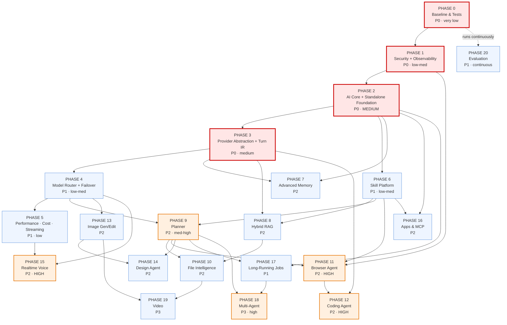

# KOLEEX AI — Evolution Plan

**Version:** 1.0 · **Date:** 2026-08-30 · **Status:** DRAFT — awaiting owner approval before Phase 0 execution
**Baseline commit:** `7c99778` (origin/main) · **Companion:** [`KOLEEX_AI_ARCHITECTURE_AUDIT.md`](../../KOLEEX_AI_ARCHITECTURE_AUDIT.md)
**Supersedes as the active roadmap:** [`implementation-phases.md`](./implementation-phases.md) (Phase 0 shipped; Phases 1–6 folded into this plan)

---

## Product definition (permanent)

> **KOLEEX AI is a general-purpose agentic artificial intelligence platform** that can operate as an integrated intelligence layer within Koleex Hub **or** as an independent multi-platform AI application. Its shared AI core provides conversational intelligence, reasoning, multimodal understanding, tools, memory, research, coding, voice, image and design capabilities, while optional secure connectors allow authorized users to access systems such as Koleex Hub and other external services.

Two deployment modes, one core:

| | Mode A — Integrated | Mode B — Standalone |
|---|---|---|
| Surface | Inside Koleex Hub | Web · iOS · iPadOS · Android · APK · macOS · Windows |
| Identity | Same KOLEEX account | Same KOLEEX account |
| General capabilities | ✅ all | ✅ all |
| Hub data | ✅ via connector, permission-gated | ✅ via connector, permission-gated, **only if entitled** |
| Backend | **The same AI Core** | **The same AI Core** |

The correct relationship is **two independent products with deep first-party integration** — never "Hub contains a chatbot", and never "AI disconnected from Hub".

---

## How to read this document

Sections A–D are **findings**, verified against the code at `7c99778`. Sections E onward are **plan**. Every score is justified; none is inflated. Where evidence is insufficient the document says **cannot confirm** rather than guessing.

---

# A. Current state (verified 2026-08-30)

## A.1 What exists

~16 000 lines of AI code. The dominant files are `src/lib/server/ai-agent/orchestrator.ts` (3 211 L) and `src/components/ai/KoleexAiApp.tsx` (3 958 L).

| Layer | Reality |
|---|---|
| **Entry points** | `POST /api/ai/agent` (primary, SSE, tool loop) · `POST /api/ai/chat` (secondary, lane router) · `/api/ai/attachments` · `/api/ai/knowledge/*` · `/api/ai/conversations|projects|translate|product-copy|feedback` · `/api/translator` · `/api/qa/ai/*` |
| **Auth** | HttpOnly HMAC cookie (`koleex_session`), 30-day, `src/lib/server/session.ts`. Codec v2 exists (`session-codec.ts`) with `iat`/tenant fields — **dual-read only, not minted** |
| **Gate** | `requireInternalUser()` — 403 unless `user_type === "internal"` on every AI route |
| **Orchestration** | `orchestrate()` — up to 4 iterations, ≤6 tool runs, forced `tool_choice` for trade-terms and `askUser`, per-turn tool cache |
| **Routing** | ~10 deterministic regex/heuristic detectors, duplicated across `agent/route.ts`, `chat/route.ts`, `orchestrator.ts` |
| **Tools** | 45, static registry, all schemas sent every call, `dispatchTool` enforces module + minRole then audits |
| **Permissions** | `buildUserContext` reads `koleex_permissions` + `account_permission_overrides`; `SENSITIVE_FIELDS` + `filterFields`; `hasProductDataAccess` / `hasProductCostAccess` |
| **Verification** | 5-stage seal chain at one funnel: tool-markup scrub → quotation hard mode → exec v1/v2/v3 → pricing gate |
| **Provider** | DeepSeek only. `orchestrator.ts:39-42` hard-codes URL + model; three raw `fetch` calls. `providersForLane()` returns `["deepseek"]` for every lane |
| **Knowledge** | Refinery (page-aware chunking) → `ai_knowledge_units` draft → super-admin approval → **ILIKE keyword retrieval** |
| **Memory** | 60-msg/48 KB window · ≤25 user facts in `accounts.preferences.ai_memory` · reply-language lock |
| **Vision** | Real — `describeImage()` → DeepSeek vision; scanned PDFs rasterised ≤3 pages |
| **Voice** | Browser-only Web Speech API. Server TTS (ElevenLabs) exists but is wired to the **QA module only** |
| **Desktop** | Electron **shell** that loads the production Hub URL. No own API client |

## A.2 Request path today

```
KoleexAiApp → POST /api/ai/agent (SSE)
  requireAuth (cookie) → requireInternalUser → conversation ownership
  canned FAST_REPLIES → return
  parallel: history(60) │ buildUserContext │ user-turn insert
  ~10 detectors decide the lane  ← DECISION HAPPENS HERE, ABOVE THE ORCHESTRATOR
    ├─ fast lane (no tools) → deepseekChatStream → sealPricingSafety
    └─ orchestrate() → loop → dispatchTool → sealFinalReply
  post-process → persist → SSE end
```

---

# B. Architecture delta vs the audit

**Method:** `git diff --stat origin/main -- src/ supabase/ package.json` → **empty**. `git rev-list --count 7c99778..origin/main` → **0**. The audited tree and the current tree are byte-identical. Four P0 claims were then re-verified directly against source rather than trusted.

**These four rows are a snapshot taken before any work started (2026-08-30, tree `7c99778`). Three of them are now false BECAUSE the plan did its job** — the "then" column is why they are kept rather than edited away, and the "now" column is what a reader running the same command today would actually see.

| Audit claim | Verified then | And now |
|---|---|---|
| `pendingAction` produced by 15 tools, **read by none** | ✅ true | ❌ **superseded.** `consumePendingAction` reads it; it is the confirmation ledger's mechanism (Phase 1) |
| `dispatchTool` / `preToolGuard` never inspect `confirm` | ✅ true — `grep -c confirm tool-registry.ts` → **0** | ❌ **superseded.** The same grep returns **7** |
| `search_web` forwards `args.query` verbatim | ✅ true | ❌ **superseded.** `scanEgress()` gates it (Phase 1, audit issue 2) |
| Full reply logged every turn | ✅ true — **7** `[ai.agent.final.before]` sites | ❌ **superseded.** **0** sites; `logSealTransform()` logs lengths and a fingerprint (Phase 1, audit issue 3) |

| Status | Finding |
|---|---|
| **Still accurate** | The entire audit. No code has changed since it was written. |
| **Already changed** | Nothing. |
| **Already fixed** | Nothing from the audit's issue list. |
| **Still missing** | All 10 critical issues; all 30 gap-analysis rows. |

## B.1 New findings — discovered for *this* plan, outside the audit's scope

The audit assessed the AI as a Hub feature. The new requirements (general-purpose, standalone, multi-platform, China-first) surface five issues it never examined:

| # | New finding | Evidence | Impact |
|---|---|---|---|
| **N1** | **Auth cannot serve native mobile.** Sessions are HttpOnly cookies read via `next/headers` `cookies()`. No bearer token, no refresh token, no device registry, no per-device revocation. `SESSION_SECRET` rotation invalidates **every** session at once. | `src/lib/server/session.ts`, `resolveServerAuth()` | **Blocks Mode B.** iOS/Android native clients need bearer + refresh + revocation. |
| **N2** | **No API versioning.** `src/app/api/` has no `v1` namespace; response shapes are coupled to current React components (e.g. the SSE `end` frame ships a raw Supabase row). | `ls src/app/api` → 0 version dirs | Shipped mobile apps pin to whatever shape exists; any change breaks them. |
| **N3** | **`requireInternalUser` blocks the general-purpose product by design.** Every AI route 403s unless `user_type === "internal"`. Correct for today's threat model; **structurally incompatible** with "a normal KOLEEX AI user who has no Hub access". | `src/lib/server/ai/require-internal.ts`, applied on 8 routes | Mode B cannot exist until capability entitlements replace this single boolean. |
| **N4** | **DeepSeek publishes no embeddings endpoint** (needs re-verification against their current API before Phase 8). The RAG phase therefore has **no China-native embedding provider identified yet** — unlike chat, where DeepSeek is China-native and ideal. | `ai-provider.ts` has no `embed()`; no embedding call anywhere | **Phase 8 has an unresolved China dependency.** Candidates to evaluate: Alibaba DashScope/Qwen, BAAI BGE self-hosted, Jina. |
| **N5** | **Desktop is a shell, not a client.** `desktop/package.json`: *"native desktop shell around the live cloud app"*. It loads the Hub URL; it has no API layer of its own. | `desktop/electron/main.ts` | A standalone desktop KOLEEX AI needs either a standalone web URL to wrap, or a real client. The shell is reusable — cheap win. |

## B.2 Prior work this plan inherits (important — do not redo)

The China readiness work is **already done to Level 2** and is a major asset:

- `docs/performance/MAINLAND_CHINA_READINESS_AUDIT.md` — **Decision: Level 2, usable with remediation.** `hub.koleexgroup.com` passed 199/201 mainland probes, avg **0.47 s**, no VPN.
- Login/session/all `/api/*` **PASS by architecture** — single origin, no Supabase Auth in the browser.
- **Koleex AI itself already passes**: DeepSeek is a China-native provider and the call is server-side egress from `hnd1`.
- Remaining degradation is the **browser→Supabase** path (realtime WSS + storage assets, ~19% node failure), with fallback polling shipped for realtime and a first-party proxy (R3) designed but unapproved.
- pdf.js self-hosted, Google favicons removed (R1/R2 done).
- **FCM push is blocked in China; APNs works.** Android push in CN needs a CN vendor.

**This changes the DeepSeek conclusion.** The audit scored coupling 7/10 as a weakness. That remains true *structurally*, but strategically DeepSeek is the **correct China-first primary**. The goal is not to replace it — it is to stop being unable to add others beside it.

---

# C. Target state

```
                              KOLEEX AI
                                  │
                         ┌────────┴────────┐
                    AI GATEWAY  (/api/v1/ai/*)
                    auth · rate limit · quota · trace
                                  │
                          POLICY ENGINE
                 capability entitlements ∩ Hub permissions
                                  │
                     INTENT / COMPLEXITY ANALYSIS
                                  │
                         CONTEXT MANAGER
                        (token-budgeted assembly)
                                  │
                 ┌────────────────┼────────────────┐
             FAST PATH       SMART PATH        AGENT PATH
                                                    │
                                                 PLANNER
                                                    │
                      ┌─────────────┬───────────────┼──────────────┐
                   MEMORY       KNOWLEDGE      MODEL ROUTER    SKILL ROUTER
                 multi-layer    hybrid RAG    provider registry  (relevant
                                                    │            tools only)
                    ┌───────────────────────────────┼──────────────┐
                  FAST  REASON  CODE  VISION  VOICE  IMAGE  EMBED
                    └───────────── Turn IR ─────────┘
                                                    │
                                            AGENT EXECUTOR
                                                    │
        ┌────────┬────────┬────────┬────────┬────────┬────────┬─────────┐
       WEB     FILES    CODE   BROWSER   IMAGE   DESIGN    MCP   CONNECTORS
                                                                      │
                                                          KOLEEX HUB CONNECTOR
                                                                      │
                                          PERMISSION → CONFIRMATION → EXECUTION
                                                                      │
                                                          VERIFICATION ENGINE
                                                                      │
                                                       ARTIFACTS → CLIENTS
```

**One core, many clients:**

```
                  KOLEEX AI CORE  (server)
                          │
      ┌───────────┬───────┴────┬────────────┬──────────────┐
  Koleex Hub   Web app      iOS/iPadOS   Android/APK   macOS/Windows
```

Clients are presentation and interaction only. Orchestration, permissions, memory, knowledge, model routing and verification never leave the server.

---

# D. Gap analysis

Score = current → target (0–10). "Blocked by" names the phase that must land first.

| Subsystem | Now | Target | What is missing | Risk if unaddressed | Blocked by |
|---|---:|---:|---|---|---|
| AI architecture | 6.0 | 9 | One canonical pipeline; routing lives above the orchestrator in 3 files | Every new capability multiplies the duplication | — |
| Provider independence | 4.5 | 9 | `chatWithTools()` interface + Turn IR; one registry replacing three | Single vendor = single point of failure | P2 |
| Agent system | 6.5 | 8.5 | Planner, decomposition, replanning, reflection budgets | Cannot do multi-step research/coding tasks | P2 |
| Tool architecture | 7.5 | 9 | Runtime schema validation, per-tool timeout, permission-scoped exposure, capability domains | 45 schemas per call wastes latency + invites bad calls | — |
| Permissions | 8.0 | 9.5 | Capability entitlements separate from Hub permissions; knowledge-nudge gate | Mode B impossible; knowledge leaks past its module gate | P1 |
| Security | 6.0 | 9 | Server-enforced confirmation, egress scanning, injection isolation, log redaction | Agent with more autonomy on prompt-only guards | — |
| Tenant isolation | 6.5 | 8.5 | Tenant-scoped query helper; AI-path isolation tests | One missing `.eq()` = cross-tenant leak, undetected | — |
| RAG | 3.0 | 8 | FTS + trigram, then pgvector hybrid + rerank; cross-lingual | Knowledge base is bypassed in practice | P5 |
| Knowledge base | 6.5 | 8.5 | Retrieval quality; expiry/versioning surfaced | Good governance, poor recall | P8 |
| Memory | 4.0 | 8 | Summarisation, entity, episodic, task memory; relevance-scored injection | Long conversations lose their middle | P2 |
| Model routing | 1.5 | 9 | Model classes, health, cost/region-aware selection | Everything pays reasoning-model latency | P3 |
| Verification | 8.5 | 9.5 | Write-payload, date, citation, code-execution verification | Writes and dates unverified | — |
| Voice | 2.0 | 8 | Server STT/TTS, realtime duplex, barge-in | Fails on Firefox/Android; two voices in one product | P3 |
| Vision | 6.0 | 8.5 | Multi-image, provider abstraction, re-look at source image | Pinned to one `-exp` model | P3 |
| Coding | 0 | 8 | Sandbox, repo intelligence, test runner, diff | Cannot serve a core general-purpose use case | P3,P6 |
| Browser | 0 | 7.5 | Sandboxed browser agent + confirmations | — | P3,P6 |
| Image gen/edit | 0 | 8 | Provider abstraction + China-accessible provider | — | P3 |
| Design agent | 0 | 7.5 | Structured design IR, layout, typography, QA | — | P13 |
| Observability | 3.0 | 8.5 | Trace ids, structured logs, metrics, dashboards | Cannot find the bottleneck; cannot prove regressions | — |
| Cost governance | 1.0 | 8.5 | `ai_usage`, price table, budgets | Spend is unattributable and uncapped | P3 |
| Reliability | 5.0 | 8.5 | Timeouts, circuit breaker, failover, health | Vendor outage = product outage | P3 |
| Performance | 4.5 | 8.5 | Real streaming, tool filtering, retrieval cache, measured budgets | "Fast" is unproven and partly fake | — |
| **China availability** | **7.0** | **9** | Voice/image/embedding providers unverified; storage R3; CN push | New capabilities could break the no-VPN guarantee | P3 |
| **Standalone platform** | **1.0** | **9** | Versioned API, bearer auth, entitlements, Hub connector, cross-device jobs | Mode B cannot ship | P2 |
| Maintainability | 5.0 | 8 | Split the two monoliths, dedupe routing | Change cost rises with every phase | P2 |

---

# E. Priorities

- **P0 — ship first.** Exploitable today, or blocks everything: security holes, the core refactor, provider abstraction.
- **P1 — high.** Reliability, cost, standalone foundation, tool hardening.
- **P2 — important.** Memory, RAG, planner, file intelligence, the major new capabilities.
- **P3 — future.** Multi-agent, video, computer use.

---

# F. Phased roadmap

## F.0 Sequencing changes vs the requested order — and why

The requested order is sound. Four deviations, each for a stated engineering reason:

| # | Change | Reason |
|---|---|---|
| 1 | **Standalone Platform Foundation merged into Phase 2** (not a late phase) | Extracting the AI Core out of `agent/route.ts` **is** what makes it callable from a versioned API. These are the same edit to the same files. Sequencing them apart means touching `orchestrator.ts`, `agent/route.ts` and `chat/route.ts` twice, and building 15 phases of capability on a cookie-only, Hub-coupled surface that then has to be re-cut. |
| 2 | **Observability moved earlier (into Phase 1)** | §39 of the audit and the user's own rule say *measure first, don't optimise by guessing*. Trace ids and token capture are prerequisites for judging every later phase — and for proving Phase 5's latency targets were met rather than asserted. |
| 3 | **Tool hardening (P6) split**: runtime validation + tool filtering pulled into Phase 2 | Permission-scoped tool exposure is a **latency and security** change, not a nicety: it removes ~3 KB from every prompt and stops showing a Sales user 45 tool schemas. It belongs with the core refactor that already touches the schema builder. |
| 4 | **RAG Phase 1 (FTS) before Phase 8 (pgvector)** | FTS + `pg_trgm` needs no new provider and no schema gate beyond an index; pgvector needs an embedding provider that is **not yet identified for China** (finding N4). Ship the recall win that has no unresolved dependency first. |

## F.1 Phase table (near-term phases in full detail)

---

### PHASE 0 — Baseline & Tests · P0 · Risk: **very low**

**Objective.** Establish a measured, test-covered baseline so every later phase can be proven not to regress.
**Why it matters.** The audit found ~20 documented production incidents encoded as detectors and guards. A refactor without a regression net will silently undo them.

| | |
|---|---|
| **Existing code affected** | None modified. Read-only + new test files. |
| **New files** | `scripts/validate-ai-baseline.mts` (incident-replay suite); `scripts/validate-ai-tenant-isolation.mts`; `docs/koleex-ai/BASELINE_METRICS.md` |
| **DB changes** | None |
| **APIs** | None |
| **Security impact** | Adds the first automated cross-tenant test for the AI path (audit Issue 10). |
| **Performance impact** | None at runtime. Captures the p50/p95 baseline. |
| **China impact** | None |
| **Tests** | ~20 incident cases from orchestrator comments (fast-lane swallow, mid-flow "yes", trade-terms forcing, choice-card prose refusal, tool-markup leak, pricing guard, quotation hard mode, Franco→Arabic, language lock); tenant-isolation probes per tool |
| **Rollback** | Delete the scripts. Zero production surface. |
| **Dependencies** | None |
| **Acceptance** | Suite green on `7c99778`; every incident case demonstrably fails when its guard is stubbed out; baseline latency table committed |
| **User-visible** | None (foundation) |

---

### PHASE 1 — Security Hardening & Observability · P0 · Risk: **low–medium**

**Objective.** Convert the four prompt-only rules into server enforcement, stop logging business data, and add the tracing needed to measure everything that follows.
**Why it matters.** Audit Issues 1–5 are exploitable today by any internal account or by injected document text, and the plan is about to give the agent *more* autonomy. Autonomy on prompt-only guards is the single worst combination in this document.

| | |
|---|---|
| **Existing code affected** | `ai-agent/tool-registry.ts` (confirmation gate) · `tools/{todos,projects,calendar,planning}.ts` (unchanged logic, now behind the ledger) · `tools/web-search.ts` (egress scan) · `orchestrator.ts` (log redaction, `attachedDocCtx` narrowed to the current turn) · `agent/route.ts` + `chat/route.ts` (rate limit, trace id, knowledge-nudge gate) · `ai-agent/audit.ts` (id allowlist) |
| **New files** | `lib/server/ai/security/pending-actions.ts` · `lib/server/ai/security/egress-scanner.ts` · `lib/server/ai/security/untrusted.ts` (fencing) · `lib/server/ai/observability/trace.ts` · `lib/server/ai/rate-limit.ts` |
| **DB changes** | **`ai_pending_actions`** (see §N.1) — additive, RLS enabled + no policies + `revoke all from anon, authenticated` (house style, mirrors `qa_ai_sessions_phase8.sql`). Indexed on `(conversation_id, args_hash)` and `expires_at`. |
| **APIs** | `POST /api/ai/actions/:id/confirm` · `POST /api/ai/actions/:id/cancel`. SSE gains a `pending_action` frame. |
| **Security impact** | **The point of the phase.** Closes audit Issues 1, 2, 3, 5, 7 and part of 6. |
| **Performance impact** | +1 indexed lookup per write tool (~ms). Rate limiter is in-process + DB-backed counter. Log redaction *reduces* serialisation cost. |
| **China impact** | None — all first-party. |
| **Tests** | Red-team suite: fake `confirm:true` without a preview → rejected · injected document instructing a delete → rejected · egress scan on customer names/prices/codes/emails → blocked · rate limit → 429 · no reply text in logs at default level |
| **Rollback** | Each guard behind a flag (`AI_CONFIRM_LEDGER`, `AI_EGRESS_SCAN`, `AI_RATE_LIMIT`). Flags off = today's behaviour. Table can stay unused. |
| **Dependencies** | Phase 0 |
| **Acceptance** | No write executes without a matching unexpired pending action · no query reaches a search vendor unscanned · production logs carry no reply text · every AI route rate-limited · audit rows identify the affected record |
| **User-visible** | Explicit **Confirm / Cancel** buttons instead of typing "yes" and hoping. |

---

### PHASE 2 — AI Core Refactor + Standalone Platform Foundation · P0 · Risk: **medium (highest of the near phases)**

**Objective.** One canonical `runTurn()` pipeline that owns routing, behind one versioned, client-neutral API — callable without loading any Hub UI.
**Why it matters.** Today the lane decision happens **above** the orchestrator in three files that must be hand-synced; the orchestrator's own comment says every future tool needs a new detector in the route or "this lane will swallow it". And the API is cookie-only and Hub-shaped, which blocks Mode B entirely (findings N1–N3). Both are fixed by the same extraction.

| | |
|---|---|
| **Existing code affected** | `orchestrator.ts` 3 211 → ~800 L (behaviour preserved, code moved) · `agent/route.ts` + `chat/route.ts` become thin transports · `KoleexAiApp.tsx` split into ~6 modules · `tool-registry.ts` gains `openAiToolSchemas(ctx)` filtering |
| **New files** | `lib/server/ai/core/{run-turn,decide-turn,context,streaming,recovery}.ts` · `lib/server/ai/seals/*` (moved verbatim) · `lib/server/ai/prompts/*` (moved verbatim) · `lib/server/ai/entitlements.ts` · `lib/server/ai/auth/bearer.ts` · `lib/server/connectors/koleex-hub/index.ts` · `app/api/v1/ai/**` |
| **DB changes** | ~~`ai_sessions`~~ — **SUPERSEDED, see `PHASE_2G_DESIGN.md` §1.** The columns it proposed already exist across `account_sessions` (`session_token_hash`, device metadata, `revoked_at`), `account_api_keys` (hashed PATs with scopes) and `accounts.sessions_valid_after`, and a staged rollout to enforce them is already in flight. Creating it would split session revocation across two systems — a security defect, not an addition. **Revised: 2G needs no schema at all.** |
| **APIs** | **`/api/v1/ai/*`** — `conversations`, `messages`, `turn` (SSE), `files`, `artifacts`, `jobs`, `memory`, `connectors`. Auth accepts **cookie (web/Hub) or bearer (native)**. Legacy `/api/ai/*` kept as a shim for one release. |
| **Security impact** | `requireInternalUser` replaced by **capability entitlements ∩ Hub permissions** (finding N3). Hub permissions are **unchanged and still enforced** — a standalone client gains no privilege. Bearer tokens get per-device revocation, which today's cookie cannot do (N1). |
| **Performance impact** | **Positive.** Permission-scoped tool exposure removes ~3 KB/call; one decision point removes duplicated regex passes. |
| **China impact** | Neutral-positive — `/api/v1/*` is same-origin on the proven-reachable host. |
| **Tests** | Phase 0 suite must pass **unchanged** (this is the gate) · same conversation reachable via cookie and bearer · a non-Hub user gets general AI and is denied every Hub tool · a Sales user is still denied supplier cost from the standalone path |
| **Rollback** | `/api/ai/*` shim stays live; flag `AI_CORE_V2` routes to old or new. Frontend split is behaviour-neutral. |
| **Dependencies** | Phases 0, 1 |
| **Acceptance** | The 10 standalone criteria in §N.2 · no routing regex outside `decide-turn.ts` · Hub UI unaffected |
| **User-visible** | Nothing changes visually — but KOLEEX AI becomes callable from any client. |

---

### PHASE 3 — Provider Abstraction + Turn IR · P0 · Risk: **medium**

**Objective.** The orchestrator stops speaking any vendor's wire format.
**Why it matters.** The single highest-leverage change in this document: ~6 files, **no tool, prompt, or guard touched**, and provider independence moves 4.5 → ~8. It unlocks Phases 4, 5, 12–15 (voice, image, coding all need provider choice).

| | |
|---|---|
| **Existing code affected** | `orchestrator.ts` — the three raw `fetch` calls · `router.ts` · `ai-provider.ts` · `providers/*` · `vision.ts` · `qa/ai/providers.ts` (generalised **upward**, not reinvented — it is already the right pattern) |
| **New files** | `lib/server/ai/provider/{types,registry,turn-ir}.ts` · `provider/adapters/{deepseek,openai-compatible,anthropic,gemini,qwen}.ts` |
| **DB changes** | None |
| **APIs** | None external. `ProviderName` widens from a closed union to a string. |
| **Security impact** | Neutral. Keys stay server-side; adapters never log the `Authorization` header. |
| **Performance impact** | Neutral by design (DeepSeek path must stay byte-identical through the interface before a second adapter is added). |
| **China impact** | **Strongly positive.** DeepSeek stays the China-first primary; the registry lets a second China-accessible provider (e.g. Qwen/DashScope) be added as failover instead of the current single point of failure. |
| **Tests** | Golden-transcript tests: identical tool loop over the DeepSeek adapter vs today's raw `fetch` · Turn IR round-trips tool calls/results without loss · fragmented streaming `tool_calls` reassembly preserved |
| **Rollback** | Flag `AI_PROVIDER_V2`; old path retained one release. |
| **Dependencies** | Phase 2 |
| **Acceptance** | Zero vendor strings in `core/` · a second adapter passes the same golden transcripts · `chatWithTools()` is the only way the core reaches a model |
| **User-visible** | None directly — everything after depends on it. |

---

### PHASE 4 — Model Router + Failover · P1 · Risk: **low–medium**

**Objective.** Choose a model class per task; survive a provider outage.
**Why it matters.** Today every lane is one model, and `router.ts` states plainly: *"If DeepSeek is down, Koleex AI is down."* Also the main speed lever — a greeting must not pay reasoning-model latency.

| | |
|---|---|
| **Existing code affected** | `router.ts` (`providersForLane` becomes class-based) · `core/run-turn.ts` |
| **New files** | `lib/server/ai/router/{model-classes,selector,health,circuit-breaker}.ts` |
| **DB changes** | None (health state in-process + optional Redis later) |
| **APIs** | None |
| **Security impact** | Region/policy become routing inputs — a tenant can be pinned to China-only providers. |
| **Performance impact** | **Primary lever.** FAST class for greetings/small talk; REASONING only when complexity analysis calls for it. |
| **China impact** | **The core mechanism** for the regional strategy — see §J. |
| **Tests** | Forced provider failure → fallback within budget, tool calls preserved · circuit breaker opens/closes · region pin never selects a blocked provider |
| **Rollback** | Flag `AI_MODEL_ROUTER`; static single-provider selection remains the fallback path. |
| **Dependencies** | Phase 3 |
| **Acceptance** | Classes FAST/GENERAL/REASONING/CODING/VISION/LONG_CONTEXT/EMBEDDING/REALTIME_VOICE/IMAGE selectable · measured failover < 3 s · no class routes to an unhealthy provider |
| **User-visible** | Faster simple answers; the assistant keeps working during a vendor incident. |

#### Phase 4 — delivered, scored honestly

| Acceptance criterion | Status | Evidence |
|---|---|---|
| A second provider exists | ✅ **but not the one planned** | `provider/adapters/openai-compatible.ts`. The plan named Qwen/DashScope and this environment's egress policy **refuses CONNECT to `dashscope.aliyuncs.com`**, so its URL, path and model ids could only have been written from memory. A wrong constant in a failover path is worse than no failover — it looks configured and fails exactly when the primary is already down. The vendor became four env vars instead, which is also the stronger reading of *"do not hard-code one AI provider"*. |
| `core/transport.ts` takes an endpoint and key | ✅ | 4A. Transport is now HTTP only; endpoint, model and key live in the adapter. `core/` contains **no vendor identity at all** — the boundary sweep was tightened to drop its transport exemption. |
| Failover on provider failure | ✅ | `chatWithToolsVia()`, proved with fakes. Two rules matter more than the feature: never fail over **after a delta has been emitted** (a test drives a fake that streams `"Three widths "` then dies, and asserts the user's screen is not given a second answer), and never fail over on a status the next provider would also return (400/413/422 stop; 5xx/429/401/403/404 continue). |
| Measured failover **< 3 s** | ❌ **not met, and not claimed** | The primary's retry ladder (3 attempts, 8 s cap) runs to exhaustion *before* the second provider is tried, so a 429 can cost ~14 s. Shortening the ladder is the wrong fix — it is what absorbs ordinary rate limits. |
| Circuit breaker opens/closes | ✅ | `router/circuit-breaker.ts`, fake clock, 15 assertions. It fixes the **repetition** rather than the first failure: once tripped, the dead provider is not contacted again, proved end to end. It **fails open** and **can never block the last provider** — if every candidate is open, all are tried anyway. |
| Classes selectable | 🟡 **six, not nine** | EMBEDDING / REALTIME_VOICE / IMAGE are **not chat completions** and cannot travel through the Turn IR. Listing them would be a taxonomy that looks complete and cannot work. The six chat classes are wired at all three real turn sites and resolved by both adapters — asserted, because a class layer nothing sets is a feature that exists only in its own test. |
| No class routes to an unhealthy provider | ✅ | The breaker filters candidates before any class resolution. |
| Region pin never selects a blocked provider | ⬜ **not started** | Region/policy routing inputs are not built. DeepSeek-first ordering is asserted, which is the China property that matters today, but a *tenant-level* pin does not exist. |
| Rollback flag | ✅ **default-on, not default-off** | `AI_MODEL_ROUTER=off`. Deviation stated: a default-off flag on an already-inert path (failover does nothing until a second key exists) means the feature is disabled twice and enabled by nobody. **The configuration is the rollout.** |

**Still outstanding after Phase 4:** no key exists for any fallback service, so the interface is tested and **the vendor is not**; `activeProviderLabel()` reports the *first configured* adapter rather than the one that actually served after a failover; breaker state is **per-instance and dies with the instance** (the plan's "optional Redis later"), so it is not a cluster-wide health view and must not be described as one.

---

### PHASE 5 — Performance, Cost & Real Streaming · P1 · Risk: **low**

**Objective.** Hit the §I latency budgets with evidence, and make spend visible.

| | |
|---|---|
| **Existing code affected** | `agent/route.ts` (remove pseudo-streaming where genuine streaming is available) · `core/streaming.ts` · every provider adapter (read `usage`) · `ai-knowledge.ts` (retrieval cache) |
| **New files** | `lib/server/ai/cost/{meter,prices}.ts` · `lib/server/ai/cache/*` |
| **DB changes** | **`ai_usage`** (tenant, account, lane, model, provider, tokens in/out, cost, ms, trace id, day) — additive, indexed on `(tenant_id, day)` and `(account_id, day)` |
| **APIs** | Admin read endpoint for usage (super-admin only) |
| **Security impact** | Budgets prevent cost-exhaustion abuse (pairs with Phase 1 rate limits). |
| **Performance impact** | The measurable win: real token streaming on the tool lane's answer phase; retrieval cache removes 2 Supabase round-trips per fast-lane turn. |
| **China impact** | Positive — fewer round-trips matters more on a ~1 s RTT link. |
| **Tests** | TTFB measured against §I · no pseudo-stream where a genuine stream exists · token totals reconcile with provider dashboards within tolerance |
| **Rollback** | Cache and meter are additive; streaming change behind `AI_TRUE_STREAM`. |
| **Dependencies** | Phases 1 (trace), 3, 4 |
| **Acceptance** | §I targets met at p50 and p95 on the measured network · cost attributable per user/tenant/feature/day |
| **User-visible** | Noticeably faster first token; no more typewriter that isn't real. |

#### Phase 5 — delivered, scored honestly

| Acceptance criterion | Status | Evidence |
|---|---|---|
| Remove pseudo-streaming where genuine streaming exists | ✅ **but the premise was wrong** | There was no pseudo-stream to remove. Genuine streaming has been live since 3C; the chunking loop is guarded by `liveDeltaCount > 0`, so a real stream is never re-chunked, and a canned reply returns as ONE delta before reaching the loop. §I's row *"pseudo-streamed after full completion"* was **incorrect** and is corrected below. |
| — the real defect found instead | ✅ **fixed** | An **unbounded artificial delay** in the fallback path: 28-char chunks with a 12 ms pause and no ceiling, sitting in FRONT of the `end` event, so it delayed the turn and not just the animation. Multiplied out: 1 200 ch → 504 ms, 9 000 ch → **3 852 ms**, 100 000 ch → 42 852 ms. `planReveal()` bounds the whole reveal to 400 ms at any length. Short replies keep the pace they had — the budget is a **ceiling, never a target**, a rule added after the first version made 120-char replies 8× slower. |
| Every provider adapter reads `usage` | ✅ | It always parsed it; **nothing read it**, and the streaming path returned none at all — the SSE reader skipped the frame carrying it, because that frame has an empty `choices` array. Fixed. `stream_options` is deliberately **not** sent: a provider that rejects the option would fail the whole turn, and trading *"cannot measure"* for *"turn fails"* is the wrong direction. |
| Cost meter | 🟡 **tokens yes, prices configured** | `cost/meter.ts` + `cost/prices.ts`. Tokens are **measured or null, never estimated**. Cost is derived **only** when a price is configured (`AI_MODEL_PRICES`) — prices are not hard-coded for the same reason the fallback endpoint is not: this environment cannot reach a pricing page, and a wrong price does not fail loudly, it produces a plausible figure somebody budgets against. `null` and `0` never collapse. |
| Retrieval cache | ✅ **but the plan overstated it** | It removes **one** round-trip, on a repeat — not "2 per fast-lane turn". The other block (taught answers) has been cached per tenant since long before this phase. The cache's real content is its **key**: `tenant-cache.ts` takes the tenant as the first positional argument of every operation, because an unkeyed cache here leaks one tenant's approved knowledge into another's prompt for the TTL. |
| `ai_usage` table + admin read endpoint | ⬜ **not built — awaiting a decision** | Schema needs its reason, indexes, RLS, migration, rollback and load put up first. The meter emits `[ai.usage]` in the exact shape those columns would take, so the writer is proved before the table is asked for. See §R. |
| §I targets met at p50 and p95 | ❌ **not measured, not claimed** | The plan's own rule — *no phase may claim a latency improvement without a Phase 0 baseline* — still binds. That baseline needs a running instance with a provider key. The only latency number claimed here is **arithmetic**: two constants multiplied, which needs no network to verify. |

**Riding along:** the 4B gap closed. `activeProviderLabel()` names the *first configured* adapter, and that string is what the audit trail stores — so it was wrong on exactly the turns that failed over. The registry now returns `servedBy` / `model` / `ms` / `failedOver` on the outcome, and all five `AgentResponse` sites use the **served** label.

---

## R. Proposed schema — `ai_usage` (NOT created; decision pending)

Put up per the standing rule that no table arrives without this section. **Nothing has been created, and no migration file exists.**

**Reason.** Cost is currently answerable only by log search. Log retention is finite and grep does not aggregate, so *"what did this tenant cost last month"* and *"which lane is expensive"* are not answerable at all past the retention window. Everything else in Phase 5 works without it — this buys retention and aggregation, nothing more.

**Is it necessary?** Honestly: **not yet.** The `[ai.usage]` line answers today's questions from log search. The table earns its place when (a) someone needs per-tenant cost **beyond log retention**, or (b) budgets are to be **enforced**, which needs a queryable running total. If neither is true, the right decision is to not create it.

| | |
|---|---|
| **Columns** | `id` uuid pk · `tenant_id` uuid null · `account_id` uuid null · `day` date · `lane` text · `provider` text · `model` text · `input_tokens` int null · `output_tokens` int null · `cost_usd` numeric(12,6) null · `ms` int · `trace_id` text null · `created_at` timestamptz default now() |
| **Nullability** | `input_tokens` / `output_tokens` / `cost_usd` are **nullable on purpose**. NULL means *not reported*; 0 means *genuinely zero*. Defaulting to 0 would silently under-report every quiet provider. |
| **Indexes** | `(tenant_id, day)` and `(account_id, day)` — the two aggregations named in the acceptance criterion. No index on `trace_id` until someone actually joins on it. |
| **RLS** | Enabled, **zero policies**, `anon` and `authenticated` revoked — service-role only, matching `ai_pending_actions` and `ai_rate_limits`. It contains no message content, but it does reveal per-tenant volume and spend. |
| **Migration** | One `CREATE TABLE` + two indexes + the RLS block. Additive; touches nothing existing. **Staging first, verified, then production** — same as Phase 1's two migrations. |
| **Rollback** | `DROP TABLE ai_usage`. Nothing reads it on the request path; the meter keeps logging either way, so a rollback loses history and breaks no behaviour. |
| **Expected load** | One INSERT per model call — so **1–2 rows per turn**, more on a long tool loop. At 5 000 turns/day that is ~10 k rows/day, ~3.6 M/year: small for Postgres, but it is the highest-write table the AI subsystem would own, so the write must stay **fire-and-forget** and must never block a reply. |
| **Risk if wrong** | A blocking write on the request path would add provider-latency-scale delay to every turn. This is why it is proposed as fire-and-forget with the meter's existing fail-open posture, not as an awaited insert. |

---

### PHASE 6 — Skill Platform Hardening · P1 · Risk: **low–medium**

**Objective.** Turn 45 tools into a validated, domain-organised skill platform.

| | |
|---|---|
| **Existing code affected** | `tool-registry.ts` · all 16 `tools/*.ts` (metadata only — **no handler logic changes**) · `audit.ts` |
| **New files** | `lib/server/ai/skills/{domains,validate,timeout,risk}.ts` |
| **DB changes** | None |
| **APIs** | None |
| **Security impact** | Runtime input/output validation (zod) replaces the 7-of-45 `preToolGuard`; every tool carries a declared risk class (§L). |
| **Performance impact** | Per-tool timeouts stop one slow handler blocking a turn. |
| **China impact** | None |
| **Tests** | Malformed args rejected before the handler · timeout fires · domain filtering returns the right subset · **all 45 tools still function identically** |
| **Rollback** | Validation log-only for one release, then enforcing. |
| **Dependencies** | Phase 2 |
| **Acceptance** | Every tool has domain + risk class + validated schema; no behaviour change in any existing tool |
| **User-visible** | Fewer wrong tool calls. |

#### Phase 6 — delivered, scored honestly

| Acceptance criterion | Status | Evidence |
|---|---|---|
| Every tool has a **domain** | ✅ | `skills/catalog.ts`. Eight domains mirroring the Hub modules — not invented taxonomy; a domain a user cannot point at in the product is one nobody can reason about. Distribution: work 21, products 10, knowledge 5, quotations 3, customers 2, system 2, inventory 1, web 1. |
| Every tool has a **risk class** | ✅ | All 45 declared against §L. Risk was previously **inferred from the tool's NAME**, which cannot express the matrix: `search_web` came out `high_risk_write` rather than an external side effect, `remember_about_user` the same, and `calculateQuotationPricing` matched `/price/i` and came out `financial` despite writing nothing. Distribution: read_only 25, high_risk_write 11, destructive 4, low_risk_write 3, financial 1, external_side_effect 1. |
| §L rule 5 — a tool without a class **fails validation** | ✅ | `validate:ai-skills` asserts a **bijection** between registry and catalogue, so a new tool with no class fails and an orphaned declaration fails too. Verified non-vacuous by removing a tool and by mis-declaring one. |
| Per-tool **timeouts** | ✅ **with the limitation stated** | 15 s default, 25 s for the one tool that leaves our network. `Promise.race` frees the **caller**; it cannot cancel the work. Real cancellation needs an `AbortSignal` through all 45 handlers, which Phase 6 excludes by design ("metadata only"). This bounds how long the **turn** waits, not how long the query runs. |
| Runtime **input validation** | 🟡 **log-only by default** | `skills/validate.ts`, reading the tool's **own** `parameters` schema. **Not zod**, which the plan names: a second schema per tool drifts from the advertised one, and the drift rejects a call the model was *told* to make. Default is log-only because these schemas have never been enforced — `AI_TOOL_VALIDATION=enforce` flips it. **Until then this measures; it does not protect.** |
| — and enforcement is *safe to turn on* | ✅ **checked, not assumed** | A `required` entry naming a property absent from `properties` would fail **every** call under enforcement. None exist, at either nesting level; all 12 no-argument tools accept `{}`; and `confirm: true` is never blocking on any of the 16 ledger-bearing tools — which would otherwise have broken the confirmation step itself. |
| Output validation | ⬜ **not built** | The phase header says "input/output"; only input is done. Tool *results* are still shaped by `filterFields` and the seals, which is real but is not schema validation. |
| **All 45 tools function identically** | ✅ | The only consumer of the risk class is the `risk_class` **column**; `consumePendingAction` matches on tool name, args hash, tenant, account and conversation — never on risk — so a more accurate value lands in the audit trail and nothing branches on it. Two baseline ordering pins were **repointed, not relaxed**, and two added: validation must run **after** the permission gate and **before** the ledger. |

**Noted, not changed:** the agent route declares no `maxDuration`, so a whole turn — several model calls plus tools — runs on the platform default. Out of scope for a metadata phase; worth an operational decision.

---

### PHASE 7 — Advanced Memory · P2 · Risk: medium
Rolling summarisation (never truncate the middle), entity memory, episodic memory, task/goal memory consuming the now-live `pendingAction`, relevance-scored injection. **New tables:** `ai_memories`, `ai_entities`. **Depends:** 2, 3. **Rollback:** flag; falls back to today's window + 25 facts.

### PHASE 8 — Hybrid RAG · P2 · Risk: medium
**Stage A (no new vendor):** Postgres FTS + `pg_trgm`, chunk overlap, query rewriting, permission pre-filter in the candidate query, retrieval cache. **Stage B [SCHEMA GATE]:** pgvector per-tenant namespace, hybrid merge, rerank — **gated on resolving finding N4** (a China-accessible embedding provider). **Depends:** 3, 6. **Rollback:** retrieval strategy behind a flag; ILIKE remains.

### PHASE 9 — Planner & Self-Correction · P2 · Risk: medium-high
Explicit `AgentPlan`/`AgentTask`, decompose→execute→observe→reflect→replan, strict budgets (depth, tool calls, retries, cost, elapsed). **Only for complexity-flagged turns** — trivial requests must never pay planner latency. **Depends:** 2, 3, 4, 6.

### PHASE 10 — File Intelligence · P2 · Risk: medium
Structured document model (pages/sections/tables/sheets/slides) replacing "everything becomes one text blob", DOCX + PPTX support (current gap), long-PDF indexing instead of 3 rasterised pages, citations to exact locations. Deterministic spreadsheet compute — never LLM arithmetic. **Depends:** 6, 8.

### PHASE 11 — Browser Agent · P2 · Risk: **high**
Sandboxed Playwright (already installed in this environment), allowlisted navigation, DOM/a11y-tree reads, screenshots, structured extraction. Every side-effecting action (purchase/send/submit/delete/publish) is a **HIGH_RISK_WRITE** requiring the Phase 1 ledger. **Depends:** 1, 6, 9.

### PHASE 12 — Coding Agent · P2 · Risk: **high**
Isolated container only — **never the app server**. Repo search, code intelligence, edit, test, diff. Execution limits on CPU/memory/network/time. **Depends:** 3, 6, 9, 11 (sandbox infrastructure shared).

### PHASE 13 — Image Generation & Editing · P2 · Risk: medium
Provider-abstracted generation and targeted editing (preserve unchanged regions). **China gate:** must ship with at least one China-accessible provider or be regionally disabled with an honest message — never a silent failure. **Depends:** 3, 4.

### PHASE 14 — Design Agent · P2 · Risk: medium
Structured design IR (`canvas` + `elements[]` + typography/spacing), not a flattened bitmap, so output stays editable. Planner → assets → layout → background → typography → brand rules → render → QA. **Depends:** 9, 13.

### PHASE 15 — Realtime Voice · P2 · Risk: **high**
Duplex streaming, VAD, turn detection, barge-in, multilingual (EN/AR/EGY/ZH). ~~**China gate:** realtime voice provider accessibility is **unverified**~~ — **RESOLVED**, and so is the blocker that replaced it. The China gate closed when a mainland-hosted model was selected. A second blocker then took its place — the vendor's documented handshake carried the **real API key**, so the phase appeared to need a relay service on a second host, and the phase waited on an owner decision about running one. **That blocker was mine and it was wrong.** The vendor offers **three** transports, not one: WebSocket (key on the client), WebRTC (**browser-native**, handshake brokered server-side) and AOQ (**native apps**, temporary token). Two of the three keep the key off the client. The relay was a property of the *model originally chosen* — `qwen-audio-3.0-realtime-plus` supports WebSocket only — not of the vendor or of realtime voice. **Model changed to `qwen3.5-omni-plus-realtime`** (owner approved, pricing accepted): all three transports, 256 K context, **native function calling**, 113 recognition languages, semantic interruption. **No second service is required.** Vercel cannot hold a WebSocket, but the WebRTC handshake is one HTTP POST, which is exactly what a Function is for. The remaining work is real and mostly security: with WebRTC the model talks to the **browser**, so tool calls are client-relayed and the audit trail must say so — authorisation is unaffected because the client was never trusted for it. Redesigned in full in [`PHASE_15_VOICE_DESIGN.md`](./PHASE_15_VOICE_DESIGN.md) v3. **Depends:** 3, 4, 5.

### PHASE 16 — External Apps & MCP · P2 · Risk: medium
KOLEEX AI as MCP **client**; OAuth connector service where **tokens never reach the model**. Every MCP call passes through the Phase 2 permission engine and Phase 1 confirmation ledger — MCP must never bypass them. **Depends:** 2, 6.

### PHASE 17 — Long-Running Jobs · P1 (earlier if Phases 9/11/12 demand it) · Risk: medium
Queue + workers; states QUEUED→PLANNING→RUNNING→WAITING_FOR_USER→VERIFYING→COMPLETED/FAILED/CANCELLED. **New table:** `ai_jobs`. Required for cross-device agent tasks (§N.4) — a job must not depend on the originating tab. **Depends:** 2, 9.

### PHASE 18 — Multi-Agent · P3 · Risk: high
Supervisor delegating to specialised agents over **structured state, not chat text**. Strict budgets; loop prevention. Only after the single-agent runtime is stable. **Depends:** 9, 17.

### PHASE 19 — Video & Advanced Multimodality · P3 · Risk: medium
Scene segmentation → keyframes → transcript → timeline index → multimodal retrieval. Never the raw video to the reasoning model. **Depends:** 10, 13.

### PHASE 20 — Evaluation & Continuous Improvement · P1 (**runs continuously from Phase 0**) · Risk: low
Versioned benchmark suite across conversation, reasoning, coding, tool selection, planning, hallucination, security/injection, permission bypass, RAG, multilingual (AR/EGY/Franco/ZH), speed, cost. Results tracked per version; **no silent regressions**. **Depends:** 0.

> Phases 11–19 are deliberately specified at lower resolution. They are far enough out that detailed design now would be guesswork; each gets a full spec (same field set as Phases 0–6) when its dependencies land.

---

# G. Dependency graph



**Critical path:** `P0 → P1 → P2 → P3` — everything of consequence sits behind it. **P3 is the keystone**: eight later phases need provider choice.

**Never build these on an unstable foundation:** Browser Agent, Coding Agent and Multi-Agent all require Phase 1's confirmation ledger and Phase 9's budgets. Shipping an autonomous browser or code executor on today's prompt-only confirmation would be the most dangerous thing in this plan.

---

# H. Score targets

Current scores carry over from the audit (re-verified). Targets are what the roadmap delivers — not aspirations.

| Dimension | Now | Target | Why the target is what it is |
|---|---:|---:|---|
| AI architecture | 6.0 | **9.0** | One pipeline, one decision point, modular files. Not 10: the planner will still be young. |
| Agent system | 6.5 | **8.5** | Plan/decompose/replan with budgets. Not 9+: multi-agent is P3. |
| Tool architecture | 7.5 | **9.0** | Validated, domain-scoped, timed, risk-classed. Already the strongest layer. |
| Security | 6.0 | **9.0** | Server confirmation, egress scan, injection isolation, redacted logs. Not 10: injection is never fully solved. |
| Permissions | 8.0 | **9.5** | Entitlements ∩ Hub permissions; the nudge gate closed. Already excellent. |
| Tenant isolation | 6.5 | **8.5** | Structural helper + tests. Not 9+: RLS stays bypassed by design, so it remains code-enforced. |
| RAG | 3.0 | **8.0** | FTS then hybrid + rerank + cross-lingual. Not 9: reranking quality needs real tuning. |
| Knowledge base | 6.5 | **8.5** | Governance already strong; retrieval is the fix. |
| Memory | 4.0 | **8.0** | Summarisation + entity + episodic + task. Not 9: relevance scoring takes iteration. |
| Model routing | 1.5 | **9.0** | Classes, health, region, cost. Large, well-understood win. |
| Provider independence | 4.5 | **9.0** | Turn IR + registry. Not 10: some capabilities will stay single-vendor for a while. |
| Verification | 8.5 | **9.5** | Extended to writes, dates, citations, code output. The best subsystem gets better. |
| Voice | 2.0 | **8.0** | Server realtime duplex with barge-in. Not 9: China provider risk. |
| Vision | 6.0 | **8.5** | Multi-image, abstracted, re-lookable. |
| Coding | 0 | **8.0** | Sandboxed repo agent. Not 9: a young capability. |
| Browser | 0 | **7.5** | Sandboxed and confirmation-gated — deliberately conservative. |
| Observability | 3.0 | **8.5** | Traces, metrics, dashboards, guard counters. |
| Cost governance | 1.0 | **8.5** | Full attribution + budgets. |
| Reliability | 5.0 | **8.5** | Timeouts, breaker, failover, health. |
| Performance | 4.5 | **8.5** | Measured against §I, not asserted. |
| **China availability** | **7.0** | **9.0** | Already Level 2 for the existing product; the work is keeping new capabilities from breaking it. |
| **Standalone platform** | **1.0** | **9.0** | Versioned API + bearer + entitlements + connector + cross-device jobs. |
| Maintainability | 5.0 | **8.0** | Monoliths split; routing deduped; comments preserved. |
| **OVERALL** | **5.3** | **8.6** | |

---

# I. Performance targets

Engineering ranges on the measured network (CN→`hnd1` ≈ 50–80 ms leg; server ~150 ms baseline per the China audit). **Targets, not guarantees** — each is verified in Phase 5 against the Phase 0 baseline.

| Metric | Today (measured/observed) | Target p50 | Target p95 | How |
|---|---|---|---|---|
| Canned reply (greeting) | auth + writes only | **< 300 ms** | < 600 ms | Already fast — keep it |
| **TTFB, simple chat** | fast lane streams; tool lane waits for the whole completion | **< 1.2 s** | < 2.0 s | FAST model class + slim prompt + real streaming |
| Simple chat complete | — | < 3 s | < 6 s | |
| **TTFB, tool turn** | ~~pseudo-streamed after full completion~~ — **this row was wrong.** Phase 5 traced it: the answer phase HAS streamed genuinely since 3C, and the chunking loop is suppressed whenever a real stream ran. What existed was an unbounded artificial delay on the *fallback* path only, now capped at 400 ms | **< 2.0 s** | < 4 s | Already streaming; remaining work is measurement, not mechanism |
| Agent start (first visible progress) | empty wait | **< 800 ms** | < 1.5 s | Emit `plan`/`step` frames before the first model call |
| Single tool call | not measured per-tool | < 400 ms | < 1.2 s | Per-tool timeout + parallel independent calls |
| RAG retrieval | 2 uncached Supabase round-trips per fast-lane turn | **< 250 ms** | < 600 ms | FTS + index + tenant-scoped cache |
| Voice turn latency | n/a | **< 800 ms** | < 1.5 s | Regional realtime endpoint |
| Image request start | n/a | < 2 s ack | — | Async job + progress |
| **Provider fallback** | none | **< 3 s** | < 5 s | Circuit breaker + pre-warmed secondary |
| Tokens/cost per turn | ~~not measured at all~~ — **meter shipped in 5B.** Tokens recorded whenever the provider reports them (null, never estimated, when it does not); cost derived only where a price is configured | recorded 100% | — | Coverage is now a provider-reporting question, not a code one |

**Rule:** no phase may claim a latency improvement without a Phase 0 baseline and a Phase 1 trace to prove it.

---

# J. China readiness matrix

Baseline from `MAINLAND_CHINA_READINESS_AUDIT.md` (Level 2, `hub.koleexgroup.com` 199/201 nodes, avg 0.47 s, no VPN). Rows below the line are **new** capabilities this plan adds — each carries a China gate.

| Capability | China ready? | Provider dependency | Fallback | Risk |
|---|---|---|---|---|
| Frontend + all first-party APIs | ✅ **PASS** | first-party (`hub.koleexgroup.com`) | — | none |
| Login / session | ✅ **PASS by architecture** | first-party cookie sessions | — | none |
| **LLM chat / agent** | ✅ **PASS** | DeepSeek — **China-native**, server-side egress | Phase 4 shipped the failover *slot*, not a second China provider: `AI_FALLBACK_*` turns any OpenAI-compatible service into the fallback, and a mainland-reachable one (Qwen/DashScope, Moonshot, Zhipu, or a CN-hosted gateway) needs only four env vars. It is **unset today**, so DeepSeek remains a single point of failure in China until a key exists. | low → **medium until a 2nd CN key is set** |
| Vision | ✅ likely PASS | DeepSeek vision, server-side | model is `-exp`; abstract in P3 | medium — model may vanish |
| Web search | ⚠️ server-side, unverified | Tavily / Brave (server egress) | honest "couldn't check" already implemented | low (server egress, not user network) |
| Browser→Supabase realtime | ⚠️ **DEGRADED ~19%** | Supabase WSS | ✅ fallback polling shipped | medium |
| Browser→Supabase storage | ⚠️ **DEGRADED ~19%** | Supabase Storage | ❌ none — **R3 proxy designed, unapproved** | **high for files/images** |
| Web push — iOS/APNs | ✅ works | Apple | in-app bell | low |
| Web push — Android/FCM | 🔴 **BLOCKED** | Google | in-app bell | medium for mobile |
| — *new capabilities below* — | | | | |
| **Embeddings (RAG Stage B)** | ❓ **UNRESOLVED — finding N4** | DeepSeek publishes no embeddings endpoint | evaluate Qwen/DashScope · self-hosted BGE · Jina | **blocks P8 Stage B** |
| **Realtime voice** | ❓ **UNVERIFIED** | provider TBD | server TTS via ElevenLabs (reachability unverified from CN) | **blocks P15 start** |
| **Image generation** | ❓ **UNVERIFIED** | provider TBD | must ship a CN-accessible option or regionally disable **with an honest message** | blocks P13 GA in CN |
| **Coding sandbox** | ✅ by architecture | server-side container | — | low |
| **Browser agent** | ✅ by architecture | server-side headless browser | — | low (target sites may still be blocked — report honestly) |
| **Mobile push (CN Android)** | 🔴 needs CN vendor | FCM blocked | in-app + polling | medium |
| **App distribution (CN)** | ⚠️ needs review | iOS CN App Store · APK · CN Android stores | APK direct | **regulatory, not technical — out of engineering scope** |

**AUDIENCE CORRECTION (2026-08-31).** This matrix was built on the assumption that the
users are in mainland China. The owner has since stated the actual shape: **staff and
company in China, customers in many countries, and Koleex AI is intended to be global.**

The no-VPN guarantee for mainland China is unchanged and non-negotiable. What changes
is that it is now a *floor*, not the whole requirement — a capability that works
beautifully in China and badly everywhere else is no longer acceptable either. Phase 15
is the first phase where this bites, and its design carries the consequence
([`PHASE_15_VOICE_DESIGN.md`](./PHASE_15_VOICE_DESIGN.md) §4): a China-native provider
serves the staff, and a second configurable provider serves customers — the same
two-provider shape Phase 4 built for text.

**Governing rule:** *no phase ships a capability that silently breaks the no-VPN guarantee.* A capability with no China-accessible provider is either (a) regionally disabled with an honest user-facing message, or (b) held until a provider is verified. It is never shipped as a silent failure.

**Explicitly not concluded here:** ICP filing, CN CDN, and legal/regulatory questions around China distribution require local regulatory review. This document flags them and draws no legal conclusions.

---

# K. Feature matrix

| Feature | Current | Target | Phase |
|---|---|---|---|
| Chat | ✅ Current | ✅ | — |
| Reasoning | 🟡 Partial (one model, no class) | ✅ | P4 |
| Web search | ✅ Current (⚠️ unscanned egress) | ✅ safe | P1 |
| Deep research | 🔴 Missing | ✅ | P9 |
| Files | 🟡 Partial (text blob) | ✅ structured | P10 |
| PDF | 🟡 Partial (≤3 scanned pages) | ✅ long + indexed | P10 |
| DOCX | 🔴 **Missing** | ✅ | P10 |
| PPTX | 🔴 Missing | ✅ | P10 |
| Spreadsheet | 🟡 Partial (CSV dump) | ✅ deterministic compute | P10 |
| Images (understanding) | ✅ Current | ✅ multi-image | P10 |
| Image generation | 🔴 Missing | ✅ | P13 |
| Image editing | 🔴 Missing | ✅ | P13 |
| Design | 🔴 Missing | ✅ structured IR | P14 |
| Voice | 🟡 Partial (browser only) | ✅ realtime duplex | P15 |
| Video | 🔴 Missing | ✅ | P19 |
| Coding | 🔴 Missing | ✅ sandboxed | P12 |
| Browser | 🔴 Missing | ✅ sandboxed | P11 |
| Computer use | 🔴 Missing | 🟡 controlled | post-P12 |
| Memory | 🟡 Partial (25 facts) | ✅ multi-layer | P7 |
| Knowledge | ✅ Current (governance) | ✅ | P8 |
| RAG | 🟡 Partial (**lexical only**) | ✅ hybrid | P8 |
| Tools | ✅ Current (45) | ✅ | P6 |
| Skills | 🔴 Missing (no domains) | ✅ | P6 |
| MCP | 🔴 Missing | ✅ client | P16 |
| External apps | 🔴 Missing | ✅ connectors | P16 |
| Artifacts | 🔴 Missing | ✅ | P10 |
| Multi-agent | 🔴 Missing | ✅ | P18 |
| **Standalone clients** | 🔴 **Missing** | ✅ | **P2** |

---

# L. Agent safety matrix

| Class | Definition | Confirmation | Audit | Examples today |
|---|---|---|---|---|
| **READ_ONLY** | No state change, no egress | none | standard | `searchProducts`, `listMyTodos`, `getCustomerByName`, `search_knowledge`, `getUserPermissions` (28 tools) |
| **LOW_RISK_WRITE** | Reversible, self-scoped | none | standard | `remember_about_user`, `forget_about_user` |
| **HIGH_RISK_WRITE** | Affects shared/other-user state | **mandatory ledger** | + before/after | `createTodo` w/ assignees, `reassignTodo`, `updateTodo`, `createProjectTask`, `createCalendarEvent`, `createQuotationDraft` |
| **DESTRUCTIVE** | Irreversible | **mandatory ledger + explicit destructive acknowledgement + soft-delete where possible** | + full snapshot | `deleteTodo`, `deleteProjectTask`, `deleteCalendarEvent`, `deletePlanningItem` |
| **EXTERNAL_SIDE_EFFECT** | Leaves our network | **egress scan**; confirmation for side-effecting calls | + full query logged | `search_web`, future MCP/connector writes, browser submit/purchase |
| **FINANCIAL** | Money or commercial commitment | **mandatory ledger + deterministic verification** | + full payload | `createQuotationDraft`, future invoice/order tools |
| **SECURITY_SENSITIVE** | Permissions, secrets, identity | **super-admin + ledger** | + immutable | future permission/connector-token tools |

**Rules.** (1) Every tool declares its class in `ToolDef` — no default. (2) Confirmation is a **server-side ledger match**, never a model flag. (3) Untrusted content (documents, images, web, MCP) can never satisfy a confirmation. (4) Destructive prefers soft-delete via the existing `recycle-bin.ts`. (5) A new tool without a class fails registry validation at build time.


---

## S. Memory storage — the N12 fix, and what Phase 7 needs (decision pending)

Two questions that look separate and are the same question. **Nothing has been created.**

### The problem in one line

AI memory lives in `accounts.preferences.ai_memory` — a shared JSONB column with three read-modify-write writers and no locking (finding N12).

### Option A — atomic merge RPC · *smallest thing that fixes N12*

One database function, `account_prefs_merge(p_account_id uuid, p_patch jsonb)`, doing a single `UPDATE accounts SET preferences = coalesce(preferences,'{}'::jsonb) || p_patch WHERE id = ...`. All three writers call it instead of reading first.

| | |
|---|---|
| **Fixes** | The race, completely. `||` is applied inside one statement; there is no gap to lose a write in. |
| **Does NOT fix** | The 25-fact cap (still bounded by JSONB size, not by anything meaningful), no per-fact timestamps, no queryability, no history. Phase 7's entity and episodic memory still have nowhere to live. |
| **Schema** | One function. No table, no column, no index. |
| **RLS** | Not applicable — a `SECURITY DEFINER` function callable by the service role only, matching the posture of `ai_rate_limit_hit()`. |
| **Migration / rollback** | `CREATE OR REPLACE FUNCTION` / `DROP FUNCTION`. The callers fall back to today's code by reverting one commit; the function being present but unused is harmless. |
| **Load** | Same write volume as today, one round-trip instead of two — strictly *less* database work. |
| **Risk** | Low. The one thing to get right is that the patch must be shallow-merged at the top level only, so `{ai_memory:{…}}` REPLACES the memory object rather than deep-merging it — otherwise `forget_about_user` could never remove a key. |

### Option B — `ai_memories` table · *fixes N12 and unblocks Phase 7*

| | |
|---|---|
| **Columns** | `id` uuid pk · `account_id` uuid · `tenant_id` uuid · `kind` text (`fact` / `entity` / `episode`) · `key` text · `value` text · `source` text · `last_used_at` timestamptz null · `created_at` · `updated_at` |
| **Fixes** | The race — one row per fact, `upsert` on `(account_id, key)`, no shared document to lose. And the 25-fact cap becomes a *policy* rather than a JSON-size limit. |
| **Unblocks** | Phase 7's entity memory and episodic memory, which have nowhere to live today. `kind` is what lets one table carry all three rather than the plan's two. |
| **Indexes** | Unique `(account_id, key)` — the upsert target. `(account_id, kind)` for retrieval. |
| **RLS** | Enabled, zero policies, `anon`/`authenticated` revoked — service-role only, matching `ai_pending_actions` and `ai_rate_limits`. It holds personal facts users dictated, so it is the most sensitive table this subsystem would own. |
| **Migration** | One table + two indexes + RLS, then a backfill copying existing `preferences.ai_memory` keys into rows. **Staging first, verified, then production.** |
| **Rollback** | `DROP TABLE`. The JSONB column is *left in place and not deleted* during the migration precisely so rollback is a code revert, not a data restore. |
| **Load** | One row per remembered fact — tens per user, not thousands. Reads are one indexed query per turn, replacing a column read that already happens. |
| **Risk** | Medium, and concentrated in the backfill: a partial copy loses facts users dictated. Mitigated by leaving the JSONB in place and reading BOTH for one release. |

### Recommendation

**A now, B when Phase 7 is authorised.** A is small, fixes a live P1, and is not wasted work if B follows — B needs an atomic write path anyway during the dual-read release. Doing B first means shipping a table before the bug that justifies half of it is fixed.

### What is NOT recommended

Leaving N12 open. It silently discards something a user explicitly asked for, on a phrasing that is not unusual.

---

# M. Subsystem strategies

## M.1 Model router
Nine classes — `FAST · GENERAL · REASONING · CODING · VISION · LONG_CONTEXT · EMBEDDING · REALTIME_VOICE · IMAGE`. Selection inputs: task type, complexity, latency target, context length, modality, **region**, provider health, cost, user plan, privacy policy. Region is a **hard filter**, not a preference: a China-resolved request never selects a provider that is unreachable from China. Cost is a tiebreaker among adequate models, never a reason to drop below the quality floor for the task.

## M.2 Memory
Seven layers — working · conversation · **summary** (rolling; never truncate the middle) · user · **entity** · **episodic** · **task/goal**. Retrieval is relevance-scored and token-budgeted; memory is never dumped wholesale into a prompt. Memory inherits the permission layer: a memory recorded under one entitlement is not readable after it is revoked. Extraction is proposed, never silently trusted — the same "human gate" principle the knowledge plane already uses.

## M.3 RAG
`Question → query understanding → rewrite → permission pre-filter → FTS → semantic → merge → rerank → context selection → answer + citations`. The permission filter runs **inside the candidate query** (spec principle P4) — filtering after generation is a leak that happens to be uncited. Cross-lingual is a requirement, not a bonus: an Arabic question must retrieve English knowledge. Stage A ships without any new vendor; Stage B is gated on finding N4.

## M.4 Skills & MCP
Domains: `GENERAL · WEB · BROWSER · FILES · DOCUMENTS · SPREADSHEETS · CODE · IMAGE · DESIGN · VOICE · COMMUNICATION · PRODUCTIVITY · BUSINESS · KOLEEX_HUB`. The model sees only the domains relevant to the turn — a programming question must not carry quotation and calendar schemas. MCP is added as a **client**; every MCP call passes through the same permission engine, confirmation ledger, egress scan and audit as a native tool. MCP never bypasses the security layer, and MCP tool descriptions are treated as untrusted text.

## M.5 Browser agent
Sandboxed headless browser, allowlisted navigation, structured extraction preferred over raw HTML. Page content is **untrusted** — fenced exactly like an uploaded document. Purchase / send / submit / delete / publish / settings changes are `EXTERNAL_SIDE_EFFECT` + `HIGH_RISK_WRITE` and require the ledger. A blocked or unreachable site is reported honestly, never worked around.

## M.6 Coding agent
Isolated container, never the application server. Filesystem + repo search + code intelligence + git + test runner + lint/typecheck, with CPU/memory/network/time limits. Output is a **diff for review**, not an applied change. Test results are verified by execution, never asserted by the model.

## M.7 Image generation & editing
Provider-abstracted behind `IMAGE` class. Editing preserves unchanged regions (mask-based) rather than regenerating the whole frame. Generated images are artifacts with provenance metadata. China gate per §J.

## M.8 Design agent
Design is **not** image generation. A structured design IR (`canvas`, `elements[]` of image/text/shape/logo, typography, alignment, spacing) keeps the output editable; rendering is the last step, not the only one. Brand rules are applied as constraints — the existing `koleex-brand-guidelines` skill and `src/lib/visual-library/` are the natural inputs.

## M.9 Realtime voice
Duplex streaming with VAD, turn detection and barge-in; EN/AR/EGY/ZH. The existing Egyptian-dialect engine (`src/lib/language/*`, 827 L) is a genuine differentiator and applies to voice as it does to text. Cannot start until the China provider question is answered.

## M.10 Testing & evaluation
Every phase ships unit + integration + security tests. Phase 0's incident-replay suite is the regression gate for Phases 1–6. The Phase 20 benchmark runs per version across conversation, reasoning, coding, tool selection, planning, hallucination, injection, permission bypass, RAG, multilingual, speed and cost. **A phase is not complete because it compiles** — it is complete when its acceptance criteria are demonstrated and no benchmark regressed.

---

# N. Standalone platform architecture

## N.1 New tables (all additive; house style = RLS enabled, no policies, `revoke all from anon, authenticated`)

| Table | Phase | Purpose | Key indexes |
|---|---|---|---|
| `ai_pending_actions` | 1 | Server-enforced confirmation | `(conversation_id, args_hash)`, `expires_at` |
| `ai_usage` | 5 | Token/cost attribution | `(tenant_id, day)`, `(account_id, day)` |
| `ai_sessions` | 2 | Device registry + refresh-token hashes + revocation | `(account_id)`, `revoked_at` |
| `ai_memories` / `ai_entities` | 7 | Multi-layer memory | `(account_id, kind)`, relevance |
| `ai_jobs` | 17 | Long-running agent tasks | `(account_id, status)`, `updated_at` |

Every migration ships with reason, schema, indexes, RLS posture, rollback and expected load — per the standing schema-gate policy. **No table is created that an existing one can serve.**

## N.2 Acceptance criteria for the standalone foundation (Phase 2)

1. KOLEEX AI Core is callable without loading any Koleex Hub UI.
2. Authentication resolves both standalone and Hub users.
3. General AI conversations work with **no** Hub modules present.
4. Hub-connected users reach Hub tools under their **existing, unchanged** permissions.
5. One conversation is reachable from multiple clients.
6. An agent job survives the originating browser session ending.
7. No privileged database credential exists in any client.
8. Regional/China routing applies identically to standalone clients.
9. Voice, image and file APIs are platform-neutral.
10. The backend has no critical dependency on one frontend implementation.

## N.3 Entitlements ∩ permissions

```
CAN_EXECUTE(operation) =
      capability_entitlement(user, CAPABILITY)     // WEB_SEARCH, CODE_EXECUTION, IMAGE_GENERATION, …
  AND connector_available(user, CONNECTOR)         // e.g. KOLEEX_HUB connected
  AND hub_permission(user, MODULE, ACTION)         // unchanged: koleex_permissions ∩ overrides
  AND confirmation_satisfied(operation)            // ledger, for write classes
```

A standalone client **never** widens authorization. A Sales employee asking for supplier cost from the iPhone app is denied by exactly the same `hasProductCostAccess` check that denies them in the Hub — the query is never issued.

## N.4 Cross-device continuity
Conversations, memory, artifacts and job state are server-side and canonical. A task started on Windows shows live progress on iPhone and completes whether or not any client is connected. This requires Phase 17; until then, agent turns remain request-scoped and the plan says so rather than implying otherwise.

## N.5 Client strategy
- **Web (standalone)** — a distinct entry point for the AI app; the cheapest real proof of Mode B.
- **Desktop** — the existing Electron shell (`desktop/`) is reusable: it wraps a URL. Point a build at the standalone web app and macOS/Windows exist almost immediately. Native features (global shortcut, screenshots, drag-drop, selected-text actions) come later.
- **Mobile** — needs Phase 2's bearer auth (finding N1) before any native client is worth starting. Camera-first flows, voice, and share-sheet input are the mobile-specific value.
- **Android distribution** — one codebase, multiple channels (Play, direct APK, CN stores). Essential function must not depend on Google services; CN push needs a CN vendor (§J).

---

# O. Rules of engagement during implementation

**Order of preference, always:** deterministic code > LLM guessing · verified data > LLM memory · server enforcement > prompt instructions · structured state > agent chatter · parallel > sequential · relevant context > huge prompts · specialised routing > one model · real streaming > fake typewriter · regional redundancy > single provider · measured > assumed · human confirmation > autonomous destruction.

**Never, during any phase:**
break Hub integration · remove a working tool · weaken permissions or verification · expose sensitive data or put secrets in client code · hard-code one provider into the architecture · make a VPN-dependent service mandatory for core China functionality · introduce uncontrolled autonomous writes · execute arbitrary code on the app server · trust an uploaded document as instructions · let external content override policy · create uncontrolled agent loops · **delete an incident-driven safety comment without understanding it** · rewrite the project · add a framework for fashion · claim a feature is complete when it is not reachable and tested at runtime.

**Preserve and evolve (audit §40):** the 45 tools · `ToolDef`/`ToolResult` · `dispatchTool` · `buildUserContext` · `SENSITIVE_FIELDS`/`filterFields` · the seal chain · `pricing-engine.ts` · the Egyptian-Arabic/Franco language engine · knowledge governance + Refinery + approval bench · the static corpora · the SSE protocol · forced-tool mechanisms · honest-failure behaviour · the attachment pipeline. **Move the comments with the code.**

**Method:** REUSE → REFACTOR → ISOLATE → STRENGTHEN. Small reviewable commits. Feature-flag every behavioural change. Every phase carries a rollback. No phase begins while the previous one's critical tests fail.

---

## Phase status

| Phase | Status | Evidence |
|---|---|---|
| **0 — Baseline & Tests** | 🟡 **IN PROGRESS** | Tenant-isolation guard ✅ · Incident-replay suite ✅ — both shipped and proven-to-fail (below). Baseline latency metrics: next (needs a running instance). |
| **1 — Security Hardening** | ✅ **COMPLETE** | All six audit issues in scope closed (1, 2, 3, 4, 5, 6) + Issue 7. Two migrations applied staging→production with sign-off. Six suites green. |
| **2 — AI Core + Standalone Foundation** | ✅ **COMPLETE** | 2A–2J all shipped. `orchestrator.ts` 3 220 → **734** at the end of Phase 2 (**809** as of 2026-08-30 — later phases added to it; the figure is a Phase 2 result, not a current measurement), zero vendor references; `KoleexAiApp.tsx` 3 958 → **2 462**. **2G decided by the owner and built with no schema** — see [`PHASE_2G_DESIGN.md`](./PHASE_2G_DESIGN.md). `ai_sessions` **struck**; `requireInternalUser` unchanged (Option A) and one missing door closed. **N6, N7, N9 and the 2D layering item closed.** |
| **3 — Provider Abstraction + Turn IR** | ✅ **COMPLETE** | **3A–3D shipped.** The agent loop reaches a model **only** through `chatWithTools()`; it reads no key, no environment, and no `choices[0].message`. **N8 closed in 4D** — the streaming fast lane now goes through the same door, gaining failover and the circuit breaker it never had. See N8 in §P.4 for the trace that corrected the earlier reading. |
| **4 — Model Router + Failover** | ✅ **COMPLETE** | Scored in full above. Two provider adapters, failover with two load-bearing rules, a circuit breaker that fails open, six model classes. **Not met and not claimed:** measured failover < 3 s. |
| **5 — Performance, Cost & Real Streaming** | ✅ **COMPLETE** | Scored in full above. `planReveal()` bounds the reveal; the usage meter reads what the provider reports; a tenant-keyed retrieval cache. **Not met and not claimed:** §I latency targets, which need a Phase 0 baseline. |
| **6 — Skill Platform Hardening** | ✅ **COMPLETE** | Scored in full above. All 45 tools declare a domain and a §L risk class, per-tool timeouts, argument validation. **Not built:** output validation. |
| **7 — Advanced Memory** | 🟡 **PART SHIPPED, NOT AUTHORISED** | Phase 7 proper is not started: it needs the `ai_memories` decision in §S. What shipped under its number is the **N12 fix** — `account_prefs_merge` — plus the N10 and N11 closures listed in §P.4. |
| 8–20 | ⬜ Not started | — |

**How this table went stale, since it is worth naming.** It said "4–20 ⬜ Not started" while this same document carried three completed phase scorecards above it, and it said N8 was open while §P.4 recorded it closed. Both were true when written and neither was revisited when the work landed. The scorecards are the evidence; this table is a summary of them, and a summary that disagrees with its own evidence is worse than no summary. `npm run validate:ai-plan-claims` now checks the checkable half of this document against the code.

### Phase 2 · Sub-stage 2A — the lane decision has one home ✅

`src/lib/server/ai/core/decide-turn.ts` · `src/lib/server/ai/core/canned-replies.ts` · `npm run validate:ai-core-boundaries` · **48 passed, 0 failed.**

**What moved.** Every regex that decides which lane a turn takes — `tryFastReply`, `isSmallTalk`, `classifyBrandSection`, `isChoiceShapedQuestion`, `isTradeTermQuestion`, `isBusinessDataQuery`, `isWorkDataQuery`, `isLiveInfoQuery`, `isMemoryIntentQuery` — left `orchestrator.ts` for `core/decide-turn.ts`. The two API routes now import the decision from the module that owns it instead of from the loop that happened to sit next to it. The orchestrator's own comment had asked for exactly this: *"If this list grows, collapse into a single exported `detectFastPath(msg)` helper."*

`orchestrator.ts`: **3 220 → 2 703 lines.** Sliced line-for-line, not retyped — the only edits are `export` keywords and two comments reunited with the function they describe (the live-information comment sat above `isMemoryIntentQuery`; a brand-detector comment sat above the brand-name replacer).

**What was de-duplicated, and what deliberately was not.** `tryFastReply` existed in **three** files. Two of those — `/api/ai/agent` and `/api/ai/chat` — carried a canned-answer table under a comment asking a human to *"keep in sync"*. They were compared entry by entry before anything was deleted: every regex and every Q1–Q10 string was identical and only the surrounding prose had drifted, so they are now one table in `core/canned-replies.ts` and unifying them changed nothing a user reads.

The **third** table, the orchestrator's, is genuinely different — greetings and thanks only, with short replies. Merging it would have changed behaviour, so it stayed separate and the two lookups now have different names (`tryFastReply` vs `tryCannedReply`) so importing the wrong one is a compile error rather than a silent change. **The suite asserts the two tables stay different**, because the obvious future "cleanup" is to collapse them.

**Purity.** `core/decide-turn.ts` has zero runtime imports and deliberately no `server-only` — the same choice `session-codec.ts` made, for the same reason: a pure decision function should be runnable in plain Node so its behaviour can be **tested**, not merely grepped for. There is nothing secret in a regex.

**Evidence, not compilation.** Unlike the other suites here, `validate:ai-core-boundaries` imports both modules and asserts on **return values** — 13 of its 48 checks are real routing decisions. Purity is asserted on comment-stripped source, so prose in a header cannot satisfy it.

**Proven to fail** (three negative tests, tree restored after each):
- an `import` added to `decide-turn.ts` → 2 purity checks fail
- the two tables collapsed into one → 2 checks fail
- a route re-declaring its own table → 1 check fails

And the pre-existing behavioural test was used as the real gate: `validate:trade-terms` (15 retrieval + 12 routing cases) passed before the move, was **made to fail** by breaking one regex in the new file, and passed again once restored — proving the moved code is genuinely covered rather than merely present.

**Regression gate:** all nine `validate:ai-*` suites plus `validate:trade-terms` green, `tsc` clean, `eslint` clean.

### Phase 2 · Sub-stage 2B — the seal chain is its own layer, and is now tested ✅

`src/lib/server/ai/seals/{text,pricing,execution,quotation,index}.ts` · `npm run validate:ai-seals` · **32 passed, 0 failed.**

**What moved.** The whole verification engine — the component the audit scored **8.5/10**, the highest in the system — left `orchestrator.ts` for `ai/seals/`. Five modules along the boundaries the code already had: text seals, pricing, execution (v1/v2/v3), Quotation Hard Mode, and `index.ts` holding `sealFinalReply`, which remains **the one funnel**. `orchestrator.ts`: **2 703 → 1 716 lines** (3 220 → 1 716 across 2A + 2B).

**Why this was worth the risk.** Before this, the seal chain was the least-defended part of the system *in test terms*: the only coverage was a handful of greps confirming its regexes were present in a file. A grep cannot tell you a guard still blocks anything. The chain turned out to be **pure and synchronous** — 18 references to `AgentStep`, 2 to `ToolResult`, and zero `await`, Supabase, `process.env` or `UserContext` — so once extracted it could be **called**. `validate:ai-seals` builds fabricated steps and asserts on real outputs.

Cases that now have real coverage rather than a grep:

| Failure mode | Asserted behaviour |
|---|---|
| Invented pricing | `$6,200 / $12,400` with no pricing tool this turn → replaced by the guard message |
| `createQuotationDraft` used as cover | still **not** pricing evidence — the exact audit incident |
| Denied or empty pricing result | not evidence |
| Fake workflow narration | *"I found the customer in our database"* with no tool result → replaced |
| Placeholders | `[Insert Customer Name]` blocked **even with** a successful customer lookup |
| Leaked provider markup | reply cut at the first marker, legitimate prose kept |
| Transcript divergence | the answer step is synced to the sealed text, so `steps[]` cannot differ from what the user read |

**The exemption is scoped, and that is now asserted.** A user's own invoice trips every pricing pattern by nature, so v3 and the pricing seal stand down when a turn recites an attachment. v1 and v2 must **not** — reciting a document never justifies claiming a tool ran. This is the regression that was nearly shipped in Phase 1; there are now two tests that fail if the exemption widens.

**Two of the first tests written were wrong, and the suite said so.** One tested `scrubLeakedToolMarkup` with `<function=…>` syntax, which that function does not handle (`cleanAssistantText` does) — and the failure exposed that the *next* assertion had passed **vacuously**, because unmatched text simply returns unchanged. The other asserted guard order with a character window, which really measures how long the comments are; it is now asserted by call **position**. Both were errors in the test, not the code, and both are documented in the file.

**Proven to fail** (three negative tests, tree restored after each): re-admitting `createQuotationDraft` as pricing evidence → 1 failure; running the pricing seal before the execution seal → 4 failures; widening the attachment exemption to skip v1/v2 → 2 failures.

**The incident pins were repointed, not relaxed.** Moving the seals broke **12 assertions** in `validate:ai-baseline` — the gate doing its job. Each was repointed at the specific seals module that owns the behaviour, **not** at a concatenated blob of the tree: a pin that any file can satisfy no longer pins anything. A *guard-the-guard* check was added first, so if the layer moves again the pins fail loudly instead of going quietly vacuous. Both repointed pins were re-proven to fail. Baseline is now **43 passed, 0 failed**.

**Regression gate:** twelve suites green (`trade-terms`, `ai-seals`, `ai-core-boundaries`, `ai-tenant-isolation`, `ai-baseline`, `ai-egress`, `ai-untrusted`, `ai-confirm-ledger`, `ai-rate-limit`, `ai-orb`, `ai-platform`, `ai-quotation-guard`), `tsc` clean, `eslint` clean, and a full `next build` compiled successfully.

### Phase 2 · Sub-stage 2C — the prompts are a layer, and every lane is checked ✅

`src/lib/server/ai/prompts/{blocks,index}.ts` · `npm run validate:ai-prompts` · **47 passed, 0 failed.**

**What moved.** The three system prompts and the two blocks they share left `orchestrator.ts`. `orchestrator.ts`: **1 714 → 1 269 lines.** The loop now *uses* a prompt; it is no longer also the place prompts are written. The measure of the split: after it, **all four knowledge-rule imports** (`BRAND_EXCLUSIVITY_RULE`, `DIRECT_VOICE_RULE`, `DATA_PROTECTION_RULE`, `AI_PROVENANCE_RULE`) became unused in the orchestrator, because it no longer builds any prompt at all.

**A fourth prompt was found.** `orchestrateNoGroq()` assembled its own system prompt inline — the degraded lane used when no provider is configured. Inline is precisely how a lane ends up with a different set of rules from the other three, so it was moved into the layer as `buildDegradedSystemPrompt` and is now visible next to them.

**Why the tests are worth more than the move.** These are built by calling each builder with one shared fixture and asserting on the produced **text**, and they are written as *every lane, without exception* rather than per-builder spot checks — because the historical failure was drift, an assistant that knew who you were on one lane and not another.

| Property | Lanes |
|---|---|
| Names no model or provider | all 7 built prompts |
| Carries `AI_PROVENANCE_RULE` | all |
| Calls itself Koleex AI | all |
| Carries the viewer block | all except the degraded lane (**N7**) |
| Data-protection rule, no-invented-pricing rule | agent lane |
| Super-admin status stated only when true | agent lane |

**The vendor check needed the prompt, not the file.** The product rule is that Koleex AI never names the model behind it. Every vendor mention in the AI tree is a **code comment** — harmless, since a comment reaches neither the model nor the user. Grepping source cannot tell the two apart; the built prompt string contains no comments at all, so this test can.

**Two assertions I wrote were wrong, and one was silently vacuous.**
- *"an empty memory produces no dangling section"* searched for the word "remember", which appears in the unrelated instruction *"call remember_about_user"*. The **code was correct**; the test was not. Re-anchored on the section heading, plus a companion check so the negative case cannot pass vacuously.
- *"every lane names the signed-in user"* passed even after the viewer block was deleted from a lane — every builder also ends with a bare `Current user: <username>` line. That is not the same thing: the bare line does not tell the model it may *use* the name, which is what produced *"I have no access to your identity"*. Now anchored on a sentence only `viewerBlockFor` emits — and re-proven to fail.

**Proven to fail:** naming a vendor in prompt text → caught · deleting the viewer block from a lane → caught (only after the fix above) · making the now-block ignore the timezone → caught.

**New finding N7**, recorded rather than quietly fixed — see the findings table.

**Regression gate:** thirteen suites green, `tsc` clean, `eslint` clean, full `next build` green.

### Phase 2 · Sub-stage 2D — the vendor surface has exactly one home ✅

`src/lib/server/ai/core/transport.ts` · asserted by `npm run validate:ai-core-boundaries` · **54 passed, 0 failed.**

**What moved.** Every raw `fetch` to a completions endpoint, the endpoint URL, the model id, the API-key read, the retry/backoff policy and the streaming `tool_calls` reassembly. `orchestrator.ts`: **1 269 → 988 lines**, and — the number that matters — **zero vendor references**:

```
grep -n "AGENT_LLM_URL|AGENT_MODEL|DEEPSEEK|api.deepseek|Authorization|process.env" orchestrator.ts
  (none)
```

**Why this was extracted last.** It is the seam Phase 3 cuts along. The provider abstraction replaces the *inside* of this one file with adapters and a Turn IR, and nothing above it moves again. Isolating it first is what turns Phase 3 from "edit the orchestrator" into "edit one module".

**One real de-duplication on the way.** The `provider` string was written out as `` `deepseek:${AGENT_MODEL}` `` at **six** separate return sites; it is now `providerLabel()`. Six copies of a vendor string is five chances to leave one stale on the day the provider changes.

**Asserted, and each proven to fail:**

| Assertion | Broken by |
|---|---|
| the endpoint, key and auth header appear ONLY in `core/transport.ts` (directory walk over all four core dirs) | reading `process.env.DEEPSEEK_API_KEY` in the orchestrator |
| `transport.ts` really holds the surface — so the check above is not vacuous | — |
| the orchestrator reads the key through the transport, never from the environment | same as above |
| the provider label is built in one place | restoring one inline literal |
| the API key is never logged, thrown, or interpolated into a message | adding one `console.warn` |

**New finding N8**, recorded rather than hidden. The agent route keeps a **parallel transport**: its streaming fast lanes read the key and call `deepseekChatStream` directly, bypassing the core. That contradicts Phase 3's *"one way to reach a model"* criterion. It is asserted as a **count** (currently 1 call site) so the situation cannot silently get worse while it waits for Phase 3.

**One more incident pin followed the code**: the streamed-`tool_calls`-reassembly pin now reads `transport.ts`, behind its own guard-the-guard check, and was re-proven to fail there.

**Regression gate:** thirteen suites green (`ai-baseline` now 44), `tsc` clean, `eslint` clean.

### Phase 2 · Sub-stage 2E — the loop is only the loop, and N7 is closed ✅

`src/lib/server/ai/core/{types,wire,pre-tool-guard,recovery}.ts` · **`orchestrator.ts` 988 → 734 lines.**

**What moved.** Four things the loop was carrying but did not need to own:

| Module | What it is |
|---|---|
| `core/types.ts` | `TurnInput` — the turn contract. It described one function's arguments while it lived in the orchestrator; now that the loop *and* the recovery paths both take it, it belongs to neither |
| `core/wire.ts` | `toLlmSafe` / `humaniseCall` — what the **model** sees of a tool result, what the **user** sees of a call |
| `core/pre-tool-guard.ts` | the pre-dispatch guard, so an invalid call never reaches the database or burns an audit row |
| `core/recovery.ts` | `runDegradedTurn` (was `orchestrateNoGroq`) and `fallback` — the paths taken when the tool loop cannot run |

Moving `TurnInput` was not tidiness: it removes the only import cycle the split would otherwise have created, since recovery needs the type and the loop needs recovery.

**`orchestrator.ts` ended sub-stage 2E at 734 lines**, below the ~800 the plan set, containing the tool loop and nothing else. (It was 809 as of 2026-08-30; later phases added to it. A line count is the result of a refactor, not a property of the code, so it is dated rather than left to read as current.)

**Finding N7 is closed.** `buildDegradedSystemPrompt` now takes the `UserContext` and embeds the viewer block. Being unable to reach a provider for live data is no reason to forget who is asking — the identity comes from the user's own authenticated session, not from the model. The degraded lane was held apart in the prompt suite while the gap was open; it now sits in the same loops as the other three and is held to every property they are, **without exception**. Re-proven: removing the block again fails 2 assertions.

**One more incident pin repointed — and made stricter.** The `attachedDocCtx` pin counted **two** occurrences in one file; after 2E the two turn paths live in two files. It now asserts **per file** (`loop=1, recovery=1`) rather than a total of two, because a total of two is also satisfied by both sites landing in one file while the other path loses its check entirely — which is precisely the failure the pin exists to catch. A companion assertion now applies audit Issue 5's *this-turn-only* rule to the recovery path as well. Re-proven to fail by making the recovery path scan history again.

**Regression gate:** thirteen suites green (`ai-prompts` 49, `ai-baseline` 45), `tsc` clean, `eslint` clean.

### Phase 2 · Sub-stage 2F — the model is offered only what the caller may run ✅

`openAiToolSchemas(ctx)` · `staticToolDenial(ctx, tool)` · `npm run validate:ai-tool-exposure` · **26 passed, 0 failed.**

**What changed.** Until now the model was handed all **45** tool schemas regardless of who was asking. A Sales user saw every schema, tried the ones they could not use, and burned a turn being denied.

**The risk was never the filtering — it was disagreement.** If the filter and the dispatcher ever decide differently, *both* directions are bugs: hiding a permitted tool silently breaks a feature; offering a forbidden one wastes a turn and teaches the model to try things that never work. So the two static gates (module + action, and role tier) were pulled out of `dispatchTool` into **`staticToolDenial(ctx, tool)`**, and exposure is derived from that same function. They cannot drift, because there is only one of them.

**Deliberately NOT in the filter:** the confirmation ledger. That gate depends on arguments and conversation state, so it cannot be decided at exposure time — a write tool is still *offered* to someone entitled to use it, and still *stopped* at dispatch until a matching pending action exists.

**Defence in depth is unchanged.** `dispatchTool` still re-checks every call, because a model can name a tool it was never handed.

**Measured, and the plan's estimate was wrong — in our favour.** §F said permission-scoped exposure would remove *"~3 KB from every prompt"*. Actual, measured by the suite:

| Caller | Tools offered | Schema bytes | vs. super admin |
|---|---:|---:|---:|
| Super admin | 45 | 35 178 | — |
| Sales rep | 21 | 13 147 | **−63 %** |
| No module grants | 7 | 6 581 | **−81 %** |

Roughly **22 KB** removed from a typical scoped user's request, not 3 KB.

**Closes the layering item recorded in 2D.** Tools are now passed *into* the transport as `opts.tools`; `core/transport.ts` no longer imports the tool registry and has no opinion about which tools exist — which is exactly what made permission-scoping possible, since only the caller knows who is asking.

**Proven to fail:** exposure bypassing the shared predicate → **13 failures**, naming every divergent tool · a filter that checks the module but ignores the action → view-only grant leaks 5 To-do write tools · role tier no longer enforced → an external account is offered internal-only tools.

**Two existing pins were repaired, one of them because this refactor quietly weakened it.** The `checkModule` ordering pin compared indexes across the whole file; moving the gate into a function defined *above* `dispatchTool` made it pass for a structural reason rather than the intended one. Both ordering pins are now scoped to the dispatcher's own body, behind a guard-the-guard check.

**One limit is stated rather than implied.** The "denials are audited" pin proves the audit call is *present* in the denial branch, not that it is *reachable* — a negative test that wrapped it in `if (false)` still passed. Deleting the call is caught; disabling it in place is not. That note now lives in the assertion itself. Behavioural coverage needs a database and arrives with Phase 20.

**Regression gate:** fourteen suites green (`ai-baseline` 46), `tsc` clean, `eslint` clean.

### Phase 2 · Sub-stage 2I — a tool result any client can act on ✅

`src/lib/server/ai/core/resource-ref.ts` · `npm run validate:ai-client-neutral` · **8 passed, 0 failed.**

**The finding was smaller than the audit said, and that is the useful part.** N6 was recorded as *"six places"*. Checked before changing anything: **five of the six are not defects.** Every `/todo?task=` string in the tool layer is an `inbox_messages` row or a push-notification payload — Hub features, written to a Hub table, consumed by the Hub inbox, and **never returned in a `ToolResult`**. Rewriting them would have broken a working feature to fix a problem they do not have, in direct conflict with *"do not break current Koleex Hub integration"*.

The AI surface had exactly **one** Hub-relative link: `review_url` on `createQuotationDraft`, rendered as an `href` by `KoleexAiApp.tsx`. On an iPhone `/quotations/abc` is not a destination — it is a string.

**The fix is additive, not a replacement.** `createQuotationDraft` now also returns `resource: { kind: "quotation", id }` — a `ResourceRef` that says *what* the record is, not *where the Hub keeps it*, so each client resolves its own navigation. `review_url` stays, because the Hub UI reads it and deleting it to "clean up" would break a working feature for no benefit.

**Hub paths are not banned — they are declared.** The suite requires every Hub-relative literal in the tool layer to be either on a named allowlist **with a reason**, or paired with a `ResourceRef`. Same pattern as `SHARED_BY_DESIGN` in the tenant-isolation validator: an exception a human agreed to, never a blanket exemption. The next tool that adds an undeclared one fails the build.

**Proven to fail:** adding a second Hub link with no `ResourceRef` → caught, both offending lines named · deleting `review_url` → caught, because that would break the Hub UI.

**Regression gate:** fifteen suites green, `tsc` clean, `eslint` clean.

### Phase 2 · Sub-stage 2H — the Hub boundary has a name ✅

`src/lib/server/ai/connectors/koleex-hub/index.ts` · `npm run validate:ai-hub-connector` · **17 passed, 0 failed.**

**The boundary already existed; what it lacked was a name.** Every Hub read and write already went through `dispatchTool()`, which owns the permission guard, the confirmation ledger and the audit trail. But it was held together by convention, and a boundary held together by convention is one an honest mistake walks around. It is now a type — `KoleexHubConnector` — with a single `invoke()`, the caller's available tool set, and `isConnected()`.

**A deliberate departure from §P.5, stated rather than quietly made.** The plan sketched eight domain methods (`products()`, `customers()`, `quotations()`, …). That shape is **not** implemented, for two reasons:

1. All 45 tools already have the signature `(ctx, args) → ToolResult`. Eight methods that re-dispatch to them add a second surface with **no new guarantee**, and one that must be kept in sync with the tools by hand — the exact "keep in sync" failure mode this whole refactor has been removing.
2. Worse, a domain method is a plausible place for someone to later "optimise" by calling a tool handler directly. That would bypass the guard, the ledger and the audit log in one step. **A door is only a door while there is one of it.**

If a future domain method earns its place, it belongs *behind* `invoke()`, not beside it.

**`isConnected(ctx)`** is the genuinely new capability §P.5 asked for: a caller with no Hub identity gets the general-purpose assistant, and Hub tools are **not offered** rather than merely denied — so the model is never tempted to try one and the user never reads an apology for a capability they were shown. It is derived from what the server already resolved at authentication (an internal account inside a tenant), **not** a new flag and **not** a new table: a second source of truth for "is this a Hub user" is a second thing to get wrong. It mirrors `requireInternalUser()` at the route door and loosens nothing; replacing that gate is **2G**, still open.

**It can only narrow.** The signal decides what is *offered*; `dispatchTool` re-checks what may *run*. Asserted: an unconnected caller is denied all **41** Hub-gated tools at dispatch regardless of the signal.

**Proven to fail:** the core calling `dispatchTool` directly → 2 failures naming the file · the connector re-implementing the permission guard → caught · `isConnected` trusting a client-supplied field → caught · a tenant-less internal account counted as connected → 2 failures.

**Regression gate:** sixteen suites green, `tsc` clean, `eslint` clean.

### Phase 2 · Sub-stage 2J (part) — the client split, as far as it can be verified 🟡

`components/ai/{types,copy,ProjectDialog,DraftCard,WelcomeCard}` · **`KoleexAiApp.tsx` 3 958 → 3 466 lines.**

**This sub-stage is different from every other one in Phase 2, and it is worth saying why.** Every suite in this repo is server-side. There is **no client test harness** — so a frontend change is gated only by `tsc`, `eslint` and the production build. Those catch a wrong prop type or a missing import; they do **not** catch a dropped class name, a reordered sibling, or a changed default. That is a real limit on what "verified" can mean here, so the split was scoped to what could be proven rather than what could be compiled.

**What was moved, and why each is provably safe:**

| Module | Why it cannot change behaviour |
|---|---|
| `types.ts` | Types only — it compiles away entirely, leaving no runtime footprint |
| `copy.ts` | A frozen data table, moved verbatim; no logic to behave differently |
| `ProjectDialog`, `DraftCard`, `WelcomeCard` | Module-level leaves that take props and nothing else — no parent-state closure |

**The three component bodies were diffed against the originals and are byte-identical.** That is the strongest evidence available without a runtime harness, and it is stronger than "it compiles": the code was *sliced*, never retyped.

**`tsc` did its job during the work.** The first slice was missing six imports (`Link`, `ProjectIcon`, `ProjectColor`, `PROJECT_ICONS`, `PROJECT_COLOR_KEYS`, `KoleexOrb`) because the dependency scan that preceded it was too narrow. The compiler named every one.

**What was deliberately NOT moved.** `Bubble`, `BubbleActions` and the sidebar rows — roughly 1 250 lines — are more entangled and are where a silent visual regression would actually hide. Attempting them without a harness would be exactly the "claim it is complete because it compiles" the project rules forbid. **Recorded as finding N9**, with the harness as its prerequisite.

### Phase 2 · Sub-stage 2G — a versioned API, and no new schema ✅

`src/app/api/v1/ai/**` · `npm run validate:ai-api-v1` · **68 passed, 0 failed.**

Built to the owner's decisions of 2026-08-30: **`ai_sessions` struck**,
**`requireInternalUser` unchanged (Option A)**, **`/api/v1/ai/*` now**.

**Ten versioned routes, and not one line of duplicated logic.** Each v1 file
**re-exports** the legacy handler rather than re-implementing it, so the two
URLs are not *kept in sync* — they are the same function. Auth, rate limits,
the confirmation ledger and the seal chain cannot differ between them, because
there is only one implementation to differ from.

Route segment config is the one thing that **cannot** be re-exported — Next
reads `maxDuration` and `dynamic` statically from the route file (checked in
`node_modules/next/dist/docs`, as `AGENTS.md` requires). It is therefore
restated literally, and the suite asserts it **matches the legacy route**: a v1
attachments route that silently lost `maxDuration = 120` would time out at the
platform default on the single endpoint that needs two minutes.

**One real gap was found and closed.** Classifying all 15 AI routes by guard:
10 carry `requireInternalUser`, 4 carry the stricter super-admin gate, and
**one — `conversations/[id]/messages` — had neither**, relying on ownership
scoping alone. That already held in practice (creating a conversation goes
through a route that *does* have the door, so a non-internal account has none
to post into), so it was defence in depth, not an open hole. It was closed
anyway, because the 2026-08-03 directive behind `requireInternalUser` says
exactly this: *"the tools would deny anyway" is not an acceptable exposure*.
Publishing that handler under a second URL while leaving the gap would have
been the wrong call. Two lines; trivially reversible.

**A false security finding was avoided by reading the file.** The first pass
grepped for `isSuperAdmin` — the `UserContext` field — while the routes use
`auth.is_super_admin`, the auth field. It reported the knowledge approval
bench as unguarded. Opening one file showed `if (!auth.is_super_admin) return
403` on the first screen. The suite now checks the correct identifier, and the
episode is recorded in it.

**Two of this suite's own assertions were wrong first.** A count
(*"at least 12 of 15 routes are guarded"*) passes while the wrong three are the
unguarded ones — replaced by classifying **every** route and naming any that
fails. And a filename match on `/ai_sessions/` flagged `qa_ai_sessions_phase8.sql`,
an unrelated QA table months old — the same substring-matching mistake as the
audit-Issue-2 false positive, now anchored on the table being **created**.

**Proven to fail:** a v1 route growing its own handler → 2 failures · a v1
route losing `maxDuration` → caught, both configs printed · the internal door
removed from a legacy route → caught and named · an `ai_sessions` migration
added anyway → caught and named.

**Regression gate:** eighteen suites green, `tsc` clean, `eslint` clean.

---

### Phase 3 · Sub-stage 3A — the Turn IR, proved by differential ✅

`src/lib/server/ai/provider/turn-ir.ts` · `npm run validate:ai-turn-ir` · **24 passed, 0 failed.** Additive: no wiring changed.

**The IR is not the wire format with different names.** Where the OpenAI shape carries an accident of history, the IR says what is meant:

| wire | IR |
|---|---|
| `tool_choice: { type:"function", function:{ name:"askUser" } }` | `toolChoice: { forceTool: "askUser" }` |
| `tools: [{ type:"function", function:{ name, description, parameters } }]` | `tools: [{ name, description, parameters }]` |

One thing is carried over **unchanged on purpose**: tool-call arguments stay a JSON **string** (`argumentsJson`), never parsed. A model can and does emit invalid JSON, and the loop has guards that depend on seeing it. An IR that parsed eagerly would throw inside the transport or silently swallow a malformed call.

**The differential is the point.** `buildChatBody` was extracted from `core/transport.ts` — where the request body had been built inline inside three `fetch` calls and could only be checked by *reading* — so the two can now be run over a matrix of turns and their JSON **compared**, not described.

**It caught a real regression on its first run, before any wiring changed.** The IR defaulted a missing `toolChoice` to `"auto"`, which added `tools: []` and `tool_choice: "auto"` to the **small-talk and brand fast path** — a lane that today sends neither key. Phase 3's whole premise is that the DeepSeek path stays byte-identical while the layering changes; that silent addition would have been attributed to "the new provider layer" and hunted in the wrong place. **The IR was wrong, not the transport**, and the fix is now documented at the function.

**One of this suite's own assertions had encoded the bug** — it claimed a tool-less call *should* default to auto with an empty list. Replaced, and an explicitly-empty tool list is now distinguished from no tools at all.

**Proven to fail:** the IR parsing tool arguments → caught, *and the assertion was rewritten to survive it*: an unguarded call killed the whole suite with a stack trace instead of naming the regression, which is a worse failure than a red line · the transport gaining `stream: false` → 5 cases fail · a tool result losing its `tool_call_id` → 2 fail.

**Regression gate:** nineteen suites green, `tsc` clean, `eslint` clean.

### Phase 3 · Sub-stage 3B — the adapter and the one door ✅ (not yet wired)

`provider/{types,registry}.ts` · `provider/adapters/deepseek.ts` · `npm run validate:ai-provider` · **31 passed, 0 failed.**

**Stated plainly: this is not reachable at runtime yet.** The agent loop still calls the transport directly; `chatWithTools()` exists, is tested, and is used by nothing. Wiring it is **3C**. Calling 3B "provider abstraction, done" would be exactly the *"complete because it compiles"* the project rules forbid.

**The adapter delegates; it does not re-implement.** Phase 2D isolated the endpoint, key, retry policy and streaming reassembly into `core/transport.ts` for this moment. The adapter holds no `fetch`, no endpoint and no key — asserted, and proven by adding a real `fetch` and watching two checks fail.

**What genuinely moved is the PARSE.** Two of the three call sites parsed the provider's JSON inside the agent loop. That parse lives in the adapter now, and the suite compares it against **the loop's own expression, copied verbatim**:

```
choice    = json.choices?.[0]?.message;
toolCalls = choice.tool_calls ?? [];
content   = choice.content ?? "";
```

Those two `??` are load-bearing: a tool-only turn arrives with `content: null`, and a turn with no calls has no `tool_calls` key at all. Seven canned provider responses — plain answer, tool-only, both together, empty `choices`, no `choices`, malformed arguments, usage present — are run through both.

**A failure carries status AND body**, because the rescue path reads both. That is not decoration: an adapter that threw, or flattened failures to null, would delete behaviour that exists because of real incidents.

**The registry order is a decision, not an accident.** DeepSeek is first because it is the China-accessible provider and *mainland China without a VPN* is a stated architectural requirement. A future adapter inserted above it would silently change that, so the position is asserted.

**Two of this suite's own assertions were too weak, and the negative tests found them:**
- *"the failure branch carries status and body"* matched the **key** `bodyText` and passed happily when every branch set it to `""` — which, for a path that logs and branches on that text, is the same as deleting it. Re-anchored on the **sources** (`await res.text()`, `s.bodyText`).
- The no-`fetch` check only catches an actual **call**; the first negative test wrote `void fetch;`, which is not one. The test was wrong, not the check — redone with a real call, and it fails.

**Proven to fail:** dropping the null-content normalisation → **6** failures · a second provider inserted above DeepSeek → caught · a real `fetch` in the adapter → 2 failures · the failure branch emptying its body → 2 failures.

**Regression gate:** twenty suites green, `tsc` clean, `eslint` clean.

### Phase 3 · Sub-stage 3C — the loop goes through the one door ✅

`orchestrator.ts` **734 → 766 lines** (it grew by the mapper below, and that is the right trade).

**Three call sites became one.** The loop previously called `callGroqPlain`, `callGroqStreamingOnce` or `callGroqWithRetry` and parsed the provider's JSON itself at two of them. It now calls `chatWithTools()` once, streaming or not, and never sees a `choices[0].message`.

**What deliberately did NOT change: everything below the call site.** The provider's answer is mapped back into the same `choice` shape the loop already used — including `tool_calls: undefined` rather than `[]` when empty, reproducing exactly what the streaming branch built. So the tool loop, the dedupe, the seals and the rescue path are untouched by Phase 3 and **cannot** have been changed by it. Two hundred lines of the most incident-scarred code in the system were left alone on purpose.

**The loop no longer reads the key or the environment.** It asks the registry `providerConfigured()`. With one adapter that is the same boolean it always was, but the question it asks is now the one it means.

**An existing assertion was tightened, not relaxed.** `validate:ai-core-boundaries` required the orchestrator to read the key *through the transport*; it now reads no key at all, so the check became: touches neither `process.env` nor `readProviderKey`, **and** reaches a model only through `chatWithTools`. Proven by putting a real transport call back (1 failure) and by reading the env again (2 failures).

**Two negative tests of mine were wrong before they were right** — `void callGroqPlain;` and `void fetch;` are not calls, so a check that targets *calls* correctly ignored them. The check was right; the test was lazy. Redone with real calls.

**N8 remains open, and 3C is not the place to close it.** The agent route's streaming fast lane consumes `deepseekChatStream` as an **async generator** (`yield {type:"delta"|"done"|"error"}`) — a different contract from `chatWithTools({ onDelta })`, with its own `gotFirst` partial-answer semantics on error. It is also the path most users actually hit. Squeezing it into this commit would have put a user-visible streaming change behind a proof built for something else. **3D** gives the adapter a generator method and closes it with its own differential.

**Regression gate:** twenty suites green, `tsc` clean, `eslint` clean.

### Phase 2 · Sub-stage 2J (completed) — proved by rendering both versions ✅

`components/ai/{Bubble,Sidebar}.tsx` · **`KoleexAiApp.tsx` 3 466 → 2 462 lines** (3 958 → 2 462 overall).

With the harness in place, the entangled part became provable rather than merely compilable. `Bubble`, `isRtl`, `BubbleActions`, `SectionHeader`, `ProjectRow`, `SidebarRow`, `RowMenu` and `groupByDate` moved out.

**The proof.** The pre-split component was checked out from git into a temporary module, its sub-components exported, and **both versions rendered with identical props and their HTML diffed**:

| Case | Result |
|---|---|
| Bubble — assistant, last message | identical, 18 054 bytes |
| Bubble — user message, Arabic (RTL) | identical, 655 bytes |
| Bubble — question card with options | identical, 19 489 bytes |
| SectionHeader | identical, 178 bytes |
| SidebarRow — default | identical, 2 186 bytes |
| SidebarRow — active + pinned | identical, 2 120 bytes |
| groupByDate — data, not markup | identical |
| isRtl — Arabic vs Latin | identical |

**8 identical, 0 differing.** The comparison harness was then deleted; the cases it proved are kept as assertions in `validate:ai-client-render` (**38 passed**).

**One case was caught being vacuous.** The first "with tool steps" fixture rendered byte-for-byte the same as the no-steps case — it proved nothing. Replaced with a **question step carrying options**, which renders the choice card instead of plain markdown: a genuinely distinct path, and 1 435 bytes larger.

**A 2I assertion failed, correctly, and was repaired at the intent rather than the path.** `validate:ai-client-neutral` asserted that `KoleexAiApp.tsx` reads `review_url`; 2J moved the reader into `DraftCard.tsx`. The first repair scanned the client directory for the string — and its negative test still passed, because `types.ts` **declares** the field and a declaration is not a reader. Re-anchored on a property access (`.review_url`), which a type declaration cannot produce, plus a specific check on the card that renders the link. Re-proven to fail.

### Finding N9 — the client test harness ✅

`scripts/validate-ai-client-render.tsx` · `npm run validate:ai-client-render` · **27 passed, 0 failed.**

**No new dependency was needed.** `react-dom/server` is already in the tree because Next uses it, and the repo already runs `.ts`/`.tsx` scripts under `tsx`. So a component is rendered to HTML and asserted on — the same house style as the other eighty validators, applied to the client for the first time.

**What it can and cannot do, stated rather than implied:**
- **CAN** assert text, links, classes, and which branch of a conditional rendered — which covers the regressions a refactor actually causes.
- **CANNOT** run effects, exercise handlers, or measure layout. `renderToStaticMarkup` is first paint, not a live component.

It is not a browser test. It is the difference between *"it compiles"* and *"it renders what it rendered before"*.

**It found a real gap on its first run.** Phase 2I added `resource` to the **server** result and to the client `types.ts` **header comment** — but not to the client `interface`. The server had been returning the field since 2I and no client could read it, because the type did not declare it. A comment claiming a field the type does not have is worse than no comment. Fixed, and declared **optional**, because a conversation persisted before 2I has a payload without it and must keep rendering — asserted.

**Security coverage, not just layout.** The draft card's own comment says cost and margin never reach the client. A comment is not a guarantee: the card is now rendered with `cost`, `margin_percent`, `unit_cost` and `supplier` present on the payload anyway — the real risk being a future spread of the whole tool payload into the card — and asserted to print none of them.

**Proven to fail:** the card printing a cost value · pluralisation regressing to a hard-coded *"lines"* · the save guard dropped so a double submit becomes possible · the approval badge no longer distinguishing an approval-required draft.

**Regression gate:** sixteen suites green, `tsc` clean, `eslint` clean.

### Phase 0 · Result 1 — AI tenant-isolation guard ✅

`scripts/validate-ai-tenant-isolation.mts` · `npm run validate:ai-tenant-isolation` · **39 passed, 0 failed, 7 documented pre-verified patterns.**

Closes audit **Issue 10** ("~40 hand-written tenant filters with zero automated coverage"). Static analysis, house style (matches the repo's 80 existing validators): pure Node fs, no DB, no network, no runtime behaviour.

**Proven to fail** — a guard that cannot fail is worthless, so both failure modes were tested and the tree restored:
- removing one real `.eq("tenant_id", …)` → caught (`customers.ts:70`)
- introducing an unclassified new table → caught (forces a human classification decision)

**Verdict on the AI path: zero tenant-isolation defects.** Every one of the 11 initial flags was either a scanner limitation or a documented-safe pattern:

| Pattern | Count | Why it is safe |
|---|---:|---|
| Builder pattern (`let q = …from(); if (tenantId) q = q.eq(…)`) | 3 | Filter applied in the next statement — scanner is now builder-aware |
| By-PK mutation after a tenant-scoped loader (`loadTodoRow`, `loadEventRow`) | 6 | Tenant checked when the row was loaded; a second filter would be cargo-cult |
| Scoped via a tenant-resolved parent key (`source_id` from `rollingSourceId(tenantId,…)`) | 1 | Parent resolved tenant-scoped |
| Self-rollback of a row just inserted with the caller's `tenant_id` | 1 | Same function, same tenant |

**One genuine finding, and it is not AI-specific.** The AI's three `inbox_messages` inserts omit `tenant_id` — **and so does the app's own `/api/todos` route, with a byte-identical payload**; planning routes do set it. So this is a pre-existing, app-wide inconsistency in a notification sink, not an AI defect: *the AI is not broader than the app path it mirrors*. Recorded in the guard's `SHARED_BY_DESIGN` map with that reasoning. **Tracked as hygiene, deliberately not escalated to a Phase 1 security fix** — escalating it would misrepresent where the problem lives.

### Phase 0 · Result 2 — AI incident-replay guard ✅

`scripts/validate-ai-baseline.mts` · `npm run validate:ai-baseline` · **37 passed, 0 failed.**

Pins the ~20 production incidents the audit found encoded as guards in code comments. This is the **regression gate for Phases 1–6**, where `orchestrator.ts` goes 3 211 → ~800 lines: it must pass before and after every refactor. Static analysis — it asserts the guards **exist and are wired in the right order**; behavioural coverage arrives with Phase 20.

Coverage: lane routing (5 fast-lane exclusions) · forced `tool_choice` (trade terms, `askUser`, prose refusal) · provider wire-protocol ordering (the budget nudge that returned HTTP 400 when misplaced) · streaming lifecycle (keepalive `finally`, canned-reply SSE, fragmented `tool_calls`) · the full seal chain · permission invariants (incl. the `customers.notes` column-name bug and bidirectional overrides) · write-path invariants (incl. the `source: "manual"` CHECK-constraint incident that silently broke every confirmed create until 2026-08-08).

**Proven to fail**, three ways, tree restored each time: dropping `!isLiveInfo` from `canFastPath` → caught · removing `sealPricingSafety` from the funnel → caught · renaming `canFastPath` → caught by an explicit *guard-the-guard* assertion that fails loudly rather than letting every exclusion check become vacuous.

**Two assertion bugs found and fixed while building it — both would have made the suite lie:**

1. The fast-lane checks asserted on the *function* names (`isWorkDataQuery`); the route assigns results to locals (`isWorkData`) first. All five checks were passing against nothing. Fixed by extracting the real `canFastPath` expression and adding the guard-the-guard assertion above.
2. **The egress check reported audit Issue 2 as FIXED when it is open.** `/redact/i` matched `requi`**`redAct`**`ion` in the tool's own metadata. *A security assertion that can false-positive is worse than no assertion* — it now anchors on identifiers that cannot occur by accident **and** cross-checks that the handler no longer forwards the query verbatim.

The four known-open P0s are **reported, not failed**, so the suite is green on today's tree and each line flips to a hard assertion as Phase 1 closes it:

```
…OPEN  Issue 1 — server-enforced write confirmation (dispatchTool still never inspects `confirm`)
…OPEN  Issue 2 — web-search egress scanning (args.query still forwarded verbatim)
…OPEN  Issue 3 — full reply in logs (7 sites)
…OPEN  Issue 6 — audit rows identify the changed record (task_id/event_id absent from SAFE_LOG_KEYS)
```

### Phase 1 · Progress

| Audit issue | Status | How |
|---|---|---|
| **3 — full replies in logs** | ✅ **CLOSED** | `logSealTransform()` logs `changed=0\|1`, byte lengths and an 8-char fingerprint instead of the text. Full text only under `AI_DEBUG_REPLIES=true`, read per call so it flips without a rebuild. 14 call sites → 0. |
| **6 — audit cannot identify the record** | ✅ **CLOSED** | The allowlist had `taskId`; every work tool takes `task_id`, and `event_id`/`item_id`/`project_id` were absent entirely — so every todo/calendar/planning write logged its target as `<redacted:36ch>`. Added those, the assignee id arrays, and `confirm`/`done` (which separate a preview from an execution). Free text and dates stay redacted. |
| **7 — knowledge nudge bypassed its gate** | ✅ **CLOSED** | Both call sites now gated on `checkModule(ctx, "AI Knowledge", "view")` — a pure in-memory read of the context already built, so no extra round-trip. **Taught answers deliberately left ungated**: they are canonical replies the owner wrote for the assistant to *give* users; the nudge is document content with citations. Different thing, different rule. |
| **2 — web-search egress** | ✅ **CLOSED** | `scanEgress()` — deterministic, no model call, no network, no DB. Two tiers: **block** for data identifying a person/record/internal entity (email, phone, UUID, document number, model code, money + commercial context); **warn** for a bare amount. Default ON; `AI_EGRESS_SCAN=off` is an emergency rollback, not a setting. |
| **1 — server-enforced confirmation** | ✅ **CLOSED** | `ai_pending_actions` applied to **staging first, then production**, both verified (14 cols, 4 indexes, RLS on, 0 policies, `anon` + `authenticated` denied). `dispatchTool` now **consumes** a matching unexpired pending row before any confirmed write, and **records** one when a tool returns a preview. **Zero tool changes** — the `pendingAction` the 15 write tools already returned, and nothing read, is now the mechanism. Modes: `enforce` (default) / `observe` / `off`. |
| **5 — prompt-injection isolation** | ✅ **CLOSED** | Untrusted content is now **fenced with a per-turn nonce** instead of a constant `"""` a document could forge, with explicit *data-not-instructions* framing that also forbids it authorising an action. `attachedDocCtx` narrowed from *retained history* to **this turn only** — one attachment used to switch the field-grounding and pricing seals off for every later turn in the conversation, the widest blast radius in the seal chain. Both `attachedDocCtx` sites (the second was in `orchestrateNoGroq`) now share **one** detector. |
| **4 — rate limiting** | ✅ **CLOSED** | Option B taken. `ai_rate_limits` + an atomic `ai_rate_limit_hit()` RPC, applied staging→production. Budgets: 30 turns/min per account, 200/min per tenant, **6 attachment requests/min** (that route can fan out to 18 vision calls each). Modes `enforce` (default) / `observe` / `off`; **fails open** if the counter store is unreachable — a limiter must not become an outage. |

**Calibration matters more than coverage here.** A scanner that blocks `"Cairo weather today"` breaks the feature it protects, and one that lets a quotation total through protects nothing. `npm run validate:ai-egress` asserts **both** directions — **22 passed, 0 failed**: 12 legitimate queries from the tool's own description all allowed (including `"USD to CNY rate"`, which contains a currency code, and `"convert 5000 USD to CNY"`), 10 realistic leaks all blocked.

**Stated limit, not implied:** the scanner does **not** yet match queries against this tenant's actual customer and supplier *names*. That needs a cached per-tenant index — a round-trip on every search is exactly the latency this plan is trying to remove — so it lands with the Phase 5 cache work. This reduces exposure; it does not eliminate it.


---

# P. Amendment 1 — Standalone + Integrated deployment (2026-08-30)

**Status: permanent architecture requirement.** This is an amendment to v1.0, not a restart. No completed work is undone.

## P.1 What actually changed in the roadmap

**The core requirement was already in v1.0** — §F.0 change #1 merged the Standalone Platform Foundation into **Phase 2**, for the stated reason that extracting the AI Core out of the routes *is* what makes it callable from a versioned API, and §N already carries the architecture plus 10 acceptance criteria. The amendment **confirms that decision**; it does not reverse it.

What the amendment genuinely adds, and is now written into the plan:

| # | Added | Where |
|---|---|---|
| 1 | **Product data as the flagship connector case**, with a one-source-of-truth rule | §P.6 |
| 2 | **A cache contract** — scope, invalidation, TTL, tenant isolation, permission safety — so a cache can never become a second source of truth | §P.6 |
| 3 | **General-user vs Hub-connected capability model** made explicit | §P.7 |
| 4 | **Standalone acceptance criteria pushed into later phases**, not only Phase 2 | §P.8 |
| 5 | One newly discovered blocker: **Hub-relative deep links** (§P.3, N6) | §P.3 |

## P.2 Do Phase 0 or Phase 1 need additional work?

**No.** Both were verified client-agnostic before answering:

- **Phase 0** is static analysis over server source. It has no client dimension at all.
- **Phase 1's four closed issues are all server-side and client-neutral.** Redacted logging, the audit allowlist, the knowledge gate and the egress scanner behave identically whichever client originated the turn — because none of them touches transport.
- **Issue 1 (confirmation ledger, awaiting sign-off) becomes *more* important under this requirement**, not less: a mobile client's "confirm" tap must be verified server-side exactly like a web one. The drafted migration is already client-neutral — it keys on `conversation_id` + `account_id` + `tenant_id`, never on a session or a browser. **No change to the migration.**

## P.3 Does Phase 2 need adjustment?

**Fundamentals: no.** Two additions, both small, both cheaper now than later.

**The good news, verified rather than assumed** — I grepped the tree rather than trusting the design:

| Check | Result |
|---|---|
| Tools importing anything under `src/app` (route coupling) | **zero** |
| Tools importing React / `next/navigation` / client code | **zero** |
| AI core (`ai-agent/`, `ai/`) reading `next/headers` or `cookies()` | **zero** — confined to 3 session files |

**All 45 tools are already frontend-independent.** They take `ctx: UserContext` plus args and return `ToolResult`. The Koleex Hub Connector is therefore not a rewrite — **the tools already are its implementation**; Phase 2 formalises the boundary around code that already respects it.

**N6 — the one real coupling found (new).** Six strings assume a Hub web frontend:

```
tools/quotations.ts:512   review_url: `/quotations/${quote.id}`
tools/todos.ts:424,556,562,854   link: `/todo?task=${id}`
```

On an iPhone `/todo?task=x` means nothing. **Phase 2 addition:** tools return a structured resource reference (`{ kind: "quotation", id }`) and each client resolves its own navigation — Hub to a route, mobile to a screen, web to a URL. Small, contained, and far cheaper before native clients exist than after.

**Phase 2 addition 2:** formalise `KoleexHubConnector` as a named interface (§P.5) so the boundary is enforced by types, not by convention.

## P.4 Current blockers for standalone deployment

| # | Blocker | Phase | Severity |
|---|---|---|---|
| N1 | **Cookie-only auth** — no bearer, no refresh, no per-device revocation; `SESSION_SECRET` rotation kills every session at once | 2 | **blocking for native** |
| N2 | **No API version namespace** — response shapes coupled to current components | 2 | **blocking for shipped apps** |
| N3 | **`requireInternalUser` 403s every AI route** — correct today, incompatible with a general user who has no Hub account | 2 | **blocking for Mode B** |
| N6 | ~~**Hub-relative deep links**~~ — **CLOSED in 2I**, and the count was wrong. The audit said six places; **five of them were not defects.** Every `/todo?task=` string in the tool layer is an `inbox_messages` row or a push-notification payload — Hub features consumed by the Hub, which never travel in a `ToolResult`. Rewriting them would have broken a working feature to fix a problem they do not have. The AI surface had **one** Hub-relative link: `review_url` on `createQuotationDraft`. | ✅ 2I | closed |
| N10 | **`USE_DEEPSEEK` reads like a global kill-switch and is not one** — the evidence is under N8. Anyone reaching for it during a vendor incident would find the agent still talking to the vendor. **RESOLVED, and the risk it named is gone.** The flag is now read in ONE place — `router/provider-policy.ts:deepseekEnabled()` — and consulted by both the legacy provider and the adapter, so it is the global switch its name promises. The objection above was real and was answered by **inverting the default rather than by adding a gate**: unset now means ENABLED, so no environment can be newly broken by this change, and only an explicit `USE_DEEPSEEK=false` turns the vendor off. That also fixed a second defect the trace exposed — with the flag unset, every chat-route turn had been falling through to local knowledge. | ✅ **7** | closed |
| N12 | **A real, reachable write race on `accounts.preferences`.** Found while surveying Phase 7. Three paths write that JSONB column — `remember_about_user` / `forget_about_user`, `setReplyLanguage`, and the user's own settings endpoint — and **all three read-modify-write the whole column**. Any write landing between another's read and its write is silently discarded. It is not theoretical: the language write is **`void setReplyLanguage(...)`**, deliberately un-awaited so it "must never delay the reply", so it runs concurrently with the entire turn. One message triggers it — *"reply in Arabic, and remember my birthday is 3 May"*: the un-awaited language write and the tool's memory write read the same `prefs`, and whichever lands second erases the other's key. The user asked for two things and one vanishes with no error, presenting as *"the assistant went back to English"* — which reads like a prompt problem and is not one. **THE REACHABLE CASE IS FIXED** (option A in §S). `account_prefs_merge` — one `UPDATE` with `||` applied inside it, so there is no gap to lose a write in — is applied and verified on **staging**; both AI writers (`remember_about_user`/`forget_about_user` and `setReplyLanguage`) go through it, so the one-message scenario above can no longer happen. **The migration is now applied to production** (2026-08-31, owner-applied; verified by querying `pg_proc` rather than trusting the editor's success message — `SECURITY DEFINER` on, `search_path` pinned empty, `EXECUTE` held only by `postgres` and `service_role`), so both deployed environments take the RPC path and the read-modify-write fallback is no longer reached on either. **One thing remains, stated rather than implied away:** the third writer, the user's own settings endpoint, is deliberately unchanged: it scopes its write with `.eq("tenant_id", …)` and the RPC takes only an account id, so routing it through would remove a tenant check to fix a race. `validate:ai-prefs-race` still pins the writer count and now also asserts the RPC is the primary path. | ✅ **7 + applied** | **P2 — needs a human clicking Save inside an AI turn** |
| N11 | **The `provider` label is shipped to the browser with no consumer.** `AgentResponse.provider` (e.g. `deepseek:deepseek-chat`) crosses the wire on every turn; `KoleexAiApp.tsx` declares it in the response type at two places and **never reads or renders it**. It is not product copy, so it does not breach the user-facing vendor-language rule, but it does disclose the vendor to anyone with devtools, and it is dead weight. **CLOSED in 7, then RE-OPENED and closed properly by the documentation-vs-code review.** The field was kept — dropping it is a contract change for clients this repository cannot see — and its VALUE was neutralised by `publicProviderLabel()`, an allow-list so a vendor name that appears tomorrow is stripped without anyone adding it to a list. The first fix covered `/api/ai/agent`, and the suite that proved it read that one file, so it asserted *every send site* over a search space of one. The review swept the whole route tree and found the same leak on **three more paths**: `/api/ai/chat` in four places, and — the exact shape the agent-route fix had already named — the PERSISTED ROW returned by `/api/ai/conversations/[id]` (the whole history, one vendor label per message, on the request made every time a user opens a conversation) and by `/api/ai/conversations/[id]/messages`. All are re-exported under `/api/v1/ai/*`. The guard is now a sweep of the directory, so a new route inherits the rule; it was verified against **seven** restored leaks, including two the first version of the sweep missed. The label is still written to `ai_messages.provider` — the audit trail is not the browser. | ✅ **7 + review** | closed |
| N9 | ~~**The client has no test harness**~~ — **CLOSED.** `validate:ai-client-render` renders components with `react-dom/server` and asserts on markup, with **no new dependency** and in the repo's existing tsx-script style. It found a real gap on its first run (see below). The remaining 2J extraction is now unblocked. | ✅ closed | — |
| N8 | ~~**The agent route keeps its own provider call**~~ — **CLOSED in 4D**, and the reason it looked unclosable was a misreading that is now corrected with a trace. 3D recorded that the route's fast lane went through `providers/deepseek.ts`, gated on `USE_DEEPSEEK=true` **in addition to** the key, while the adapter gates on the key alone — so re-pointing the lane appeared to silently disable an operational control. Following the flag-off path end to end shows what actually happens: `deepseekChatStream()` yields `{type:"error"}` **before its first delta**, so the route's `gotFirst` is false, `fastReply` stays null, and the turn **falls through to `orchestrate()`** — which reaches the model through the registry, **on the key alone**. So: **`USE_DEEPSEEK` unset does NOT stop the agent calling DeepSeek.** It disables the streaming fast lane and the chat-route lanes. It makes the assistant *slower*, not *silent*. With that established, 4D routes the lane through `chatWithTools()` (gaining failover and the circuit breaker it never had) and moves the flag check up into `canFastPath` via `router/provider-policy.ts`, so behaviour is preserved in **both** switch positions. The assertion moved from a holding count (`≤ 1`) to the rule (`= 0`). | **4 — done** | closed |
| N7 | ~~**The degraded lane does not know who it is talking to**~~ — **CLOSED in 2E.** Found in 2C: `buildDegradedSystemPrompt` was the only one of four lanes omitting `viewerBlockFor`, so on the no-provider path a user asking *"do you know who I am?"* got the pre-fix answer. Left alone in 2C on purpose (that stage was code motion); fixed in 2E where the recovery path was being touched anyway. The degraded lane now sits in the same assertion loops as the other three. | ✅ 2E | closed |
| — | **Agent jobs are request-scoped** — a task cannot survive the app closing | 17 | blocking for cross-device agents |
| — | **Realtime/storage degraded ~19% in CN** (browser→Supabase) | R3 (existing) | affects file/image UX in CN |
| — | **FCM push blocked in CN** | — | Android push in CN needs a CN vendor |

## P.5 Koleex Hub Connector — proposed boundary

```
KOLEEX AI Core  (orchestrator · planner · model router · memory · RAG)
        ↓  skill router selects a domain
KoleexHubConnector          ← the named boundary Phase 2 formalises
        ↓  dispatchTool: checkModule → minRole → handler → audit
Existing 45 tools           ← UNCHANGED, already frontend-independent
        ↓
Koleex Hub services (pricing-engine, product-access, permissions)
        ↓
Database (service role; route/connector layer is the security boundary)
```

```ts
/** The ONLY way the AI Core reaches Hub data. No client, on any platform,
 *  ever holds a privileged credential — every call resolves permissions
 *  server-side from the authenticated session, never from client claims. */
interface KoleexHubConnector {
  products(ctx: UserContext, q: ProductQuery): Promise<ToolResult>;
  customers(ctx: UserContext, q: CustomerQuery): Promise<ToolResult>;
  quotations(ctx: UserContext, q: QuotationQuery): Promise<ToolResult>;
  tasks(ctx: UserContext, q: TaskQuery): Promise<ToolResult>;
  calendar(ctx: UserContext, q: CalendarQuery): Promise<ToolResult>;
  projects(ctx: UserContext, q: ProjectQuery): Promise<ToolResult>;
  knowledge(ctx: UserContext, q: KnowledgeQuery): Promise<ToolResult>;
  isConnected(ctx: UserContext): boolean;   // false ⇒ general-only user
}
```

**Tools usable through the boundary with no modification: all 45.** Tools needing only the N6 link change: `createQuotationDraft`, `createTodo`, `completeTodo`, `reassignTodo`.

## P.6 Product data — one source of truth

The amendment's worked example — *"Tell me everything about model XSO-S800 MAX"* from the iPhone app — already has its implementation: `getProductFullDetails`. It resolves a KOLEEX code, a member/supplier model code, a slug or a name, and returns the Product-Data record tab by tab. Nothing new is needed except the transport.

```
iPhone → /api/v1/ai/turn (bearer)
  → resolve account + tenant + role + entitlements SERVER-SIDE
  → AI Core → skill router → KoleexHubConnector.products()
  → getProductFullDetails → live query, no copy, no sync
  → hasProductCostAccess(auth) decides whether the supplier/cost block is
    EVEN QUERIED — not filtered afterwards, never issued at all
  → filterFields() strips remaining sensitive columns
  → answer
```

The amendment's permission example already holds today and must not regress: an employee without cost permission asking *"what is our supplier cost for this model?"* is denied because `hasProductCostAccess` = `canViewPrivate(auth) && hasProductDataAccess(auth)` prevents the `product_suppliers` query from being issued. **The data never enters the process.** The client is never consulted.

**Cache contract** (binding — a cache must never become a second source of truth):

| Property | Rule |
|---|---|
| Scope | keyed by `(tenant_id, product_id, permission_tier)` — **never** a shared entry across permission tiers |
| What may be cached | only the neutral catalogue projection (`CATALOGUE_FIELDS`) |
| What may **never** be cached | anything behind `hasProductCostAccess` — supplier identity, `unit_cost_cny`, margins |
| TTL | short (≤60 s), matching the existing taught-answers cache convention |
| Invalidation | on Product Data write; TTL is the backstop, not the mechanism |
| Tenant isolation | tenant id in the key, always — the existing translation cache is the model |
| Failure mode | a cache miss is a live query; a cache **never** answers when the permission tier is unknown |

## P.7 General vs Hub-connected users

```
KOLEEX AI
├── General AI capabilities      ← every user: chat, reasoning, writing, translation,
│                                  research, files, images, coding, voice, memory
├── Personal capabilities        ← memory, preferences, artifacts
├── External connectors          ← Gmail, Drive, GitHub, MCP…
└── First-party KOLEEX           ← Koleex Hub (products, customers, quotations, …)
```

`CAN_EXECUTE = capability_entitlement ∧ connector_available ∧ hub_permission ∧ confirmation_satisfied`

A user with no Hub organisation gets the whole general product and `isConnected()` returns false — Hub tools are not merely denied, they are **not offered**, so the model is not tempted to try. This is also the Phase 2 replacement for `requireInternalUser` (N3).

## P.8 Standalone acceptance criteria added to later phases

| Phase | Added criterion |
|---|---|
| 3 — Provider abstraction | Region resolution comes from the authenticated session, not a client header |
| 4 — Model router | A CN-resolved user gets CN-accessible providers on **every** client incl. APK |
| 5 — Performance | Latency budgets measured on a mobile-shaped connection, not only desktop web |
| 7 — Memory | Memory is server-side and reachable identically from every client |
| 10 — Files | Upload works from camera, share sheet and file picker, not only drag-drop |
| 13/15 — Image, Voice | Server-side generation; a device never runs model inference |
| 16 — MCP/connectors | Tokens never reach the model **or any client** |
| **17 — Long-running jobs** | **A job survives the originating app closing and is resumable from any other client** |

## P.9 Client strategy (backend-first, deliberately)

**Do not build native clients yet.** Order: (1) Phase 2 ships the versioned API + bearer auth + entitlements; (2) a standalone **web** app proves Mode B at the lowest cost; (3) **desktop is nearly free** — `desktop/` is an Electron shell that wraps a URL (`desktop/package.json`: *"native desktop shell around the live cloud app"*), so pointing a build at the standalone web app yields macOS and Windows almost immediately; (4) native mobile only after bearer auth exists, where camera, voice and share-sheet input are the real value. China distribution (CN Android stores, APK, CN push vendor) is a **regulatory** question flagged in §J — this document draws no legal conclusions.

### Phase 1 · Result — the confirmation ledger

**The security property is hash stability, in both directions.** If the same intent hashed differently between preview and confirm, every legitimate write would be refused and the feature would break. If different intents hashed the same, a preview for *"delete task A"* would authorise *"delete task B"* — a confirmation bypass wearing the ledger's own uniform. `npm run validate:ai-confirm-ledger` asserts both: **18 passed, 0 failed** (key order and `confirm` ignored; array order, added/removed fields, changed values and types all separating).

**Atomicity proved at SQL level on staging**, because the single `UPDATE … WHERE status='pending' AND expires_at > now() RETURNING` *is* the safety property:

| Attempt | Result |
|---|---|
| legitimate confirm | ✅ matched 1 |
| **replay of the same confirm** | **0** — cannot be consumed twice |
| expired preview | **0** |
| **confirm with no preview at all** | **0** — the core fix |

Default mode is **`enforce`**, not `observe`. A mismatched confirm costs the user a retry; an unverified one can delete a record permanently. For a destructive action that trade is not close.

`riskClassFor()` derives the class from the tool's **declared action** rather than a hand-kept list, so a write tool added tomorrow is classified the moment it is registered — a list would silently miss it.

### Phase 1 · A regression caught before it shipped

Changing the fence format silently broke the seal chain's recital exemption, which keys on a marker in the turn text. `attachedDocCtx` would have been **false while a document was attached** — so the pricing guard would have replaced a legitimate invoice summary with its refusal message. The fix is one shared `hasUntrustedContent()` detector that matches both the new fence and the pre-fencing `[ATTACHED FILE:` marker, so conversations already in flight keep working. `npm run validate:ai-untrusted` asserts that exact case, plus the `"""` escape and forged-token neutralisation — **13 passed, 0 failed**.

## Q. Rate-limiting store — decided: option B ✅

Rate limiting was the one Phase 1 item with no correct zero-decision answer, because it needs shared state and Vercel functions are stateless.

| Option | Durable across instances? | New vendor | Cost | Notes |
|---|---|---|---|---|
| **A · Marketplace Redis** | ✅ yes | yes | small monthly | What `CLAUDE.md` points to (*"use Marketplace Redis/Postgres"*); provisioned with `vercel integration add`. The correct answer for a real limiter. |
| **B · Postgres counter table** | ✅ yes | no | none | Reuses existing Supabase; precedent already in the tree (`login_attempts`). Adds one DB write per AI request. **[SCHEMA GATE]** |
| **C · In-process only** | 🔴 **no** | no | none | Free and zero-risk, but per-instance: an attacker across N warm instances gets N× the limit. |

**Decision: B**, taken and shipped. Move to A if volume justifies it — the limiter is keyed by string and mode-flagged, so swapping the store touches one module.

**C was deliberately not shipped as a floor.** It would bound a *runaway client loop* — the most common real incident — but it does **not** bound an attacker: across N warm instances they get N× the limit. Presenting that as "rate limiting is done" would be the same class of error as the egress assertion that reported an open issue as fixed.

**Fails open by design.** If the counter store is unreachable the request is allowed, with a log line. A limiter that takes the assistant down when the database hiccups converts a cost-control measure into an availability incident; `ai_tool_calls` still records everything either way.

---

## Change log

- **2026-08-30 · v1.2** — **Documentation audited against the code**, in the same spirit as the two §I corrections Phase 5 made to this document. Six claims were no longer true and are corrected in place rather than deleted: the phase-status table listed Phases 4–6 as "not started" while carrying their scorecards, and called N8 open while §P.4 recorded it closed; three §P.4 blockers (N10, N11, N12) were marked *owner decision, not taken* after the decision had been taken and shipped; §B's four re-verification rows are now dated, with a "then / now" column, because three became false **because the plan did its job**; and line counts are dated instead of reading as current. **The audit also found a live defect, not just stale prose:** N11's vendor-label leak was closed on `/api/ai/agent` only, and the suite that proved it read that one file — so it asserted *every send site* over a search space of one. Three more paths were leaking, including the conversation history, one label per message, on the request made every time a user opens a conversation. Fixed, and the guard is now a sweep of the whole route tree, verified against seven restored leaks. New suite: `validate:ai-plan-claims`, which measures the checkable half of this document against the code and reads its figures **from the document**, so it cannot be satisfied by editing the suite to agree with itself.
- **2026-08-30 · v1.1** — **Amendment 1 (§P): standalone + integrated deployment** made a permanent requirement. The core of it was already Phase 2 in v1.0 (§F.0 #1, §N), so nothing was restarted and no completed work undone. Added: product data as the flagship connector case with a binding cache contract; the general-vs-Hub capability model; standalone acceptance criteria in phases 3–17; the `KoleexHubConnector` interface. Verified by grep, not assumed: **all 45 tools are already frontend-independent** (zero `src/app` imports, zero React, zero cookie reads in the core) — the connector formalises a boundary the code already respects. One new blocker found: **N6, Hub-relative deep links** in 6 places.
- **2026-08-30 · v1.0** — Initial plan. Delta verified against `7c99778`: audit fully accurate, zero code drift. Five new findings (N1–N5) added for the general-purpose/standalone/China requirements. Awaiting approval for Phase 0.
