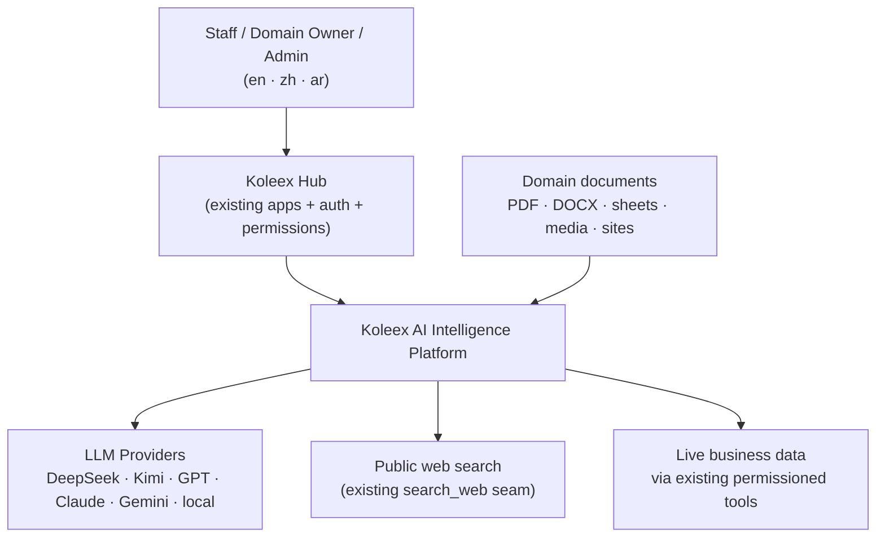
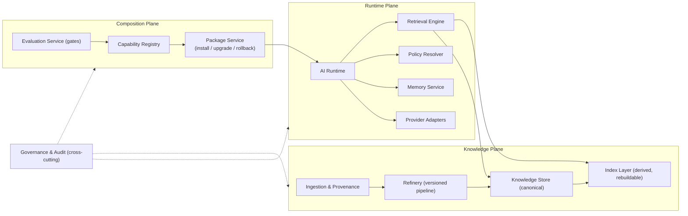
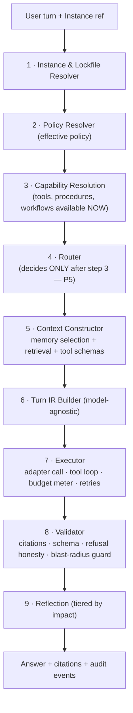
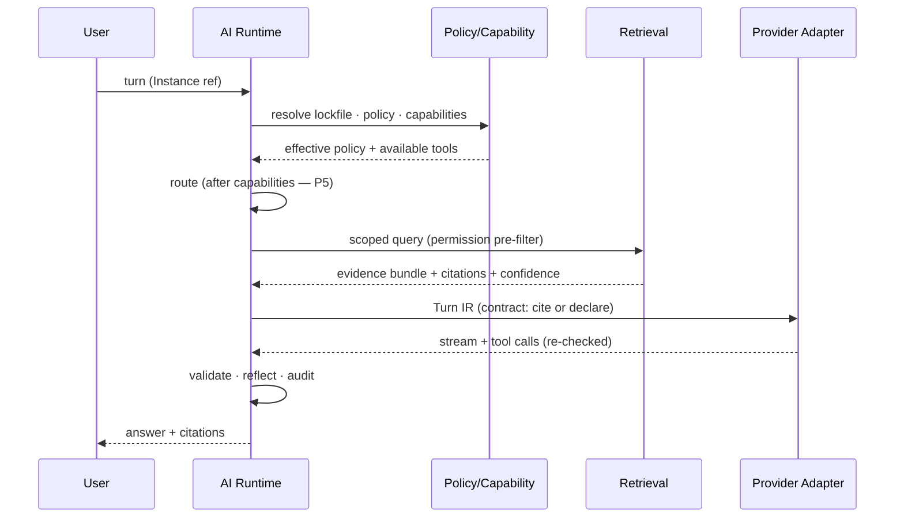
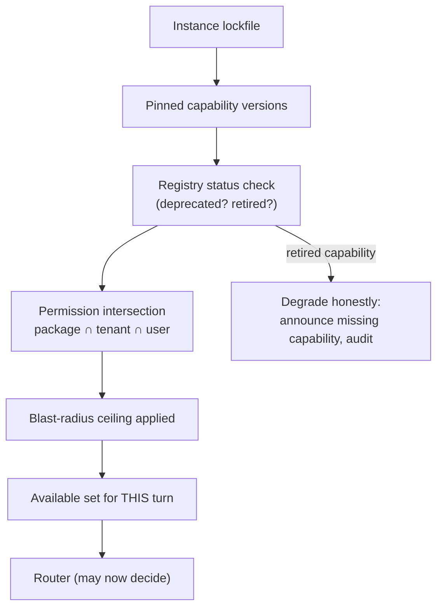
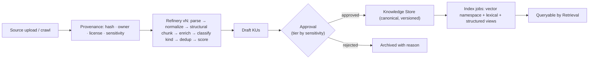
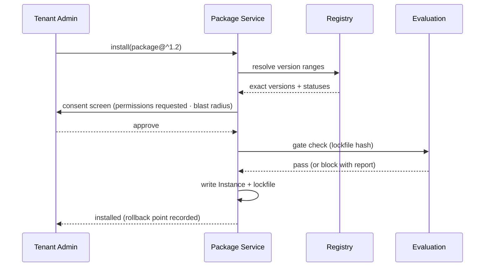
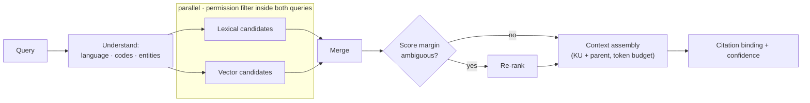
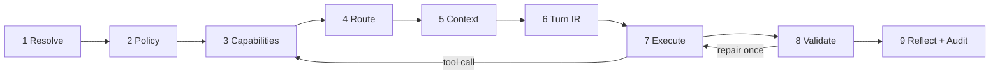

# Koleex AI Intelligence Platform — Architecture Specification

**Version:** 1.0-draft · **Date:** 2026-08-05 · **Status:** Awaiting owner ratification
**Author:** Lead Architect, Koleex AI
**Scope:** The official design foundation for the Intelligence Package platform. No implementation is authorized by this document; implementation begins only after ratification, in gated phases.

---

## Part 0 — Validation of the approved direction

The approved direction (Intelligence Packages · Capability Registry · Package Instances · Shared Knowledge Assets · Policy-driven orchestration · Enterprise governance · Multi-tenancy) was re-reviewed as a whole before writing this specification. Outcome:

**Validated unchanged**
- Package = *manifest that references*, never a container that copies.
- Instance = the only holder of runtime state (memory, logs, metrics, version locks).
- Evaluation = a *gate* on promotion, not a component inside the package.
- Permissions = *requested* by the package, *granted* by tenant ∩ user ∩ request.
- Knowledge invariant: **unit of knowledge = unit of citation = unit of permission = unit of versioning.**

**Refined in this document**
- "Policy Engine" is scoped down to a **fixed-precedence policy resolver** (no rules DSL in v1) — see ADR-009.
- Inheritance capped at **3 levels, single-parent + capability mixins** — see ADR-002.
- Evaluation gates are **tiered by blast radius** so the gate cannot become an economic excuse to skip it — see ADR-012.

**Removed as unnecessary complexity**
- A standalone "Reasoning" component → reduced to two policy fields (`thinking_effort`, `decomposition`) plus Procedures.
- "Skills" and "Planning" as separate asset types → merged into Procedures (model-executed) and Workflows (system-executed).
- "Resources" as a concept → split into Budget (policy) and Templates/Rubrics (a knowledge kind).
- A policy DSL, a full ontology engine, and an eager knowledge graph → out of v1 (Non-Goals §4).

**Inconsistencies resolved**
- All earlier "Expert" terminology is retired. The pair **Package / Instance** replaces it everywhere.
- The three memory tiers from the knowledge-platform draft are now formally attached to the Instance, not the Package (ADR-007).

**Hidden risks surfaced** (full treatment in Part VII): shared-index tenant leakage, re-rank hop cost on a ~1 s RTT network, registry governance bottleneck, unbounded instance memory, Vercel/Supabase single-region coupling.

---

# Part I — Foundation

## 1. Vision

Koleex Hub is an enterprise operating system. Koleex AI is its intelligence layer. This platform lets any organization assemble **domain experts as installable, governed, versioned Intelligence Packages** — without retraining or replacing the underlying LLM, and without coupling any knowledge to any model vendor.

One platform. Unlimited domains. The LLM is a replaceable engine; the packages, knowledge, and governance are the durable asset.

## 2. Design Principles

| # | Principle | Practical meaning |
|---|---|---|
| P1 | **Reference, don't copy** | Packages point at shared assets with version ranges. Nothing expensive is duplicated per package. |
| P2 | **State lives in the Instance** | Manifests are pure declarations. Anything that accumulates (memory, logs, metrics, locks) belongs to the installed Instance. |
| P3 | **Model independence at the reference layer** | The canonical store is text + metadata + lineage. Every index, embedding, and prompt format is a rebuildable derivative. |
| P4 | **Permission before retrieval** | Access is filtered when candidates are gathered, never after generation. A leak into context is a leak, even if uncited. |
| P5 | **Capabilities resolve before routing** | The orchestrator may not choose a path until it knows what the active package can do. (Encodes the fast-path/weather incident as law.) |
| P6 | **Gates, not intentions** | Quality is enforced by promotion gates (evaluation, approval, conflict scan) — the same governance style that keeps the product coding system healthy. |
| P7 | **Blast radius is declared** | Every package states the worst thing it can do (read / draft / write / irreversible), and the runtime enforces matching guards. |
| P8 | **Honest failure** | When retrieval is empty, a tool fails, or confidence is low, the system says so — in the user's language — and never substitutes stale model memory as if fresh. |
| P9 | **Hop budget is architecture** | On this network (~1 s per request), the number of sequential round trips per turn is a designed, budgeted quantity. |
| P10 | **Everything auditable** | Every retrieval, tool call, policy decision, and promotion emits an audit event with actor, package version, and inputs hash. |

## 3. Architecture Goals

1. Create a new domain expert in **under one day** of a domain-owner's effort (no AI expertise required).
2. Swap or add an LLM provider with **zero changes** to any package, asset, or knowledge record.
3. Serve grounded answers with citations at latencies acceptable on the measured network (targets §21).
4. Support unlimited tenants/domains/packages structurally, with governance that scales by blast-radius tiering rather than by adding approvers.
5. Make every answer explainable: which package version, which knowledge units, which tools, which policies.

## 4. Non-Goals (v1)

- **No fine-tuning** as a knowledge mechanism (style-only, if ever).
- **No ontology engine**; no eager knowledge graph. Light entity/relation extraction only where a domain pays for it.
- **No public marketplace** until Open Decision D3 (external sale) is answered; the design keeps the seam but builds none of the storefront.
- **No replacement of application permissions.** Packages consume the Hub's existing module/action grants; they never define new permission primitives.
- **No live business data inside the knowledge store.** Prices, stock, customers are answered by tools against live records — never embedded.
- **No autonomous writes.** v1 caps blast radius at *write-with-confirmation*; irreversible-class automation is design-complete but disabled.
- **No real-time collaborative knowledge editing.**

## 5. System Constraints (current-state; revisit yearly)

| Constraint | Value / consequence |
|---|---|
| Host platform | Next.js on Vercel (fn region hnd1), Supabase Postgres (RLS deny-all + service-role gateway pattern) |
| Network reality | ~1 s RTT to any host for China-based staff → sequential hops dominate latency (P9) |
| Concurrency ceiling | ~30 comfortable concurrent users today; AI multiplies per-turn cost |
| Providers today | DeepSeek primary; provider set will change (Kimi, GPT, Claude, Gemini, local) |
| Languages | en / zh / ar are first-class everywhere (UI, knowledge, answers, evaluation) |
| Build fragility | Vercel build-container OOM is a known coin-flip; platform components must not enlarge client bundles carelessly |
| Governance culture | Owner sign-off gates schema/RLS/auth/coding changes; this platform adopts the same SoT + change-log discipline |

## 6. Core Terminology

| Term | Definition |
|---|---|
| **Source** | An external thing knowledge came from (file, URL, table, note) with identity, hash, owner, license, sensitivity. |
| **Knowledge Unit (KU)** | The atomic, citable, permissioned, versioned fragment derived from a Source. Kinds: `fact`, `procedure`, `template`, `rubric`. |
| **Knowledge Scope** | A *dynamic predicate* over KU metadata (never a folder). Packages select knowledge by scope. |
| **Capability** | A shared, versioned, owned asset in the Registry: Procedure, Workflow, Tool grant definition, or Template bundle. |
| **Procedure** | Model-executed guidance ("how a specialist works"). No side effects. |
| **Workflow** | System-executed deterministic steps. Side effects; auditable; reversible where possible. |
| **Intelligence Package (IP)** | A manifest: Identity + Scope + Capability references + Policy + Evaluation gate. Pure declaration. |
| **Package Instance** | An IP installed into a tenant: locked versions + memory + audit + metrics. |
| **Capability Registry** | The governed catalog of Capabilities and Packages, with versions, owners, deprecation. |
| **Policy** | Declarative constraints on an IP: requested permissions, blast radius, language, style, confidence/refusal, safety, budget, thinking effort. |
| **Blast radius** | Declared impact class: `read` → `suggest` → `write` → `irreversible`. |
| **Evaluation Set** | Golden questions + expected properties; passing it is the promotion gate. |
| **AI Runtime** | The model-independent layer that turns (Instance + user turn) into a validated, cited, budgeted answer. |
| **Turn IR** | The model-agnostic intermediate representation of a turn (context sections, messages, tool schemas) that provider adapters translate. |
| **Lockfile** | Per-Instance record pinning exact capability/knowledge-pipeline versions resolved at install/upgrade. |

---

# Part II — System Architecture

## 7. Component Responsibilities

| Component | Owns | Explicitly does not |
|---|---|---|
| **Ingestion & Provenance** | Accepting sources, hashing, dedup at source level, sensitivity tagging, license capture | Interpret content; grant access |
| **Refinery** (pipeline) | Parse → normalize → chunk (structural) → enrich (metadata, language) → classify kind → dedup → score; emits KUs; versioned pipeline | Approve knowledge; touch indexes directly |
| **Knowledge Store** (canonical) | KUs + metadata + lineage + versions; append-only history | Store embeddings/prompt-formatted text as canonical |
| **Index Layer** (derived) | Vector, lexical, structured views; per-embedding-model namespaces; fully rebuildable | Be a source of truth for anything |
| **Retrieval Engine** | Query understanding, candidate generation (hybrid), **permission pre-filter**, re-rank, context assembly, citation binding, confidence estimate | Call the LLM; decide routing |
| **Capability Registry** | Capabilities + Packages: versions, owners, deprecation, approval states, conflict scan | Execute anything |
| **Package Service** | Install/upgrade/rollback/retire Instances; lockfile resolution; permission consent flow | Grant permissions beyond tenant/user grants |
| **Policy Resolver** | Merge policy layers into one effective policy per turn (fixed precedence, §ADR-009) | Learn or infer rules |
| **AI Runtime** | The turn loop (Part IV): context construction → routing → execution → validation → audit | Own state beyond the turn; bypass policy |
| **Provider Adapters** | Translate Turn IR ⇄ each vendor protocol; token counting; streaming envelope; capability matrix | Contain any business or domain logic |
| **Memory Service** | Instance memory tiers, caps, retention, review-gated promotion | Auto-promote conversation content to shared tiers |
| **Evaluation Service** | Run tiered eval sets; block/allow promotions; regression history | Generate its own golden answers unsupervised |
| **Governance & Audit** | Approval workflows, change log, audit event store, retirement | — |

## 8. Data Ownership

| Data | Owner (writer) | Readers | Tenancy |
|---|---|---|---|
| Sources, KUs, lineage | Refinery via Ingestion | Retrieval, Governance | Tenant-scoped rows; global tier only for platform-published assets |
| Indexes | Index Layer (rebuild jobs) | Retrieval | **Per-tenant namespace** (see R-1, Part VII) |
| Capabilities, Package manifests | Registry (via approval flow) | Package Service, Runtime | Global or tenant-scoped, flagged |
| Instances, lockfiles | Package Service | Runtime, Governance | Tenant |
| Memory (user/instance/org tiers) | Memory Service | Runtime (scoped) | Tenant, and user-scoped inside it |
| Policies (effective) | Computed per turn, never stored merged | Runtime | — |
| Audit events | Every component (append-only) | Governance, owner | Tenant + platform ops view |
| Eval sets & results | Evaluation Service | Registry (gates), owners | Follows the package's tenancy |

**Rule:** live business records (products, prices, customers, HR…) are owned by their existing apps and reached **only** through the existing tool layer with the caller's permissions. The knowledge platform never replicates them.

## 9. Structural Diagrams

### 9.1 System Context

### 9.2 Container Diagram

### 9.3 Component Diagram — AI Runtime internals

---

# Part III — Architecture Decision Records

*Format per record: Status · Context · Problem · Alternatives · Decision · Trade-offs · Advantages · Disadvantages · Consequences · Future impact · Possible revisions. All ADRs are **Accepted (pending owner ratification of this document)** unless marked otherwise.*

---

### ADR-001 · Intelligence Packages as the unit of expertise

- **Context:** The platform must produce unlimited domain experts on one substrate.
- **Problem:** What is the shippable, governable unit of "an expert"?
- **Alternatives:** (a) per-domain configuration rows; (b) per-domain forked agents; (c) container packages that embed copies of everything; (d) manifest packages that reference shared assets.
- **Decision:** **(d)** — the Intelligence Package is a manifest of six parts: Identity, Scope, Capability references, Policy, Evaluation gate; runtime state excluded by construction.
- **Trade-offs:** Indirection (references must resolve) in exchange for de-duplication and independent asset lifecycles.
- **Advantages:** One fix to a shared procedure heals every package; packages stay small, diffable, reviewable; export/import is trivial.
- **Disadvantages:** Requires a resolver + lockfile discipline; broken references become a failure class.
- **Consequences:** Every other ADR (registry, instance, versioning) exists to serve this shape.
- **Future impact:** Marketplace-ready if D3 is ever answered "external".
- **Possible revisions:** Embedding *tiny* inline overrides (e.g., a 5-line local procedure tweak) may be allowed later with strict size caps.

---

### ADR-002 · Package Manifest shape and inheritance

- **Context:** "Chinese Music Teacher" should reuse "Music Teacher" which reuses "Teacher".
- **Problem:** Reuse without hierarchy rot.
- **Alternatives:** (a) no inheritance (copy); (b) multiple inheritance; (c) deep single inheritance; (d) single inheritance ≤3 levels + capability mixins.
- **Decision:** **(d)**. A manifest may name one `extends` parent (max chain depth 3) plus any number of mixin capability bundles. Child policy may only *narrow* (never widen) permissions and blast radius.
- **Trade-offs:** Some duplication across sibling families vs. diamond-problem hell.
- **Advantages:** Predictable resolution; narrowing rule makes inheritance safe by construction.
- **Disadvantages:** Occasional copy-paste between distant domains.
- **Consequences:** Resolver is a simple linear merge: platform defaults → parent chain → package → (tenant install overrides).
- **Future impact:** Depth cap revisited only with evidence; history says deep trees rot.
- **Possible revisions:** Named "profiles" (bundled policy presets) if mixins prove insufficient.

---

### ADR-003 · Package Instance as the sole state holder

- **Context:** Packages get installed per tenant; users accumulate memory; upgrades happen.
- **Problem:** Where does mutable state live so upgrades don't destroy it and tenants can't leak into each other?
- **Alternatives:** (a) state inside the package; (b) global state keyed by package id; (c) per-tenant Instance owning all state.
- **Decision:** **(c)**. Instance = {locked versions (lockfile), memory tiers, audit trail, metrics, consent record}. Upgrading swaps locked versions; state persists. Uninstall archives state per retention policy.
- **Trade-offs:** One more entity vs. correctness of upgrade/rollback/tenancy in one stroke.
- **Advantages:** Memory survives upgrades; rollback = restore previous lockfile; tenant isolation is structural.
- **Disadvantages:** Two-level lookups everywhere (package → instance).
- **Consequences:** All runtime APIs take an Instance ref, never a bare package id.
- **Future impact:** Per-team sub-instances possible later (same pattern, one level down).
- **Possible revisions:** Shared "organization instance" memory pooling across teams, gated by governance.

---

### ADR-004 · Capability Registry

- **Context:** Procedures, workflows, tool grants, and template bundles are reused across many packages.
- **Problem:** Shared assets need identity, versioning, ownership, deprecation — without a bureaucratic choke point.
- **Alternatives:** (a) assets inline in packages; (b) free-for-all shared table; (c) governed registry with tiered approval.
- **Decision:** **(c)**. Every capability has: id, semver, owner, tenancy flag (platform/tenant), status (draft → approved → deprecated → retired), and a blast-radius ceiling. Approval requirements scale with that ceiling (read-class: owner self-approve; write/irreversible-class: governance sign-off). Retired versions are never re-issued (mirrors coding governance "no recycling").
- **Trade-offs:** Process weight on dangerous assets; near-zero weight on safe ones.
- **Advantages:** One place to answer "what exists, who owns it, what depends on it".
- **Disadvantages:** Registry availability becomes install-time critical (not turn-time; lockfiles insulate turns).
- **Consequences:** Dependency graph is queryable → impact analysis before upgrades.
- **Future impact:** The registry *is* the marketplace catalog if D3 goes external.
- **Possible revisions:** Signed capability bundles when/if third-party authors exist.

---

### ADR-005 · Shared Assets, version ranges, lockfiles

- **Context:** ADR-001 references assets; upgrades of shared assets must not silently mutate 40 packages.
- **Problem:** Dependency hell vs. staleness.
- **Alternatives:** (a) always-latest (silent breakage); (b) exact pins in manifests (staleness, mass edits); (c) semver ranges in manifests + exact pins in instance lockfiles.
- **Decision:** **(c)**. Manifests declare ranges (`^1.2`); installation resolves to exact versions written into the Instance lockfile; upgrades are explicit acts that re-resolve, re-run the evaluation gate, and are one-click reversible.
- **Trade-offs:** npm-style ceremony vs. reproducibility.
- **Advantages:** Turns are reproducible; "what changed?" always answerable; rollback trivial.
- **Disadvantages:** Fleet-wide security fixes need a bulk re-lock tool (accepted; build it when fleet >50).
- **Consequences:** Evaluation gate binds to lockfile hash, not manifest.
- **Future impact:** Enables staged rollouts (10% of instances on new lock).
- **Possible revisions:** Auto-upgrade *patch* versions for read-class capabilities only.

---

### ADR-006 · Knowledge Model

- **Context:** Knowledge must outlive models and carry trust.
- **Problem:** What is knowledge, atomically?
- **Alternatives:** (a) document-level blobs; (b) fixed-size chunks; (c) structural Knowledge Units with kinds and lineage.
- **Decision:** **(c)**. Source → Refinery → KUs. A KU carries: content (canonical text), kind (`fact | procedure | template | rubric`), language(s), domain tags, sensitivity, trust score, freshness (validity window), lineage (source + pipeline version), status (draft/approved/retired), version chain. Chunking is structural (semantic boundaries, parent-document link), never fixed-token. **Invariant:** KU = unit of citation = unit of permission = unit of versioning.
- **Trade-offs:** Refinery complexity vs. everything downstream becoming simple.
- **Advantages:** Citations are exact; retirement is surgical; re-indexing never touches canon.
- **Disadvantages:** Pipeline versioning discipline required (re-refining a source creates new KU versions, not silent edits).
- **Consequences:** Facts and procedures are separated at ingestion — the difference between a search engine and an expert.
- **Future impact:** New kinds (e.g., `exercise`, `regulation`) are additive.
- **Possible revisions:** Cross-KU "claim" extraction for contradiction detection (v2+).

---

### ADR-007 · Memory Model

- **Context:** Experts must remember; memory is also the easiest way to poison shared knowledge.
- **Problem:** What remembers what, for whom, with what promotion path?
- **Alternatives:** (a) one big memory; (b) per-conversation only; (c) three tiers with review-gated promotion.
- **Decision:** **(c)** on the Instance: **User memory** (personal facts/preferences, user-scoped, user-erasable) · **Instance memory** (curated domain learnings; enters only via explicit review) · **Org memory** (tenant-wide conventions; governance-approved). **No automatic promotion** from conversations to shared tiers, ever. Caps + retention per tier; all tiers are data, not instructions (injection rule §19).
- **Trade-offs:** Some "it should have just remembered" friction vs. an unpoisonable knowledge base.
- **Advantages:** Deleting a user deletes their tier cleanly; upgrades never touch memory (ADR-003).
- **Disadvantages:** Curation is human work; surfaced by a review queue, not hidden.
- **Consequences:** Memory Service exposes `propose_to_instance_memory` — a queue item, not a write.
- **Future impact:** Semi-automatic promotion candidates ranked by recurrence, still human-approved.
- **Possible revisions:** Team tier between user and org if demand appears.

---

### ADR-008 · Permission Model

- **Context:** The Hub already has module/action grants, a service-role gateway, and default-deny APIs.
- **Problem:** Packages must never become a privilege-escalation channel.
- **Alternatives:** (a) packages grant permissions; (b) packages ignore permissions (runtime checks only); (c) packages *request*, effective = intersection.
- **Decision:** **(c)**. `effective = package.requested ∩ tenant.granted_at_install ∩ user.grants_at_turn`. Install shows a consent screen of requested permissions + blast radius; runtime re-checks per tool call (grants may have changed since install). Packages cannot define new permission primitives (Non-Goal).
- **Trade-offs:** Triple-check cost (micro) vs. structural safety.
- **Advantages:** A user never sees more through AI than through the apps; consent is explicit and audited.
- **Disadvantages:** A package may be installed yet partially inert for low-permission users — must be *communicated*, not silent (honest failure P8).
- **Consequences:** Blast-radius guard (ADR below §Runtime) sits after the intersection, providing confirmation flows for `write` and hard-stop for `irreversible` in v1.
- **Future impact:** External marketplace would add publisher-identity checks on top; nothing here changes.
- **Possible revisions:** Delegated approvals (manager approves a specific write on behalf of a user).

---

### ADR-009 · Policy Engine → Fixed-precedence Policy Resolver

- **Context:** Policies exist at platform, parent-package, package, tenant-install, and turn levels.
- **Problem:** Merge them deterministically without building a rules language nobody can audit.
- **Alternatives:** (a) rules DSL / rete engine; (b) code-only policies; (c) declarative policy documents + fixed precedence merge.
- **Decision:** **(c)**. Policy is a flat, typed document (permissions requested, blast radius, language rules, output style, confidence/refusal thresholds, safety rules, budget class, thinking effort). Merge order is **fixed**: platform defaults → parent chain (top-down) → package → tenant install overrides → per-turn narrowing (a turn may only *narrow*). Conflicts resolve by "most restrictive wins" for safety/permissions and "most specific wins" for style/language.
- **Trade-offs:** Less expressive than a DSL; that is the point.
- **Advantages:** Every effective policy is explainable as a five-layer diff; testable as pure function.
- **Disadvantages:** Exotic conditional policies ("only on Fridays") unsupported — deliberately.
- **Consequences:** The resolver is pure and cacheable per (instance, user) pair.
- **Future impact:** If a real DSL need emerges, it must arrive with its own ADR and a kill criterion.
- **Possible revisions:** Scheduled policy variants (business hours) as first-class fields, not rules.

---

### ADR-010 · Retrieval Architecture

- **Context:** Model codes (`XPRR-2100EF-LC`), proper nouns, three languages, 1 s RTT.
- **Problem:** Grounded answers with citations under a hop budget.
- **Alternatives:** (a) vector-only; (b) lexical-only; (c) hybrid + permission pre-filter + selective re-rank.
- **Decision:** **(c)**. Pipeline: query understanding (language detect, code/entity detect) → candidate generation runs lexical and vector **in parallel** (one hop) with the **permission filter inside the candidate query** (P4) → merge → *selective* re-rank (only when the merged score margin is ambiguous; skip when the top candidates are clearly separated — hop budget P9) → structural context assembly (KU + parent expansion under token budget) → citation binding → confidence estimate (coverage × trust × freshness).
- **Trade-offs:** Selective re-rank complicates the pipeline slightly; buys back a full network hop on most turns.
- **Advantages:** Codes and names never lost (lexical); meaning matched (vector); nothing unauthorized ever enters context.
- **Disadvantages:** Confidence estimation is heuristic v1; calibrated later against eval sets.
- **Consequences:** Retrieval returns a *structured evidence bundle* (KUs, scores, citations, confidence) — the Runtime, not retrieval, decides what to do with low confidence.
- **Future impact:** Cross-language retrieval via translated search fields at ingestion (constraint §5), not query-time translation.
- **Possible revisions:** Late-interaction models if/when hosted colocated (Part VII R-2).

---

### ADR-011 · AI Runtime

- **Context:** Everything between "user turn arrives" and "validated answer leaves" — the layer where the fast-path incident happened.
- **Problem:** A model-independent, policy-obedient, budget-aware turn loop.
- **Alternatives:** (a) grow the current orchestrator organically; (b) framework adoption (LangChain-class); (c) an owned, staged, pure-function runtime with provider adapters.
- **Decision:** **(c)** — full specification in Part IV. Nine deterministic stages; routing occurs only after capability resolution (P5); provider adapters translate a model-agnostic Turn IR; validation and blast-radius guards are stages, not conventions.
- **Trade-offs:** Owning code vs. inheriting framework churn and hidden prompt magic.
- **Advantages:** Each stage testable alone; the incident class "router ignorant of capabilities" becomes structurally impossible.
- **Disadvantages:** We maintain adapters per provider (small, contract-tested).
- **Consequences:** The existing agent route migrates *into* runtime stages incrementally; its detectors become Router inputs.
- **Future impact:** Local models plug in as adapters, nothing else moves.
- **Possible revisions:** Parallel multi-model verification for irreversible-class turns (when enabled).

---

### ADR-012 · Evaluation Pipeline as promotion gate

- **Context:** Without regression checks, yesterday's expert silently breaks with today's edit.
- **Problem:** Make evaluation unavoidable yet affordable.
- **Alternatives:** (a) optional eval component; (b) full eval on every change; (c) tiered gates bound to promotion events.
- **Decision:** **(c)**. Three tiers: **Smoke** (≤20 items; every draft save; cheap) · **Full** (golden set; required to promote package/capability to live, binds to lockfile hash) · **Regression** (scheduled re-runs on live instances; drift alarms). Gate policy scales with blast radius: read-class needs Smoke+Full once; write-class adds mandatory Regression cadence. Eval items are en/zh/ar-aware where the package claims those languages.
- **Trade-offs:** Inference cost — bounded by a monthly eval budget per tenant (cost strategy §22).
- **Advantages:** "Live" *means* something; upgrades can't skip the gate because installation re-resolution triggers it (ADR-005).
- **Disadvantages:** Golden sets require domain-owner effort; mitigated by the gap-report loop (unanswered/low-confidence questions auto-propose eval candidates).
- **Consequences:** Registry stores eval status per (version, lockfile) pair.
- **Future impact:** Marketplace trust would be built on published eval provenance.
- **Possible revisions:** Model-graded eval with human spot audit once calibration is proven.

---

### ADR-013 · Versioning Strategy

- **Context:** Packages, capabilities, KUs, pipelines, embeddings, policies all change at different speeds.
- **Problem:** One coherent versioning discipline.
- **Decision:**
  - **Semver** for Packages and Capabilities (breaking = major).
  - **Version chains** for KUs (edits create new versions; citations pin the version cited).
  - **Pipeline version** stamped on every KU (re-refine = new versions).
  - **Embedding-model namespaces** in the Index Layer; dual-write during migration; old namespace dropped only after retrieval parity checks.
  - **No recycling** of retired identifiers, ever (registry rule, ADR-004).
  - **Change log** discipline: every source-of-truth change to registry assets or platform policy gets an append-only log entry — the exact model of the product-coding change log, because it demonstrably works here.
- **Alternatives considered:** timestamp-only versions (unreadable), git-as-database (wrong query model).
- **Trade-offs / Consequences:** More metadata everywhere; in exchange, "what exactly answered this question last March" is answerable — which is the audit promise.
- **Possible revisions:** Content-addressed KU ids (hash-based) if sync/export demands them.

---

### ADR-014 · Deployment Strategy

- **Context:** The Hub is a Next.js monolith on Vercel + Supabase, with a known build-OOM fragility and a service-role gateway pattern.
- **Problem:** Where does the platform run?
- **Alternatives:** (a) separate microservice fleet now; (b) inside the monolith forever; (c) **modular monolith now, seams for extraction later**.
- **Decision:** **(c)**. v1 ships inside the Hub: platform code in isolated modules with the Runtime stages as pure functions; Refinery and Index rebuilds as background jobs (cron/queue pattern already in use); heavy/long tasks must never ride a user request. Two pre-declared extraction seams: (1) Refinery+Index worker, (2) Runtime executor — each behind an internal interface so extraction is a deployment change, not a rewrite. Client-bundle impact of platform UI must be lazy-loaded (build-OOM constraint §5).
- **Trade-offs:** Monolith coupling now vs. zero premature ops burden.
- **Advantages:** Reuses auth, permissions, gateway, cron, audit habits that already exist and work.
- **Disadvantages:** Vercel function limits bound single-job size → chunked job design from day one.
- **Consequences:** No new infrastructure purchase is required to reach first production package.
- **Future impact:** If D3 (external) → extraction of seam (2) first.
- **Possible revisions:** Dedicated vector store if pgvector-at-scale metrics demand it; decision by measurement, not fashion.

---

# Part IV — AI Runtime Specification

## 10. Position and contract

The Runtime sits between Package Instances and LLM providers. Its contract:

> **Input:** (Instance ref, user turn, conversation handle)
> **Output:** validated answer + citations + tool effects (within blast radius) + audit events + cost record
> **Guarantee:** identical inputs against the same lockfile produce policy-identical behavior regardless of the model vendor selected.

## 11. The nine stages

| # | Stage | Responsibility | Failure behavior |
|---|---|---|---|
| 1 | **Resolve** | Load Instance, lockfile, pinned capability versions | Unresolvable ref → honest error, audit |
| 2 | **Policy** | Compute effective policy (ADR-009); cache per (instance,user) | Fail closed |
| 3 | **Capabilities** | Materialize available tools/procedures/workflows *for this user now* (permission intersection) | Empty set is a valid, *known* state |
| 4 | **Route** | Decide: direct answer / retrieve / tool / workflow / web / clarify / refuse — **only after stage 3** (P5). Deterministic rules first, model-assisted classification second, both logged | Ambiguity → clarify, never guess |
| 5 | **Context** | Memory selection (tiers, caps) + retrieval evidence bundle (ADR-010) + tool schemas + procedure text, all under token budget with priority order: policy > procedure > evidence > memory > history | Over budget → drop lowest priority, note in audit |
| 6 | **Turn IR** | Assemble the model-agnostic IR: system sections (identity, policy directives, procedures), messages, tool schemas, response contract (citations required if evidence present) | — |
| 7 | **Execute** | Adapter translates IR; streaming; tool-call loop re-enters stage 3 checks per call; budget meter (tokens, hops, wall-clock) hard-stops per policy class; retry ladder: same model (1 retry, transient) → fallback model (per routing table) → honest failure | Provider down → fallback chain → P8 message |
| 8 | **Validate** | Citation check (grounded claims cite or the answer must declare uncertainty); schema check for tool/workflow outputs; refusal honesty (no fake refusals, no fake confidence); **blast-radius guard**: `suggest`→ draft only; `write` → explicit confirm; `irreversible` → blocked in v1 | Validation failure → one repair pass → else honest failure |
| 9 | **Reflect & Audit** | Reflection tier by impact: none (read, high confidence) / self-check pass (low confidence or write) / mandatory (irreversible, when enabled). Emit audit: package version, lockfile hash, KUs cited, tools called, policy decisions, cost | Audit write is not skippable |

## 12. Model routing and provider independence

- **Routing table** keyed by task class (chat / grounded QA / extraction / tool-orchestration / long-form) × language × budget class → ordered provider list. The table is *data*, owned by platform policy, hot-swappable.
- **Provider Adapter contract:** translate Turn IR → vendor request; map tool-calling protocol; normalize streaming; count tokens; report cost; declare a **capability matrix** (max context, tool support, JSON mode, language strengths). Adapters contain zero domain logic and are contract-tested against golden IR fixtures.
- **Nothing upstream of stage 7 may reference a vendor name.** The canonical store never holds prompt-formatted text (P3).
- **Embedding independence:** embeddings live in per-model namespaces (ADR-013); switching embedding models is a rebuild + parity check, never a data migration.

## 13. Hallucination mitigation (layered, not magical)

1. Evidence-first routing: in-scope questions retrieve before answering.
2. Response contract: grounded claims carry citations; the validator rejects cited-KU mismatches.
3. Honest-gap rule: empty/weak evidence → say so (P8); never backfill from model memory as if fresh.
4. Live data only via tools (Non-Goal 5 kills the stale-price class).
5. Reflection pass on low-confidence and write-class turns.
6. Regression eval catches drift (ADR-012).

## 14. Runtime flow diagrams

### 14.1 Request flow (grounded question)

### 14.2 Capability resolution flow

### 14.3 Knowledge flow (ingestion → queryable)

### 14.4 Package installation flow

### 14.5 Retrieval pipeline

### 14.6 Runtime execution flow (stages)

---

# Part V — Cross-cutting Concerns

## 15. Security Model

- **Trust boundaries:** user input, retrieved KU content, web results, and tool outputs are all **data, never instructions**. System directives come only from policy + procedures resolved from the lockfile. (This is the platform-level generalization of the existing untrusted-content discipline.)
- **Tenancy:** every store is tenant-scoped; indexes use per-tenant namespaces (Part VII R-1); platform-published assets are read-only to tenants.
- **Permissions:** intersection model (ADR-008); re-checked per tool call at turn time; consent recorded on the Instance.
- **Blast-radius guards:** enforced in stage 8, not by prompt text.
- **Secrets:** provider keys live in platform env, never in manifests, never in tenant-visible data; adapters are the only components that touch them.
- **Injection defense:** retrieved content is delimited and typed in the Turn IR; the validator strips instruction-shaped content from evidence sections; red-team items are a mandatory category in Full eval sets for write-class packages.
- **Audit:** append-only, tenant-visible for their own events; platform ops view for the whole.

## 16. Scalability Strategy

- Scale *reads* by caching (below) and by keeping the turn loop stateless (all state in Instance stores).
- Scale *ingestion* by chunked background jobs sized to platform function limits (ADR-014).
- Scale *governance* by blast-radius tiering (ADR-004/012), not by adding approvers.
- Scale *organizationally* by the registry: dependency queries make impact analysis cheap.
- The declared concurrency ceiling (~30) is respected: no per-user pollers are added by this platform; all recurring work is centralized in scheduled jobs.

## 17. Caching layers

| Cache | Keyed by | Invalidation |
|---|---|---|
| Effective policy | (instance, user, lockfile hash) | any layer change |
| Capability set | (instance, user) | grant change, upgrade |
| Retrieval results | (scope hash, query hash, permission set hash) | KU version change in scope |
| Provider prompt-prefix | adapter-level where vendor supports it | lockfile change |
| Answers (exact repeat, read-class only) | (instance, normalized query, evidence hash) | evidence change |

## 18. Failure Recovery

| Failure | Behavior |
|---|---|
| Provider outage | Fallback chain per routing table → honest degradation message in user language |
| Registry unavailable | Turns unaffected (lockfiles local to Instance); installs/upgrades pause |
| Index corruption / embedding migration error | Rebuild from canonical store (P3); retrieval degrades to lexical-only meanwhile — announced, not silent |
| Refinery job death | Chunked jobs resume from last durable step; sources are immutable inputs |
| Bad upgrade | Rollback = restore previous lockfile (ADR-005); memory untouched (ADR-003) |
| Eval service down | Promotions blocked (fail closed); live traffic unaffected |
| Budget exhaustion mid-turn | Stop cleanly at stage boundary, return partial with honest note, audit |

## 19. Performance Targets (measured against the ~1 s RTT reality)

| Metric | P50 | P95 |
|---|---|---|
| First streamed token, chat (no retrieval) | ≤ 2.0 s | ≤ 4.5 s |
| Grounded answer start (with retrieval) | ≤ 4.0 s | ≤ 8.0 s |
| Tool-action turn (single write w/ confirm) | ≤ 6.0 s | ≤ 12 s |
| Sequential network hops per grounded turn | ≤ 3 | ≤ 4 |
| Source uploaded → queryable | ≤ 10 min | ≤ 30 min |
| Index full rebuild (per-tenant, 100k KUs) | — | ≤ 24 h background |

Hop accounting for a grounded turn: (1) turn request in, (2) parallel retrieval, (3) provider call. Re-rank, when triggered, is the optional 4th — which is exactly why it is selective (ADR-010).

## 20. Cost Strategy

- **Budget classes** (S/M/L) in policy set hard per-turn ceilings (tokens, hops, wall-clock); the meter is stage-7 infrastructure, not convention.
- **Routing by cost:** cheap models for classification/extraction; premium models only where the task class earns it.
- **Embedding costs amortized:** embed once per KU version per namespace; never at query time for stored content.
- **Eval budget:** monthly cap per tenant; Smoke tier sized to stay inside it.
- **Cost telemetry:** every turn's cost lands in Instance metrics → per-package cost/answer becomes a first-class governance number (feeds Open Decision D4).

## 21. AI Provider Independence (summary of guarantees)

1. Canonical knowledge holds no vendor-formatted text.
2. Turn IR is the only thing adapters consume; adapters are the only vendor-aware code.
3. Routing table is data; adding a provider = adding an adapter + rows.
4. Embeddings are namespaced per model; migration = rebuild + parity gate.
5. Evaluation sets are provider-blind; a provider swap must pass the same gates as a package upgrade.

## 22. Upgrade Strategy

- **Platform upgrades:** pipeline/runtime versions stamped everywhere they act; N and N-1 supported concurrently during migration windows.
- **Package upgrades:** explicit, gated (eval on new lockfile), reversible; staged rollout possible per ADR-005.
- **Knowledge upgrades:** new KU versions; citations pin what they cited; retirement is a status, not a delete.
- **Provider upgrades/swaps:** routing-table change behind an eval parity run.
- **Breaking changes:** require an ADR revision + change-log entry (ADR-013 discipline) — never silent.

---

# Part VI — Critical Self-Review

*Each issue: why it exists · severity · correction.*

**R-1 · Shared vector index tenant leakage** — *Severity: Critical (if multi-tenant), High otherwise.*
Why: similarity search across a shared index is the one query path that could bypass row-level habits if implemented naively. Correction (adopted into ADR-013/§8): per-tenant index namespaces are **mandatory from day one**, even while Koleex is the only tenant — retrofitting tenancy into a hot index is the single most expensive mistake this platform could make.

**R-2 · Re-rank vs. hop budget** — *Severity: High.*
Why: a remote re-rank service adds a full ~1 s hop to every grounded turn on this network. Correction (adopted into ADR-010): selective re-rank by score-margin; long-term, re-rank must be colocated (same process or same region) or remain skippable. A P50 that includes re-rank by default would blow §19 immediately.

**R-3 · Registry as governance bottleneck** — *Severity: Medium.*
Why: every shared asset passing owner sign-off recreates the "one approver" scaling wall. Correction (adopted into ADR-004): approval effort scales with blast-radius ceiling; read-class assets are self-service. Watch metric: median time-to-approve; if it exceeds 3 days, delegation rules trigger.

**R-4 · Golden-set authorship burden** — *Severity: Medium.*
Why: domain owners won't write 200 eval items cold. Correction (ADR-012): the gap report (unanswered/low-confidence questions) auto-proposes eval candidates; Smoke tier keeps the minimum viable gate at ≤20 items so the gate never feels impossible.

**R-5 · Instance memory growth** — *Severity: Medium.*
Why: unbounded user-tier memory degrades stage-5 selection and inflates cost silently. Correction (ADR-007): hard caps per tier + retention windows + relevance-ranked selection; memory pressure is surfaced in Instance metrics, not discovered in latency.

**R-6 · Modular-monolith erosion** — *Severity: Medium.*
Why: monolith seams erode under delivery pressure; the Runtime could quietly grow tentacles into app code. Correction (ADR-014): the two extraction seams are enforced by an internal-interface rule — platform modules may not import app modules except through the declared tool layer; violation is a review-blocking finding.

**R-7 · Single-region + provider concentration** — *Severity: Medium (rising if usage grows).*
Why: Vercel hnd1 + Supabase + one primary LLM vendor is three single points stacked. Correction: fallback chain (§18) covers the LLM; region strategy is explicitly deferred to the China-acceleration track and *noted as a dependency*, not solved here.

**R-8 · Over-engineering risk: registry + lockfiles for an internal-only deployment** — *Severity: Low-Medium.*
Why: if Open Decision D3 = "internal only", part of the ceremony (consent screens, publisher semantics) is heavier than needed. Correction: D3 gates that slice of scope; the lockfile itself stays regardless — reproducibility and rollback justify it internally on their own.

**R-9 · Turn IR becoming a lowest-common-denominator prison** — *Severity: Low.*
Why: model-agnostic IRs can flatten vendor strengths (native JSON modes, long-context tricks). Correction: adapters may exploit vendor features *behind* the IR contract as optimizations, never as behavior changes; parity is enforced by the provider-blind eval sets (§21.5).

**R-10 · Policy "most restrictive wins" deadlock** — *Severity: Low.*
Why: five layers of narrowing can accidentally produce an inert package (all tools stripped, refusal threshold absurd). Correction: the Policy Resolver emits a *viability warning* at install time when the effective policy strips declared core capabilities — surfaced on the consent screen, honest by design.

---

# Appendix A — Open Decisions that gate implementation

| # | Decision | Gates |
|---|---|---|
| D1 | Packages: platform-global, tenant-owned, or both? | Registry tenancy flags default posture |
| D2 | Who approves knowledge & capabilities per tier? | Governance workflow wiring |
| D3 | External sale vs. internal-only | Consent/publisher scope, marketplace seam |
| D4 | Cost ceiling per answered question | Budget classes' concrete numbers |
| D5 | First production domain (recommended: Garment Machinery — verifiable in-house) | Phase-1 content plan |

# Appendix B — Ratification

This document is the source of truth for the Koleex AI Intelligence Platform architecture upon owner ratification. Amendments follow ADR-013 discipline: a revision ADR + change-log entry; no silent edits.
